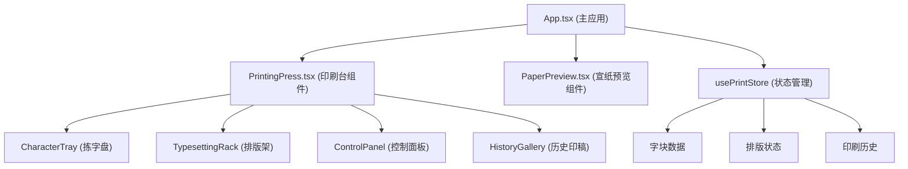

## 1. 架构设计

本项目为纯前端React应用，采用组件化架构，使用Zustand进行状态管理，framer-motion处理动画效果。



## 2. 技术描述

- **前端框架**：React@18 + TypeScript@5 + Vite@5
- **构建工具**：Vite@5 + @vitejs/plugin-react@4
- **状态管理**：Zustand@4
- **动画库**：framer-motion@11
- **样式方案**：原生CSS + CSS变量，无需Tailwind
- **包管理器**：npm

## 3. 数据模型

### 3.1 类型定义

```typescript
interface CharacterBlock {
  id: string;
  character: string;
  radical: string;
}

interface TypesetCell {
  row: number;
  col: number;
  character: string | null;
}

interface InkColor {
  id: string;
  name: string;
  value: string;
}

interface PrintedWork {
  id: string;
  timestamp: number;
  characters: { row: number; col: number; character: string }[];
  inkColor: string;
  thumbnail: string;
}

interface PrintState {
  availableCharacters: CharacterBlock[];
  typesetGrid: TypesetCell[];
  selectedInkColor: string;
  printedWorks: PrintedWork[];
  currentPreview: PrintedWork | null;
  isPrinting: boolean;
  gridConfig: {
    rows: number;
    cols: number;
    cellSize: number;
  };
}
```

### 3.2 状态管理 Actions

- `setCharacter(row, col, character)`: 设置排版格字块
- `removeCharacter(row, col)`: 移除排版格字块
- `clearTypeset()`: 清空排版架
- `selectInkColor(colorId)`: 选择墨色
- `startPrinting()`: 开始印刷动画
- `savePrintedWork()`: 保存印刷作品
- `loadPrintedWork(workId)`: 加载历史作品
- `updateGridConfig(config)`: 更新响应式网格配置

## 4. 目录结构

```
.
├── package.json
├── vite.config.js
├── tsconfig.json
├── index.html
└── src/
    ├── App.tsx
    ├── main.tsx
    ├── index.css
    ├── components/
    │   ├── PrintingPress.tsx
    │   ├── PaperPreview.tsx
    │   ├── CharacterTray.tsx
    │   ├── TypesettingRack.tsx
    │   ├── ControlPanel.tsx
    │   ├── HistoryGallery.tsx
    │   └── WoodenButton.tsx
    ├── store/
    │   └── usePrintStore.ts
    ├── data/
    │   └── characters.ts
    ├── types/
    │   └── index.ts
    └── utils/
        └── dragUtils.ts
```

## 5. 组件职责

### 5.1 核心组件
- **App.tsx**：主布局容器，响应式布局管理，全局样式
- **PrintingPress.tsx**：印刷台主组件，整合拣字盘、排版架、控制面板
- **PaperPreview.tsx**：宣纸预览组件，处理印刷动画效果
- **CharacterTray.tsx**：拣字盘，按部首分组展示字块，拖拽源
- **TypesettingRack.tsx**：排版架，拖放目标，网格布局
- **ControlPanel.tsx**：控制面板，墨色选择、刷印/清空/保存按钮
- **HistoryGallery.tsx**：历史印稿横向滚动展示
- **WoodenButton.tsx**：木质风格通用按钮组件

### 5.2 性能优化
- 拖拽使用原生Drag API或pointer事件，结合CSS transform
- 避免布局抖动：动画仅使用transform和opacity属性
- 字块列表使用React.memo优化重渲染
- 历史印稿缩略图使用canvas生成，避免DOM重绘
- 使用will-change提示浏览器优化动画性能

## 6. 动画实现方案

### 6.1 拖拽动画
- 使用pointer事件监听，requestAnimationFrame更新位置
- 拖拽时元素使用position: fixed + transform
- 释放时使用framer-motion的spring动画实现吸附效果

### 6.2 印刷动画
- 每个字块依次延迟50ms触发
- 使用framer-motion的animate实现淡入+扩散：
  - opacity: 0 → 0.9
  - scale: 0.8 → 1
  - filter: blur(3px) → blur(0)
  - textShadow实现墨渍扩散效果

### 6.3 响应式断点
- 使用window.matchMedia监听视口变化
- 断点：375px（手机）、768px（平板）、1024px+（桌面）
- 动态更新网格配置：rows/cols/cellSize
