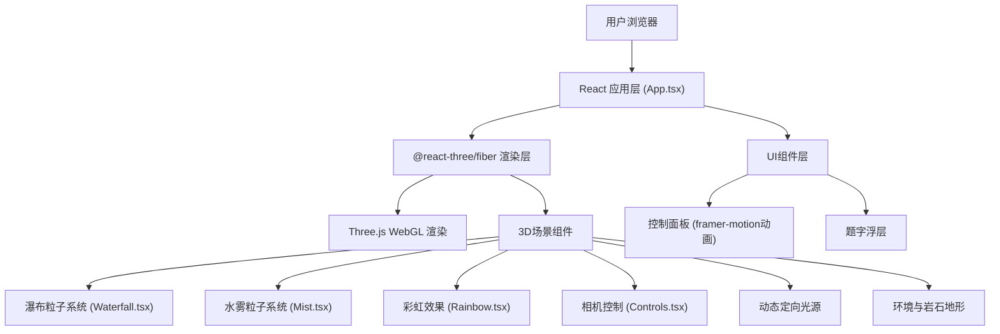

## 1. 架构设计



## 2. 技术描述

- **前端框架**：React 18 + TypeScript 5
- **构建工具**：Vite 5 + @vitejs/plugin-react
- **3D渲染引擎**：Three.js r160
- **React 3D绑定**：@react-three/fiber 8.x
- **3D辅助组件**：@react-three/drei 9.x
- **动画库**：framer-motion 11.x
- **初始化方式**：npm create vite@latest

## 3. 项目结构

```
auto138/
├── package.json
├── vite.config.js
├── tsconfig.json
├── index.html
└── src/
    ├── App.tsx                    # 主应用组件
    ├── main.tsx                   # 应用入口
    ├── index.css                  # 全局样式
    ├── components/
    │   ├── Waterfall.tsx          # 瀑布粒子系统
    │   ├── Mist.tsx               # 水雾粒子系统
    │   └── Rainbow.tsx            # 彩虹效果
    └── scene/
        ├── Controls.tsx           # 相机控制器
        ├── Terrain.tsx            # 岩石地形
        └── Lighting.tsx           # 光照系统
```

## 4. 核心数据结构与类型定义

```typescript
// 粒子基础数据
interface ParticleData {
  position: Float32Array;    // 粒子位置 [x, y, z, ...]
  velocity: Float32Array;    // 粒子速度 [vx, vy, vz, ...]
  color: Float32Array;       // 粒子颜色 [r, g, b, ...]
  size: Float32Array;        // 粒子尺寸
  opacity: Float32Array;     // 粒子透明度
}

// 光照配置
interface LightingConfig {
  elevation: number;         // 仰角 10-80度
  azimuth: number;           // 方位角 0-360度
  intensity: number;         // 光照强度
}

// 彩虹配置
interface RainbowConfig {
  radius: number;            // 彩虹半径
  thickness: number;         // 彩虹厚度
  opacity: number;           // 基础透明度
}

// 相机控制状态
interface CameraState {
  target: [number, number, number];  // 观察目标点
  minDistance: number;               // 最小距离
  maxDistance: number;               // 最大距离
  minPolarAngle: number;             // 最小极角
  maxPolarAngle: number;             // 最大极角
}
```

## 5. 核心实现方案

### 5.1 瀑布粒子系统 (Waterfall.tsx)
- 使用 `THREE.BufferGeometry` + `THREE.Points` 实现高性能渲染
- 粒子数量：3000个，位置、速度、颜色存储在BufferAttribute中
- 下落物理：模拟重力加速度 `g = 9.8`，初始速度0，随时间加速
- 粒子回收：粒子落到底部后重置到顶部随机位置
- 颜色渐变：根据粒子高度在 `#a0d8ef` 到 `#1a5276` 之间插值

### 5.2 水雾粒子系统 (Mist.tsx)
- 粒子数量：1500个，从岩石区域随机生成
- 上升速度：0.2-0.5单位/秒，水平方向随机漂移
- 粒子生长：尺寸从0.2线性增长到1.2
- 透明度衰减：从0.8线性衰减到0
- 使用 `AdditiveBlending` 混合模式增强雾气效果

### 5.3 彩虹效果 (Rainbow.tsx)
- 使用 `THREE.TorusGeometry` 创建半圆环几何体
- 七色渐变材质：红、橙、黄、绿、蓝、靛、紫
- 位置计算：始终与光照方向相反，位于水雾后方
- 透明度计算：基于视角与光照方向的夹角，以及水雾密度估计
- 使用自定义ShaderMaterial实现渐变和透明效果

### 5.4 相机控制 (Controls.tsx)
- 基于 `@react-three/drei` 的 `OrbitControls`
- 自定义阻尼参数：`enableDamping: true`, `dampingFactor: 0.08`
- 旋转限制：方位角无限制（360°），极角限制 30°-150°（约±60°）
- 缩放限制：距离限制 5-50单位（约0.5-5倍）
- 提供重置视角方法

### 5.5 性能优化
- 使用 `BufferGeometry` 而非 `Geometry`
- 粒子更新在GPU友好的 `useFrame` 钩子中进行
- 避免在渲染循环中创建新对象
- 使用 `frustumCulled: false` 确保粒子不被视锥体剔除
- 合理设置 `pixelRatio` 平衡画质与性能
