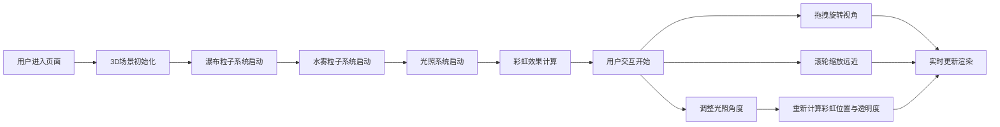

## 1. 产品概述

本项目是一个沉浸式3D古代山水画风格的瀑布可视化交互应用，用户可在虚拟庐山瀑布旁自由探索，感受自然之美。

- 核心目的：通过WebGL技术重现古代文人墨客笔下的庐山瀑布胜景，提供沉浸式的自然景观观赏体验
- 目标用户：艺术爱好者、文化学习者、3D交互体验探索者
- 产品价值：将传统山水画意境与现代3D技术结合，创造独特的文化与科技融合体验

## 2. 核心功能

### 2.1 功能模块

1. **主场景页面**：3D瀑布全景展示、交互控制、动态光照
2. **控制面板**：光照角度调节、视角重置、参数配置

### 2.2 页面详情

| 页面名称 | 模块名称 | 功能描述 |
|-----------|-------------|---------------------|
| 主场景页面 | 瀑布粒子系统 | 20单位高、5单位宽水帘，数千半透明蓝色粒子，模拟重力下落，颜色渐变 |
| 主场景页面 | 水雾气粒子系统 | 底部岩石区持续生成水雾，缓慢上升扩散，透明度衰减 |
| 主场景页面 | 彩虹效果 | 动态计算阳光与视角，渲染半圆环七色渐变彩虹 |
| 主场景页面 | 3D交互控制 | 鼠标拖拽360°旋转、滚轮缩放、阻尼平滑效果 |
| 控制面板 | 光照调节滑块 | 仰角10°-80°、方位角0°-360°实时调节太阳位置 |
| 控制面板 | 重置视角按钮 | 一键恢复默认观察视角 |

## 3. 核心流程

## 4. 用户界面设计

### 4.1 设计风格
- **主色调**：深色背景 `#0b1a2e`，营造夜晚或幽暗山谷氛围
- **点缀色**：金色题字 `#c9a96e`，瀑布蓝色渐变 `#a0d8ef` → `#1a5276`，岩石灰褐色 `#5d4e37`
- **字体**：楷体用于题字，现代无衬线字体用于控制面板
- **UI风格**：毛玻璃半透明控制面板，淡雅古风，避免过多装饰
- **动效**：淡入淡出过渡动画，流畅的粒子运动

### 4.2 页面设计概述

| 页面名称 | 模块名称 | UI元素 |
|-----------|-------------|-------------|
| 主场景页面 | 3D场景 | 深色背景、瀑布水帘、水雾粒子、彩虹、远景山体、岩石 |
| 主场景页面 | 题字 | 左上角金色楷体"庐山瀑布"，半透明浮动效果 |
| 主场景页面 | 控制面板 | 右侧边缘毛玻璃效果面板，含两个滑块、一个按钮 |
| 控制面板 | 光照控制 | 仰角滑块、方位角滑块、数值显示 |
| 控制面板 | 视角控制 | 重置按钮，悬停高亮效果 |

### 4.3 响应式设计
- 桌面端优先设计，全屏3D场景
- 控制面板在移动端可折叠或调整位置
- 触摸设备支持手势旋转与缩放

### 4.4 3D场景指导
- **环境氛围**：古代山水画意境，雾气朦胧，色调淡雅
- **光照设置**：动态定向光源模拟太阳，默认右上45°照射，可调节角度
- **相机设置**：初始位置距离瀑布约15单位，高度10单位，看向瀑布中心；OrbitControls限制极角±60°，距离0.5-5倍缩放
- **构图元素**：瀑布为视觉中心，底部岩石、上方崖顶、两侧远景山体作为衬托
- **交互动画**：粒子持续运动，彩虹随光照/视角变化透明度，相机阻尼平滑
- **后期效果**：轻微雾效增强空间感，半透明粒子叠加营造朦胧美
- **性能预算**：粒子总数控制在5000以内，使用BufferGeometry和Points，目标帧率60fps
