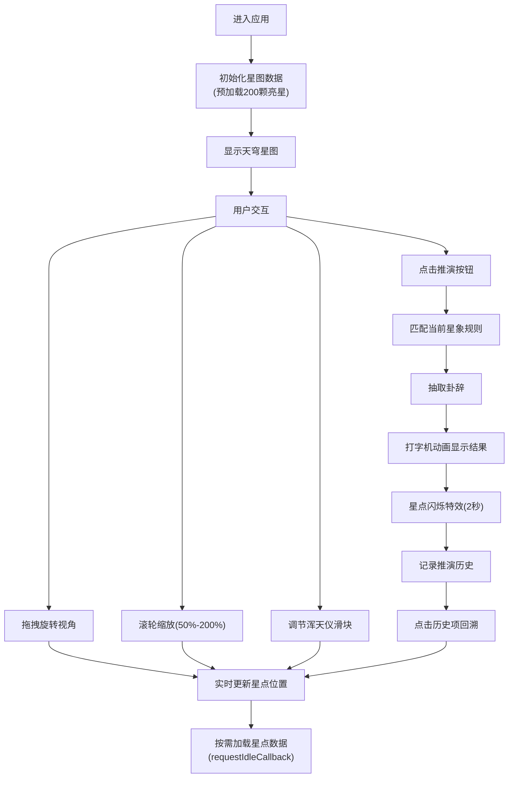

## 1. 产品概述

基于浏览器的古代星象占卜Web应用，模拟宋代司天监观星场景，用户可通过浑天仪控制面板观察28宿星辰位置变化，并依据星象推演吉凶征兆。

- 核心价值：将中国古代天文学与占卜文化融合，提供沉浸式观星占卜体验
- 目标用户：对中国古代天文、占卜文化感兴趣的用户，教育及文化传播场景

## 2. 核心功能

### 2.1 功能模块

1. **星图绘制模块**：Canvas绘制圆形天穹、28宿星点、星官连线、赤经刻度，支持鼠标拖拽旋转和滚轮缩放
2. **浑天仪控制模块**：赤经/赤纬滑块控制，实时更新星点位置，显示当前星宿信息
3. **星象推演模块**：匹配星象规则，生成占卜结果，打字机动画显示，星点闪烁特效
4. **卦辞记录模块**：卦辞库随机抽取，吉凶评级，历史记录列表（20条），支持回溯星图状态

### 2.2 页面详情

| 页面名称 | 模块名称 | 功能描述 |
|---------|---------|---------|
| 观星台主界面 | 天穹星图 | 直径600px圆形天穹，深蓝渐变背景，28宿金色星点，半透明白色虚线连线，360°赤经刻度 |
| 观星台主界面 | 浑天仪控制面板 | 左侧悬浮面板，赤经(-180°~+180°)、赤纬(-90°~+90°)滑块，当前星宿显示 |
| 观星台主界面 | 推演按钮 | 右侧暗红木色按钮，悬停变色上浮，内阴影效果 |
| 观星台主界面 | 推演面板 | 右下角古纸色面板，楷体文字，打字机动画显示占卜结果 |
| 观星台主界面 | 历史记录侧边栏 | 推演记录列表，时间倒序，点击回溯星图状态 |

## 3. 核心流程

## 4. 用户界面设计

### 4.1 设计风格
- **整体风格**：深色太空主题，古风与科技感融合
- **主色调**：深蓝夜空#1a1a2e，石板蓝#16213e，侧栏#0f3460，供案红木#e94560，星点金色#f9a826
- **背景**：径向渐变#0a0a2a至#050510，天穹叠加星云噪点纹理
- **面板效果**：半透明玻璃质感(backdrop-filter: blur(8px))，圆角12px，蓝灰色边框
- **字体**：推演面板使用楷体模拟古风，其余使用现代无衬线字体
- **动画**：全局过渡0.3s ease，星点移动0.2s ease-out，按钮悬停上浮translateY(-2px)

### 4.2 页面设计概览

| 页面名称 | 模块名称 | UI元素 |
|---------|---------|---------|
| 观星台主界面 | 天穹星图 | 圆形Canvas，深蓝渐变，金色星点(2-6px随亮度变化)，白色虚线连线，白色刻度线 |
| 观星台主界面 | 浑天仪控制面板 | 半透明蓝灰背景，宽度220px，滑块控件，星宿信息显示 |
| 观星台主界面 | 推演按钮 | 暗红木色#8b4513，悬停#a0522d，圆角6px，内阴影 |
| 观星台主界面 | 推演面板 | 古纸色#f5deb3背景，深褐#4a2a0a文字，楷体，280x160px |
| 观星台主界面 | 历史记录 | 侧边栏列表，时间倒序，最多20条，星宿+征兆+吉凶 |

### 4.3 响应式设计
- **桌面端(≥768px)**：星图直径600px，左侧控制面板220px，右侧推演面板280x160px
- **移动端(<768px)**：星图直径360px，控制面板顶部全宽横条，推演面板底部全宽横条，高度自适应

### 4.4 动画效果
- **星点闪烁**：CSS关键帧，透明度0.3-1.0，频率8Hz，持续2秒
- **打字机效果**：逐字显示推演结果
- **按钮悬停**：translateY(-2px)，0.2s过渡
- **星点移动**：transform过渡，0.2s ease-out
- **面板淡入淡出**：framer-motion动画

## 5. 性能要求
- 渲染帧率：稳定55fps以上（Chrome 6倍CPU降速）
- 交互响应：滑块/缩放操作响应时间≤50ms
- 动画性能：推演动画不阻塞主线程超过16ms
- 数据优化：Float32Array存储星点位置，首屏预加载200颗亮星，其余按需分批加载
