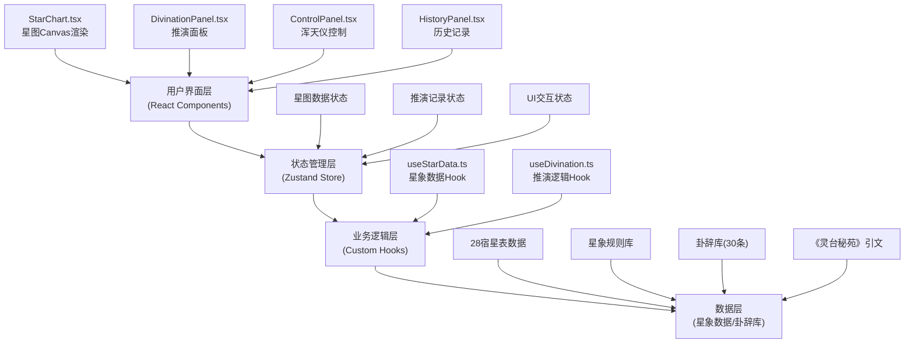

## 1. 架构设计



## 2. 技术描述

- **前端框架**：React@18 + TypeScript@5
- **构建工具**：Vite@5 + @vitejs/plugin-react@4
- **状态管理**：Zustand@4
- **动画库**：Framer Motion@11
- **样式方案**：原生CSS (global.css) + CSS变量
- **渲染技术**：Canvas 2D API
- **性能优化**：requestIdleCallback、Float32Array、requestAnimationFrame

## 3. 项目文件结构

```
├── package.json              # 项目依赖与脚本
├── vite.config.js            # Vite构建配置
├── tsconfig.json             # TypeScript配置(严格模式, ES2020)
├── index.html                # 入口HTML(viewport适配)
└── src/
    ├── App.tsx               # 应用主组件(路由/全局状态)
    ├── main.tsx              # 应用入口
    ├── components/
    │   ├── StarChart.tsx     # 星图绘制组件(Canvas)
    │   ├── DivinationPanel.tsx  # 推演面板组件
    │   ├── ControlPanel.tsx  # 浑天仪控制面板
    │   └── HistoryPanel.tsx  # 历史记录面板
    ├── hooks/
    │   ├── useStarData.ts    # 星象数据自定义Hook
    │   └── useDivination.ts  # 推演逻辑Hook
    ├── store/
    │   └── useStarStore.ts   # Zustand全局状态
    ├── data/
    │   ├── constellations.ts # 28宿星表数据
    │   ├── omenRules.ts      # 星象规则库
    │   └── divinations.ts    # 卦辞库(30条)
    ├── types/
    │   └── index.ts          # TypeScript类型定义
    └── styles/
        └── global.css        # 全局样式
```

## 4. 核心数据模型

### 4.1 类型定义

```typescript
// 星点数据
interface Star {
  id: string;
  x: number;      // 赤经 (0-360)
  y: number;      // 赤纬 (-90-90)
  brightness: number;  // 亮度 (0-1)
  constellation: string;  // 所属星宿
  name: string;   // 星官名称
}

// 星宿数据
interface Constellation {
  id: string;
  name: string;   // 星宿名 (角、亢、氐...)
  mansion: '紫微垣' | '太微垣' | '天市垣';
  stars: Star[];
  connections: [number, number][];  // 星点连线索引
}

// 星象规则
interface OmenRule {
  id: string;
  name: string;   // 征兆名 (五星连珠、荧惑守心...)
  condition: (state: StarState) => boolean;
  description: string;
}

// 卦辞
interface Divination {
  id: string;
  omenName: string;
  constellation: string;
  fortune: '大吉' | '吉' | '平' | '凶' | '大凶';
  text: string;   // 卦辞内容
  quote: string;  // 《灵台秘苑》引文
}

// 推演记录
interface HistoryRecord {
  id: string;
  timestamp: number;
  constellation: string;
  omenName: string;
  fortune: string;
  raOffset: number;   // 赤经偏移
  decOffset: number;  // 赤纬偏移
  zoom: number;       // 缩放比例
  divination: Divination;
}

// 星图状态
interface StarState {
  raOffset: number;   // 赤经偏移 (-180~180)
  decOffset: number;  // 赤纬偏移 (-90~90)
  zoom: number;       // 缩放 (0.5~2.0)
  stars: Float32Array;  // 星点位置缓冲 [x,y,brightness,...]
  isFlashing: boolean;  // 星点闪烁状态
}
```

### 4.2 Zustand Store 定义

```typescript
import { create } from 'zustand';

interface StarStore {
  // 星图状态
  raOffset: number;
  decOffset: number;
  zoom: number;
  isFlashing: boolean;
  
  // 数据状态
  visibleStars: Star[];
  allStars: Star[];
  constellations: Constellation[];
  
  // 推演状态
  currentDivination: Divination | null;
  isTyping: boolean;
  history: HistoryRecord[];
  
  // Actions
  setRaOffset: (offset: number) => void;
  setDecOffset: (offset: number) => void;
  setZoom: (zoom: number) => void;
  setFlashing: (flashing: boolean) => void;
  loadMoreStars: (count: number) => void;
  performDivination: () => void;
  loadHistoryRecord: (id: string) => void;
}
```

## 5. 核心算法与优化

### 5.1 星点坐标转换算法
```
屏幕坐标 = 天球坐标转换函数(赤经, 赤纬, 偏移, 缩放)
  - 赤经转换: screenX = centerX + (ra + raOffset) * scale * cos(dec)
  - 赤纬转换: screenY = centerY + (dec + decOffset) * scale
  - 缩放应用: scale = baseScale * zoom
```

### 5.2 性能优化策略
1. **分批次加载**：首屏加载200颗最亮星，其余1800颗通过`requestIdleCallback`分批加载，每批最多50颗
2. **内存优化**：星点位置使用`Float32Array`存储，减少内存占用75%
3. **视口裁剪**：渲染时只计算视口范围内的星点位置矩阵
4. **增量更新**：只更新变化的星点，避免全量重计算
5. **RAF调度**：所有动画使用`requestAnimationFrame`统一调度

### 5.3 星象匹配算法
```
匹配流程：
1. 获取当前浑天仪指向区域 (中心点经纬度)
2. 计算该区域内主要星宿
3. 遍历星象规则库，计算规则匹配度
4. 返回匹配度最高的星象征兆
5. 从卦辞库中随机抽取对应卦辞
```

## 6. API 定义（前端内部接口）

| 函数名 | 用途 | 参数 | 返回值 |
|-------|------|------|-------|
| `useStarData()` | 星象数据Hook | - | `{ stars, updatePosition, loadMore }` |
| `useDivination()` | 推演逻辑Hook | - | `{ divinate, typingText }` |
| `projectStar(ra, dec, offset)` | 坐标投影 | ra, dec, offset | `{ x, y, visible }` |
| `matchOmen(state)` | 星象匹配 | StarState | OmenRule |
| `generateDivination(omen)` | 生成卦辞 | OmenRule | Divination |

## 7. 性能指标与测试

| 指标 | 目标值 | 测试环境 |
|-----|-------|---------|
| 渲染帧率 | ≥55fps | Chrome DevTools 6倍CPU降速 |
| 交互响应 | ≤50ms | 滑块拖动、滚轮缩放 |
| 主线程阻塞 | ≤16ms | 推演动画期间 |
| 内存占用 | ≤50MB | 2000颗星点全加载 |
| 首屏加载 | ≤1.5s | 4G网络，无缓存 |
