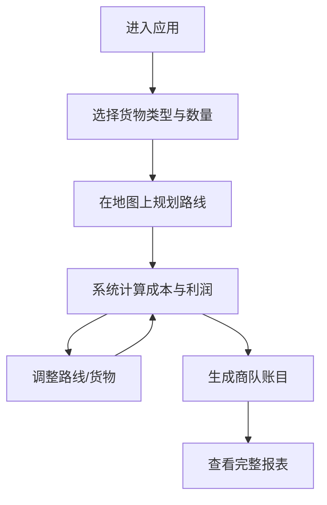

## 1. 产品概述

黑水城商队账目是一款模拟古代西夏商队贸易的全栈Web应用。用户扮演西夏商队首领，在虚拟沙盘上规划从黑水城出发前往西域各城镇的贸易路线，系统自动计算运输成本与利润，生成完整的商队账目。

- 核心目标：通过沉浸式的古丝绸之路贸易模拟，让用户体验古代商队决策的复杂性与乐趣
- 目标用户：历史爱好者、策略游戏玩家、对古代贸易感兴趣的普通用户
- 市场价值：融合历史文化与策略规划的创新交互体验

## 2. 核心功能

### 2.1 用户角色
| 角色 | 注册方式 | 核心权限 |
|------|---------|----------|
| 商队首领 | 无需注册，直接使用 | 规划路线、选择货物、查看账目、生成报表 |

### 2.2 功能模块
1. **货物与城镇面板**：左侧可拖拽选择货物类型与数量，展示西域各城镇列表
2. **交互式沙盘地图**：中间SVG绘制的可拖拽缩放地图，显示地形、路线与风险标记
3. **成本与利润面板**：右侧实时更新运输成本明细、利润预览与风险指数
4. **账目生成系统**：根据路线与货物自动生成完整商队账目报表

### 2.3 页面详情
| 页面名称 | 模块名称 | 功能描述 |
|---------|---------|----------|
| 主页面 | 三栏布局 | 左侧货物城镇、中间沙盘地图、右侧成本明细 |
| 主页面 | 货物拖拽 | 拖拽选择货物类型、调整数量 |
| 主页面 | 路线规划 | 点击城镇添加到路线，支持拖拽调整顺序 |
| 主页面 | 地形显示 | SVG地图展示沙漠、绿洲、戈壁等地形 |
| 主页面 | 风险标记 | 显示沙暴、马贼等风险区域 |
| 主页面 | 成本计算 | 实时计算运输成本、利润、风险指数 |
| 主页面 | 账目生成 | 生成完整的商队账目报表 |

## 3. 核心流程

用户进入应用后，首先从左侧面板拖拽选择要运输的货物类型和数量，然后在中间沙盘地图上依次点击途经的城镇规划贸易路线。系统根据路线长度、地形类型和风险分布，通过后端API实时计算运输成本、预期利润和风险指数，并在右侧面板更新。用户调整路线或货物时，所有数据实时联动，最终可生成一份完整的商队账目。

## 4. 用户界面设计

### 4.1 设计风格
- **主色调**：土黄色 `#c2a37a` 作为背景主色，暗红色 `#8b3a3a` 作为强调色
- **视觉主题**：羊皮卷风格，纸质颗粒纹理背景，模仿古代卷轴质感
- **按钮与边框**：模仿墨迹笔触效果，边缘不规则，有毛笔书写的质感
- **点击反馈**：墨迹扩散的波纹效果，点击时从点击点向外扩散深褐色半透明圆环
- **字体**：使用衬线字体模拟古代书法风格，标题用加粗的书法字体，正文用清晰易读的衬线字体
- **布局**：三栏布局，左右两栏固定宽度，中间自适应，整体呈现古典卷轴展开的效果

### 4.2 页面设计概述
| 页面名称 | 模块名称 | UI元素 |
|---------|---------|--------|
| 主页面 | 货物面板 | 羊皮纸背景卡片，货物图标，拖拽手柄，数量加减按钮，墨迹边框 |
| 主页面 | 城镇列表 | 竖排城镇名称，点击高亮，已选城镇显示路线序号 |
| 主页面 | 沙盘地图 | SVG地形图，沙漠（金色颗粒）、绿洲（深绿色块）、戈壁（灰褐色），可拖拽缩放，城镇标记为古代驿站图标 |
| 主页面 | 路线绘制 | 暗红色墨迹线条连接城镇，箭头指示方向 |
| 主页面 | 风险标记 | 沙暴用旋转的黄色漩涡图标，马贼用红色马头图标 |
| 主页面 | 成本面板 | 分类账目表格，收入支出用不同颜色，利润总计用大字号强调 |
| 主页面 | 动画效果 | 页面加载时卷轴展开动画，数据变化时数字滚动效果，切换面板时平滑过渡 |

### 4.3 响应性
- 桌面端优先设计，三栏布局
- 平板端：左右面板可折叠收起
- 移动端：改为上下堆叠布局，通过标签页切换三个模块
- 触摸优化：支持双指缩放地图，长按拖拽货物

### 4.4 SVG场景设计
- **地图区域**：800x600 SVG视口，使用viewBox支持缩放
- **地形图层**：底层使用路径绘制地形边界，填充使用pattern模拟颗粒纹理
- **城镇标记**：圆形驿站图标，悬停时放大并显示城镇名称
- **路线图层**：贝塞尔曲线连接城镇，虚线动画模拟商队行进
- **风险区域**：半透明色块覆盖，带有动画警示效果
- **装饰元素**：四角绘制古典花纹边框，顶部绘制卷轴标题栏
