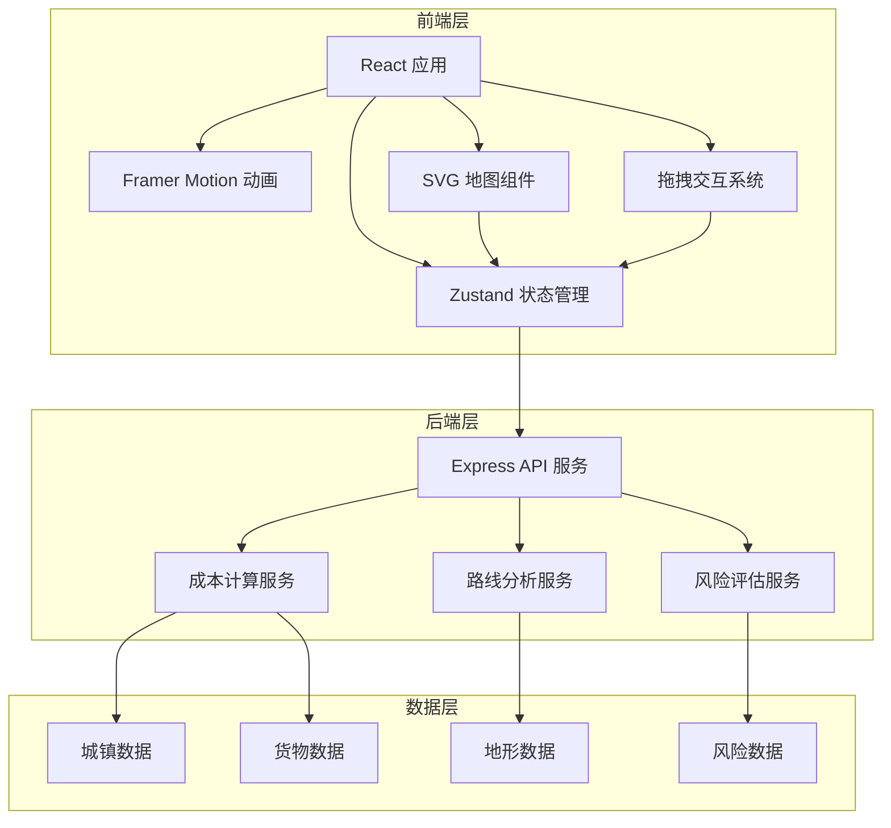
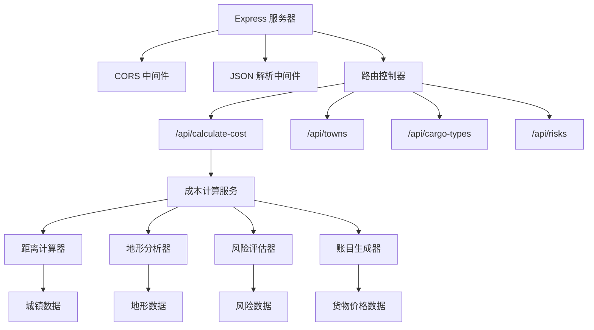
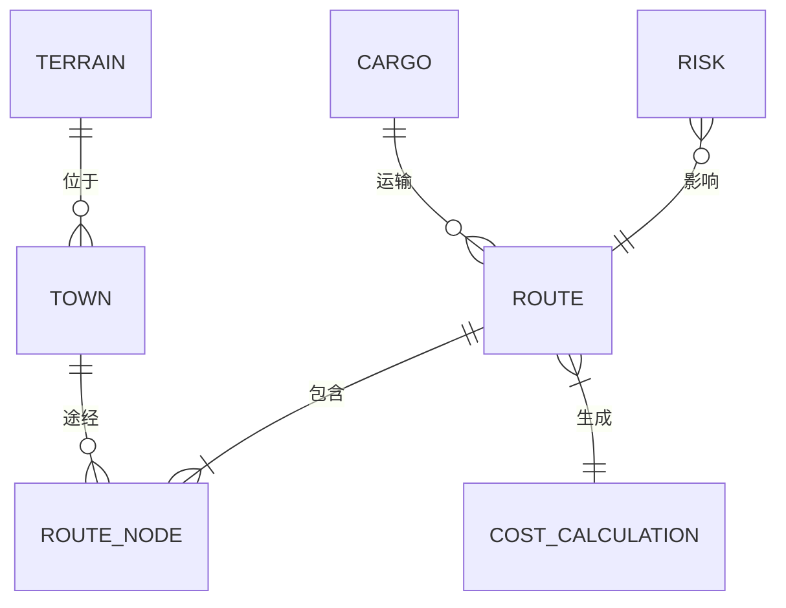

## 1. 架构设计



## 2. 技术描述

- **前端框架**：React 18 + TypeScript 5
- **构建工具**：Vite 5 + @vitejs/plugin-react
- **状态管理**：Zustand 4
- **动画库**：Framer Motion 11
- **后端服务**：Express 4 + TypeScript
- **图标**：Lucide React（古风化处理）
- **样式方案**：CSS Modules + CSS Variables（主题化管理）
- **数据存储**：前端内存状态 + 后端静态数据（无数据库）

## 3. 路由定义

| 路由 | 用途 |
|------|------|
| `/` | 主应用页面，包含三栏布局的完整贸易界面 |

## 4. API 定义

### 4.1 TypeScript 类型定义

```typescript
// 货物类型
interface Cargo {
  id: string;
  name: string;
  icon: string;
  basePrice: number;
  weight: number;
  quantity: number;
  description: string;
}

// 城镇类型
interface Town {
  id: string;
  name: string;
  x: number;
  y: number;
  type: 'oasis' | 'desert' | 'gobi' | 'fortress';
  description: string;
  priceModifiers: Record<string, number>;
}

// 地形类型
interface Terrain {
  type: 'desert' | 'oasis' | 'gobi' | 'mountain';
  costMultiplier: number;
  speedMultiplier: number;
  riskLevel: number;
}

// 风险事件
interface Risk {
  id: string;
  type: 'sandstorm' | 'bandits' | 'plague' | 'drought';
  x: number;
  y: number;
  radius: number;
  probability: number;
  impact: {
    cost: number;
    delay: number;
    cargoLoss: number;
  };
}

// 路线节点
interface RouteNode {
  townId: string;
  order: number;
  arrivalDay?: number;
}

// 成本计算请求
interface CostCalculationRequest {
  cargo: Cargo[];
  route: RouteNode[];
  caravanSize: number;
}

// 成本计算响应
interface CostCalculationResponse {
  totalDistance: number;
  totalDays: number;
  transportationCost: number;
  foodCost: number;
  laborCost: number;
  accommodationCost: number;
  riskCost: number;
  totalCost: number;
  expectedRevenue: number;
  expectedProfit: number;
  profitMargin: number;
  riskIndex: number;
  riskAssessment: string;
  terrainBreakdown: Array<{
    type: string;
    distance: number;
    percentage: number;
  }>;
  ledgerEntries: Array<{
    category: string;
    description: string;
    amount: number;
    type: 'income' | 'expense';
  }>;
}
```

### 4.2 API 端点

| 方法 | 路径 | 描述 |
|------|------|------|
| POST | `/api/calculate-cost` | 计算运输成本与利润 |
| GET | `/api/towns` | 获取所有城镇数据 |
| GET | `/api/cargo-types` | 获取所有货物类型 |
| GET | `/api/risks` | 获取风险区域数据 |

## 5. 后端架构



## 6. 数据模型

### 6.1 数据关系图



### 6.2 核心数据结构

#### 城镇数据
```json
{
  "id": "khara-khoto",
  "name": "黑水城",
  "x": 400,
  "y": 300,
  "type": "fortress",
  "description": "西夏王朝重要军事城镇，丝绸之路北道重镇",
  "priceModifiers": {
    "silk": 1.2,
    "spice": 0.8,
    "jade": 1.5,
    "tea": 0.9
  }
}
```

#### 货物数据
```json
{
  "id": "silk",
  "name": "丝绸",
  "icon": "🧵",
  "basePrice": 100,
  "weight": 5,
  "description": "来自中原的上等丝绸，西域诸国趋之若鹜"
}
```

#### 地形数据
```json
{
  "desert": {
    "costMultiplier": 2.0,
    "speedMultiplier": 0.6,
    "riskLevel": 3
  },
  "oasis": {
    "costMultiplier": 0.5,
    "speedMultiplier": 1.2,
    "riskLevel": 1
  }
}
```

### 6.3 前端状态管理（Zustand Store）

```typescript
interface AppState {
  // 货物状态
  selectedCargo: Cargo[];
  addCargo: (cargo: Cargo) => void;
  removeCargo: (cargoId: string) => void;
  updateCargoQuantity: (cargoId: string, quantity: number) => void;
  
  // 路线状态
  route: RouteNode[];
  addTownToRoute: (townId: string) => void;
  removeTownFromRoute: (townId: string) => void;
  reorderRoute: (fromIndex: number, toIndex: number) => void;
  clearRoute: () => void;
  
  // 计算结果
  calculationResult: CostCalculationResponse | null;
  calculateCosts: () => Promise<void>;
  
  // UI 状态
  mapScale: number;
  mapOffset: { x: number; y: number };
  setMapTransform: (scale: number, offset: { x: number; y: number }) => void;
  
  // 参考数据
  towns: Town[];
  cargoTypes: Cargo[];
  risks: Risk[];
  loadReferenceData: () => Promise<void>;
}
```

## 7. 性能优化策略

1. **SVG 地图性能**：
   - 使用 `transform` 进行平移和缩放，避免重排重绘
   - 事件委托处理地图元素交互
   - 使用 `requestAnimationFrame` 确保 60fps 动画
   - 分层渲染：地形层、路线层、标记层分离

2. **状态更新优化**：
   - Zustand 选择器避免不必要的重渲染
   - 防抖处理货物数量调整触发的计算
   - 批量更新路线变更

3. **动画性能**：
   - 使用 transform 和 opacity 属性动画
   - 减少动画元素数量，使用 CSS 变量控制
   - 离屏渲染复杂图形

4. **API 优化**：
   - 后端计算结果缓存
   - 增量更新：只重新计算变更部分
