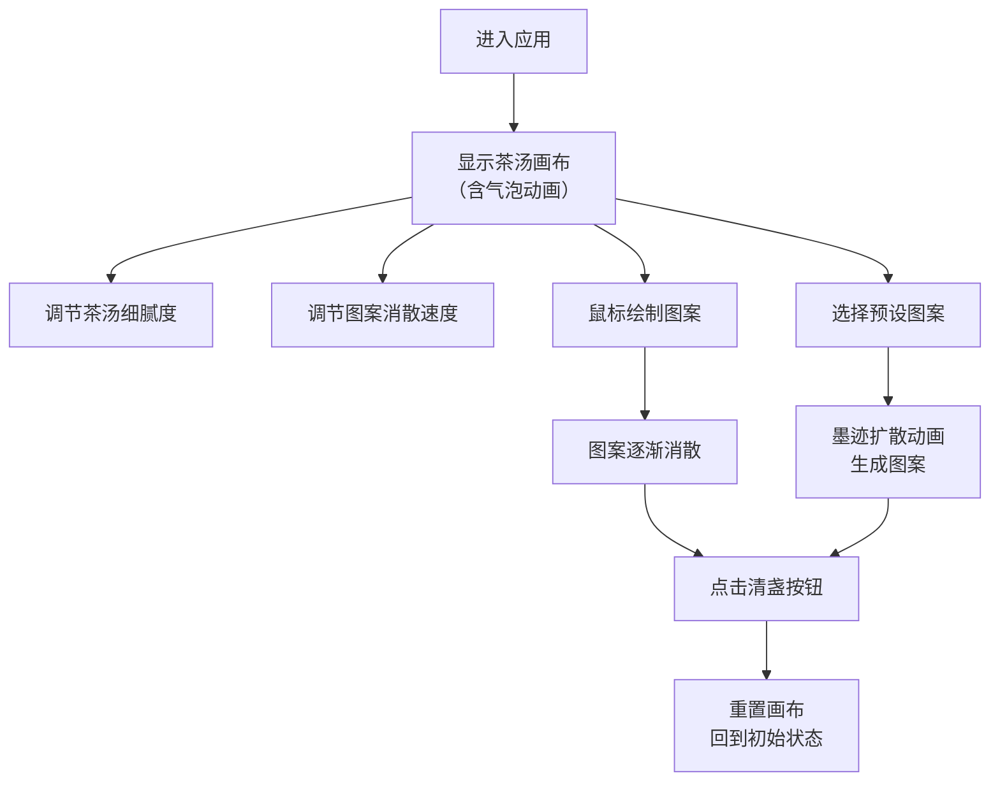

## 1. 产品概述

宋代茶百戏交互模拟与鉴赏工具，让用户在虚拟茶案前体验宋代点茶与分茶的雅致情趣，通过茶筅击拂茶汤，在茶面上绘制花鸟鱼虫等图案，感受中华传统茶文化的独特魅力。

- 核心目标：还原宋代茶百戏的艺术体验，让现代用户感受传统茶文化
- 目标用户：茶文化爱好者、传统文化学习者、艺术欣赏者
- 市场价值：传承中华茶文化，提供沉浸式传统艺术交互体验

## 2. 核心功能

### 2.1 功能模块

1. **操作面板**：茶汤细腻度调节、图案消散速度调节、清盏重置功能、预设图案选择
2. **茶汤画布**：茶汤物理效果模拟、气泡动态效果、鼠标绘制交互、图案消散动画
3. **预设图案**：寒梅、竹影、游鱼、飞鹤四种经典茶百戏图案一键生成

### 2.3 页面详情

| 页面名称 | 模块名称 | 功能描述 |
|-----------|-------------|---------------------|
| 主页面 | 操作面板 | 调节茶汤细腻度滑块（影响气泡密度与持久度），调节图案消散速度滑块（30秒-5分钟可调），"清盏"按钮重置画布，四种预设图案选择按钮 |
| 主页面 | 茶汤画布 | 4:3比例的Canvas画布，模拟浅黄绿色茶汤表面，细微气泡漂浮和消散动画，鼠标自由绘制线条，图案随时间模糊扩散消散，预设图案墨迹扩散动画 |

## 3. 核心流程

用户进入应用后，首先看到浅黄绿色茶汤表面和漂浮的气泡。可以通过左侧面板调节茶汤细腻度和图案消散速度。用户可用鼠标在画布上自由绘制图案，线条粗细随鼠标速度变化（慢速粗、快速细）。绘制的图案会随时间逐渐消散，消散速度可调节。点击预设图案按钮可一键生成经典茶百戏图案，伴有墨迹扩散动画。点击"清盏"按钮可重置画布。

## 4. 用户界面设计

### 4.1 设计风格

- **主色调**：米白#f5f0e1为基底，营造宣纸质感
- **点缀色**：墨黑#3a2a1a用于文字和边框，茶绿#6b8e23用于交互元素
- **绘制色**：深褐#4a3728用于茶画线条
- **按钮风格**：模仿竹简纹理，带有木纹质感，圆角设计
- **字体**：使用古典雅致的中文字体，标题使用书法风格字体
- **背景**：轻微宣纸颗粒纹理，营造宋代文人书房氛围
- **整体风格**：朴素淡雅，留白得当，体现宋代美学的简约意境

### 4.2 页面设计概述

| 页面名称 | 模块名称 | UI元素 |
|-----------|-------------|-------------|
| 主页面 | 操作面板 | 竹简风格面板、滑块控件（带刻度标签）、文字说明、预设图案按钮（带图案预览）、清盏按钮（突出显示） |
| 主页面 | 茶汤画布 | 4:3比例画布、茶汤渐变底色、气泡动画、深褐色绘制线条、图案消散模糊效果、墨迹扩散动画 |

### 4.3 响应式设计

- **桌面端**：左右布局，左侧操作面板占25%宽度，右侧茶汤画布占75%宽度，画布保持4:3比例居中
- **移动端**：自动切换为上下布局，操作面板在上，画布在下，画布高度自适应屏幕高度，确保触摸交互流畅
- **触摸优化**：移动端支持触摸绘制，增大滑块和按钮的点击区域

## 5. 性能要求

- Canvas动画帧率稳定在60fps
- 气泡数量控制在100个以内
- 图案消散计算使用requestAnimationFrame优化
- 内存管理得当，避免长时间运行导致性能下降
