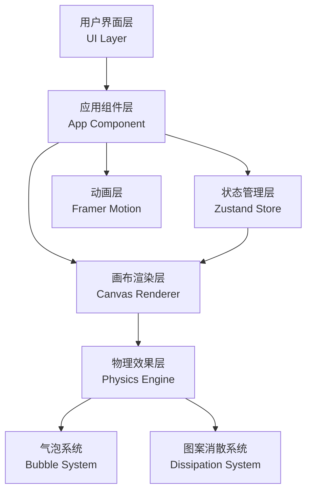

## 1. 架构设计

本项目为纯前端React应用，采用分层架构设计。



## 2. 技术描述

- **前端框架**：React 18 + TypeScript
- **构建工具**：Vite 5
- **状态管理**：Zustand
- **动画库**：Framer Motion
- **渲染技术**：HTML5 Canvas 2D API
- **包管理器**：npm

### 依赖说明
```json
{
  "react": "^18.2.0",
  "react-dom": "^18.2.0",
  "typescript": "^5.3.0",
  "vite": "^5.0.0",
  "@vitejs/plugin-react": "^4.2.0",
  "framer-motion": "^10.16.0",
  "zustand": "^4.4.0"
}
```

## 3. 项目结构

```
auto148/
├── index.html                 # 入口HTML文件
├── package.json               # 项目依赖配置
├── tsconfig.json              # TypeScript配置
├── vite.config.js             # Vite构建配置
└── src/
    ├── App.tsx               # 主应用组件
    ├── main.tsx              # 应用入口
    ├── vite-env.d.ts         # Vite类型定义
    ├── components/
    │   ├── TeaCanvas.tsx     # 核心画布组件
    │   └── ControlPanel.tsx  # 操作面板组件
    ├── store/
    │   └── teaStore.ts       # Zustand状态管理
    ├── utils/
    │   ├── bubbleSystem.ts   # 气泡物理系统
    │   ├── dissipationSystem.ts # 图案消散系统
    │   └── presetPatterns.ts # 预设图案数据
    └── styles/
        └── global.css        # 全局样式
```

## 4. 状态管理设计

### 4.1 状态定义

```typescript
interface TeaState {
  // 茶汤细腻度：1-10，影响气泡密度与持久度
  teaFineness: number;
  // 图案消散速度：30-300秒
  dissipationSpeed: number;
  // 当前茶面上的绘制点集合
  drawingPoints: DrawPoint[];
  // 气泡集合
  bubbles: Bubble[];
  // 画布尺寸
  canvasWidth: number;
  canvasHeight: number;
  // 是否正在绘制
  isDrawing: boolean;
  // 当前预设图案
  currentPattern: string | null;
  
  // Actions
  setTeaFineness: (value: number) => void;
  setDissipationSpeed: (value: number) => void;
  addDrawingPoint: (point: DrawPoint) => void;
  clearCanvas: () => void;
  addBubble: (bubble: Bubble) => void;
  removeBubble: (id: string) => void;
  updateBubbles: (bubbles: Bubble[]) => void;
  loadPresetPattern: (patternName: string) => void;
  setDrawing: (isDrawing: boolean) => void;
}
```

### 4.2 数据类型定义

```typescript
interface DrawPoint {
  x: number;
  y: number;
  pressure: number;      // 绘制压力/粗细
  opacity: number;       // 当前不透明度
  timestamp: number;     // 绘制时间戳
  velocity: number;      // 绘制速度
}

interface Bubble {
  id: string;
  x: number;
  y: number;
  radius: number;
  opacity: number;
  riseSpeed: number;
  wobbleOffset: number;  // 左右摆动偏移
  lifetime: number;      // 剩余生命周期
  maxLifetime: number;   // 最大生命周期
}

interface PresetPattern {
  name: string;
  displayName: string;
  points: DrawPoint[];
  icon: string;
}
```

## 5. 核心模块设计

### 5.1 TeaCanvas 组件

核心职责：
- 管理Canvas渲染循环（requestAnimationFrame）
- 处理鼠标/触摸绘制事件
- 协调气泡系统和消散系统
- 渲染茶汤底色、气泡、绘制图案

关键方法：
- `initCanvas()`: 初始化Canvas上下文和尺寸
- `renderLoop()`: 60fps渲染循环
- `handleMouseDown/Move/Up()`: 绘制事件处理
- `drawTeaBase()`: 绘制茶汤底色
- `drawBubbles()`: 绘制气泡
- `drawPattern()`: 绘制用户图案
- `applyDissipation()`: 应用消散效果

### 5.2 ControlPanel 组件

核心职责：
- 渲染茶汤细腻度滑块
- 渲染图案消散速度滑块
- 渲染预设图案选择按钮
- 渲染清盏按钮
- 处理用户交互事件

### 5.3 BubbleSystem 气泡系统

核心功能：
- 根据细腻度参数控制气泡生成频率
- 计算气泡物理运动（上升、摆动、破裂）
- 管理气泡生命周期
- 限制最大气泡数量（≤100）

### 5.4 DissipationSystem 消散系统

核心功能：
- 计算绘制点的不透明度随时间衰减
- 实现图案模糊扩散效果
- 根据消散速度参数调整衰减速率
- 使用低通滤波实现平滑消散

### 5.5 PresetPatterns 预设图案

四种经典图案的绘制点数据：
- **寒梅**：梅花枝桠和花朵图案
- **竹影**：竹叶和竹枝图案
- **游鱼**：水中游鱼图案
- **飞鹤**：仙鹤飞翔图案

## 6. 性能优化策略

### 6.1 Canvas渲染优化
- 使用双缓冲技术（离屏Canvas）减少闪烁
- 仅重绘变化区域而非全量重绘
- 图案消散使用ImageData像素级操作优化
- requestAnimationFrame确保60fps

### 6.2 内存管理
- 及时清理已完全消散的绘制点
- 气泡对象池复用，避免频繁GC
- 限制历史绘制点数量

### 6.3 动画优化
- Framer Motion仅用于UI按钮过渡动画
- Canvas内动画使用原生requestAnimationFrame
- 使用CSS transform和opacity实现硬件加速

## 7. 响应式布局

```typescript
// 断点定义
const breakpoints = {
  mobile: 768,
  desktop: 1024
};

// 布局模式
type LayoutMode = 'horizontal' | 'vertical';
```

- **桌面端（≥1024px）**：左右布局，操作面板280px固定宽度，画布区域自适应，保持4:3比例
- **平板端（768px-1024px）**：左右布局，操作面板240px固定宽度
- **移动端（<768px）**：上下布局，操作面板高度自适应，画布高度占屏幕高度60%

## 8. API 接口定义

本项目为纯前端应用，无需后端API接口。

## 9. 构建与部署

- 开发命令：`npm run dev`
- 构建命令：`npm run build`
- 预览命令：`npm run preview`
- 类型检查：`npx tsc --noEmit`
