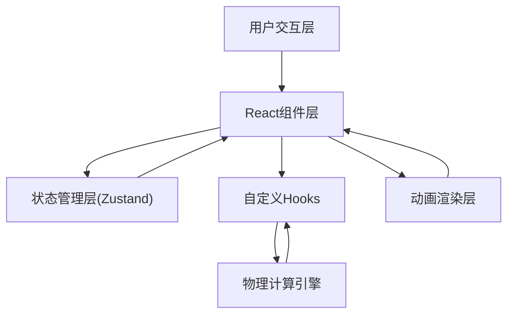

## 1. 架构设计



## 2. 技术描述

- **前端框架**: React@18 + TypeScript@5
- **构建工具**: Vite@5 + @vitejs/plugin-react@4
- **状态管理**: Zustand@4
- **动画库**: framer-motion@11
- **工具库**: lodash@4
- **样式方案**: 原生CSS + CSS变量，framer-motion处理复杂动画

## 3. 路由定义

| 路由 | 用途 |
|------|------|
| / | 主训练页面，包含战场、操作面板和积分榜 |

## 4. 数据模型

### 4.1 状态定义

```typescript
interface GameState {
  // 投石机参数
  counterweight: number; // 配重石质量 100-400斤
  elevationAngle: number; // 投石臂仰角 30-65度
  tensionCoefficient: number; // 张力系数 0.5-1.5
  
  // 环境参数
  windSpeed: number; // 风速 0-5级
  windDirection: number; // 风向 0-7 八个方向
  
  // 游戏状态
  score: number; // 总积分
  shotsRemaining: number; // 剩余发射次数
  level: number; // 当前关卡 1-3
  consecutiveHits: Record<string, number>; // 连击记录
  unlockedLevels: number[]; // 已解锁关卡
  bestTrajectory: {
    counterweight: number;
    elevationAngle: number;
    tensionCoefficient: number;
    score: number;
  } | null;
  
  // 飞行状态
  isFlying: boolean;
  isCharging: boolean;
  
  // Actions
  setCounterweight: (value: number) => void;
  setElevationAngle: (value: number) => void;
  setTensionCoefficient: (value: number) => void;
  setWind: (speed: number, direction: number) => void;
  startCharging: () => void;
  fire: () => void;
  addScore: (points: number, target: string) => void;
  nextLevel: () => void;
  resetRound: () => void;
}
```

### 4.2 弹道计算数据结构

```typescript
interface TrajectoryPoint {
  x: number;
  y: number;
}

interface TrajectoryResult {
  points: TrajectoryPoint[]; // 弹道点位数组
  highestPoint: TrajectoryPoint; // 最高点
  wallContactPoint: TrajectoryPoint | null; // 城墙接触点
  landingPoint: TrajectoryPoint; // 落点
  hitTarget: 'crenellation' | 'tower' | 'gate' | 'miss' | null; // 命中目标
}
```

## 5. 项目文件结构

```
.
├── package.json
├── index.html
├── vite.config.js
├── tsconfig.json
├── src/
│   ├── App.tsx              # 主组件，战场状态管理
│   ├── components/
│   │   ├── Battlefield.tsx  # 战场场景渲染
│   │   └── CatapultPanel.tsx # 投石机操作面板
│   ├── hooks/
│   │   └── useTrajectory.ts # 弹道计算hook
│   └── store/
│       └── gameStore.ts     # Zustand全局状态
```

## 6. 核心算法说明

### 6.1 抛物线弹道计算

```
初速度 v0 = sqrt(2 * g * h * (m1/m2) * tension)
其中:
- g = 9.8m/s² (重力加速度)
- h = 投石臂高度 (根据仰角计算)
- m1 = 配重质量
- m2 = 石弹质量 (固定)
- tension = 张力系数

位置方程:
x(t) = v0 * cos(θ) * t + wind_offset(t)
y(t) = v0 * sin(θ) * t - 0.5 * g * t²

风偏修正:
wind_offset(t) = x(t) * windSpeed * 0.05 * windDirectionFactor
```

### 6.2 碰撞检测

通过检测弹道点与城墙各区域的坐标重叠判定命中目标。

## 7. 性能优化策略

1. **弹道计算缓存**: 使用useMemo缓存计算结果，仅参数变化时重新计算
2. **动画优化**: 所有动画使用transform和opacity，避免触发重排重绘
3. **requestAnimationFrame**: 石弹飞行、粒子效果全部使用RAF驱动
4. **节流处理**: 滑块拖动事件使用节流，限制计算频率
5. **分层渲染**: 使用CSS will-change提升动画元素渲染性能
