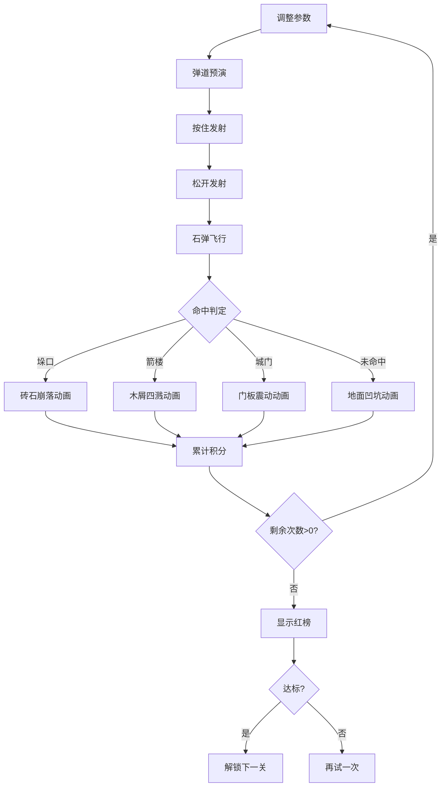

## 1. 产品概述

古代投石机（霹雳车）攻城模拟训练应用，通过交互式沙盘模拟解决传统攻城训练中士兵难以在安全环境下反复练习调整配重、射角和弹药对城墙不同区域进行精准打击的问题。

- 面向古代军事训练爱好者、游戏玩家和历史教育者
- 提供沉浸式的宋代攻城战体验，结合物理弹道模拟和风偏修正系统
- 市场价值：填补历史军事模拟类互动教育产品的空白

## 2. 核心功能

### 2.1 用户角色

| 角色 | 注册方式 | 核心权限 |
|------|----------|----------|
| 训练士兵 | 无需注册 | 调整投石机参数、发射石弹、查看积分 |

### 2.2 功能模块

1. **战场场景**：CSS绘制宋代攻城战场，包含城墙、箭楼、城门、护城河
2. **投石机控制**：三个滑块调节配重、仰角、张力，实时弹道预演
3. **发射系统**：按住发射按钮蓄力发射，石弹沿抛物线飞行
4. **命中判定**：垛口/箭楼/城门/未命中四种结果，各有专属动画
5. **风向系统**：八方向风速指示器，3级以上影响弹道偏移
6. **积分系统**：5次发射机会，不同目标不同积分，连击奖励
7. **关卡解锁**：单墙→双墙→带护城河，难度递进
8. **结果榜文**：红榜展示总积分、命中率、最佳参数

### 2.3 页面详情

| 页面名称 | 模块名称 | 功能描述 |
|---------|----------|----------|
| 主训练页面 | 战场渲染 | 横版俯瞰宋代攻城战场，CSS绘制所有元素 |
| 主训练页面 | 操作面板 | 左侧滑块控制面板，铜钱样式发射按钮 |
| 主训练页面 | 信息面板 | 右侧任务信息与积分排行榜 |
| 主训练页面 | 风向指示 | 战场上方八方向风速风向指示器 |
| 结果弹窗 | 红榜展示 | 轮次结束后红纸榜展示成绩 |

## 3. 核心流程

用户调整投石机参数 → 实时查看弹道预演 → 按住发射按钮蓄力 → 松开发射石弹 → 石弹飞行并命中目标 → 播放命中动画 → 累计积分 → 5次发射后显示红榜 → 解锁下一关或重试

## 4. 用户界面设计

### 4.1 设计风格

- **主色调**：土黄#d4c4a8、赭石#6b4e3a、军绿#4a7a4a
- **材质风格**：灰褐色沙盘风格，米黄色粗麻布纹理背景
- **按钮样式**：铜钱样式，圆形外径40px，方孔10x10px，悬停铜绿发光
- **字体**：采用历史感衬线字体，标题加粗
- **布局风格**：三栏布局（操作面板240px + 战场600px + 积分榜200px）
- **动画风格**：碎块飞散、涟漪扩散、倾斜形变，全部使用requestAnimationFrame驱动

### 4.2 页面设计概述

| 页面名称 | 模块名称 | UI元素 |
|---------|----------|--------|
| 主训练页面 | 操作面板 | 木质边框，米色内衬，三个滑块带标签，铜钱发射按钮 |
| 主训练页面 | 战场区域 | 灰绿草地，夯土城墙带雉堞，木制箭楼带红旗，朱红城门 |
| 主训练页面 | 风向指示 | 八方向箭头，箭羽长15px，风速数字显示 |
| 主训练页面 | 弹道显示 | 白色虚线抛物线，三个关键点标记（白/红/绿） |
| 结果弹窗 | 红榜 | 竖向条幅，米黄纸色#f5deb3，墨色文字#1a1a1a |

### 4.3 响应式

- **桌面优先**：三栏布局，宽度≥800px
- **移动适配**：宽度<800px时，操作面板和积分榜折叠为底部栏，战场占据全高
- **触摸优化**：滑块支持触摸拖动，按钮点击区域≥44x44px

### 4.4 动画性能要求

- 帧率稳定45FPS以上
- 弹道计算响应时间≤15ms
- 使用transform和opacity避免重排
- requestAnimationFrame驱动所有动画
