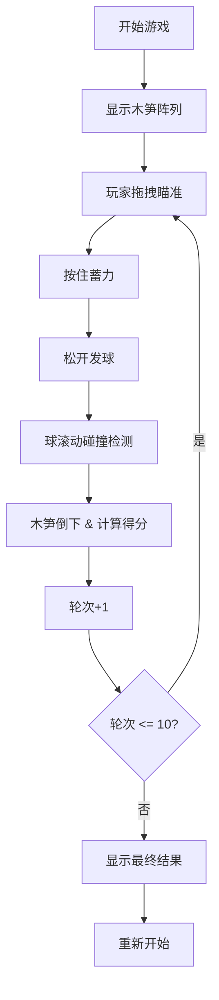

## 1. 产品概述

长安木射是一款基于唐代宫廷游戏"木射"的网页交互游戏，玩家通过拖拽瞄准、蓄力击球来击倒前方的木笋，体验古代文人雅士的娱乐活动。

- 主要目的：传承中华传统文化，以游戏形式展示唐代木射的玩法
- 目标用户：对传统文化和休闲游戏感兴趣的玩家
- 市场价值：寓教于乐，让更多人了解中国古代体育运动

## 2. 核心功能

### 2.1 用户角色
| 角色 | 注册方式 | 核心权限 |
|------|----------|----------|
| 玩家 | 无需注册 | 体验完整游戏流程 |

### 2.2 功能模块
1. **游戏主界面**：游戏场地渲染、木球控制、木笋显示
2. **计分系统**：得分统计、轮次管理、最终结果展示
3. **交互系统**：拖拽瞄准、蓄力控制、击球反馈
4. **音效系统**：撞击音效、得分音效

### 2.3 页面详情
| 页面名称 | 模块名称 | 功能描述 |
|---------|----------|----------|
| 游戏主页面 | 游戏场地 | Canvas渲染黄土地面、木球、木笋等边三角形排列 |
| 游戏主页面 | 控制面板 | 拖拽调整方向、按住蓄力条、松开发球 |
| 游戏主页面 | 计分面板 | 显示当前得分、当前轮次、红字/黑字得分明细 |
| 游戏主页面 | 结果展示 | 十轮结束后显示最终得分和胜负结果 |

## 3. 核心流程

1. 玩家进入游戏，看到十五根木笋呈等边三角形排列
2. 玩家拖拽鼠标调整击球方向
3. 玩家按住鼠标蓄力，力度条从0-100%递增
4. 玩家松开鼠标，木球沿瞄准方向滚动
5. 木球撞击木笋，木笋倒下，系统计算得分（红字加分，黑字减分）
6. 进入下一轮，重复以上步骤
7. 十轮结束后显示最终得分

## 4. 用户界面设计

### 4.1 设计风格
- **主色调**：淡黄宣纸色 #f5e6c8，木头本色 #c8a45a
- **辅助色**：红色 #d32f2f（红方/加分），黑色 #1a1a1a（黑方/减分）
- **字体**：标题使用 Google Fonts 的 Ma Shan Zheng（行书）
- **按钮样式**：卷轴样式，带墨渍动画效果
- **整体风格**：唐代古风，宣纸质感，木纹元素，墨韵动画

### 4.2 页面设计概述
| 页面名称 | 模块名称 | UI元素 |
|---------|----------|--------|
| 游戏主页面 | 标题区域 | 行书"长安木射"，卷轴装饰 |
| 游戏主页面 | 游戏区域 | Canvas渲染：黄土地面纹理、木球带阴影、15根木笋带文字 |
| 游戏主页面 | 力度条 | 垂直卷轴样式，墨色填充表示力度 |
| 游戏主页面 | 计分面板 | 红色木纹背景卷轴，显示当前轮次和得分 |
| 游戏主页面 | 操作提示 | 墨渍动画效果的提示文字 |

### 4.3 响应性
- 桌面端优先，自适应屏幕尺寸
- 游戏区域保持固定宽高比（16:9）居中显示
- 触控设备支持触屏拖拽操作

### 4.4 动画效果
- 木球滚动时带动态阴影
- 木笋倒下时的旋转动画
- 得分弹出的墨迹消散动画
- 按钮悬停的墨渍扩散效果
- 页面加载的卷轴展开动画
