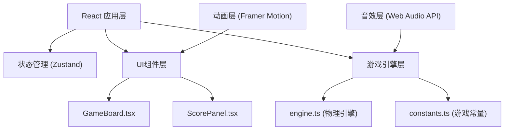

## 1. 架构设计



## 2. 技术描述

- **前端框架**：React 18 + TypeScript
- **构建工具**：Vite
- **状态管理**：Zustand
- **动画库**：Framer Motion
- **渲染技术**：Canvas 2D API（游戏主场景）
- **音效**：Web Audio API（程序化生成打击音效）
- **样式**：CSS Modules + CSS Variables

## 3. 路由定义

| 路由 | 用途 |
|------|------|
| / | 游戏主页面 |

## 4. 数据模型

### 4.1 游戏状态类型定义

```typescript
// 木笋类型
interface Pin {
  id: number;
  x: number;
  y: number;
  word: string;      // 木笋上的文字
  type: 'red' | 'black';  // 红方加分/黑方减分
  isDown: boolean;   // 是否倒下
  rotation: number;  // 倒下角度
}

// 木球类型
interface Ball {
  x: number;
  y: number;
  vx: number;        // x方向速度
  vy: number;        // y方向速度
  isMoving: boolean;
}

// 游戏状态
interface GameState {
  round: number;           // 当前轮次 (1-10)
  score: number;           // 当前得分
  pins: Pin[];             // 木笋数组
  ball: Ball;              // 木球
  aimAngle: number;        // 瞄准角度
  power: number;           // 蓄力值 0-100
  isAiming: boolean;       // 是否正在瞄准
  isCharging: boolean;     // 是否正在蓄力
  gameStatus: 'ready' | 'playing' | 'roundEnd' | 'gameOver';
  lastScore: number;       // 上一轮得分
  showScorePopup: boolean; // 是否显示得分弹窗
}
```

### 4.2 游戏常量

```typescript
// constants.ts
export const CANVAS_WIDTH = 800;
export const CANVAS_HEIGHT = 600;
export const BALL_RADIUS = 15;  // 直径30px，半径15px
export const BALL_COLOR = '#c8a45a';
export const PIN_WIDTH = 10;
export const PIN_HEIGHT = 40;
export const PIN_SPACING = 40;
export const GROUND_COLOR = '#e8d4a8';
export const BACKGROUND_COLOR = '#f5e6c8';
export const FRICTION = 0.98;  // 摩擦系数
export const MIN_SPEED = 0.5;  // 最小速度阈值
export const MAX_POWER = 100;
export const POWER_TO_SPEED = 0.3;  // 力度转速度系数
export const TOTAL_ROUNDS = 10;

// 木笋文字配置
export const PIN_WORDS = [
  { word: '仁', type: 'red' },
  { word: '义', type: 'red' },
  { word: '礼', type: 'red' },
  { word: '智', type: 'red' },
  { word: '信', type: 'red' },
  { word: '骄', type: 'black' },
  { word: '奢', type: 'black' },
  { word: '淫', type: 'black' },
  { word: '逸', type: 'black' },
  { word: '盗', type: 'black' },
  // 额外5个随机字
  { word: '忠', type: 'red' },
  { word: '孝', type: 'red' },
  { word: '廉', type: 'red' },
  { word: '耻', type: 'black' },
  { word: '贪', type: 'black' },
];

// 得分规则
export const SCORE_RULES = {
  red: 10,     // 红字加10分
  black: -10,  // 黑字减10分
};
```

## 5. 目录结构

```
d:\Solocoder\VersionFast\tasks\auto150/
├── .trae/documents/          # 项目文档
├── src/
│   ├── components/           # React组件
│   │   ├── GameBoard.tsx     # 游戏主画布组件
│   │   └── ScorePanel.tsx    # 计分面板组件
│   ├── game/                 # 游戏核心逻辑
│   │   ├── engine.ts         # 物理引擎
│   │   └── constants.ts      # 游戏常量
│   ├── store/                # 状态管理
│   │   └── useGameStore.ts   # Zustand store
│   ├── hooks/                # 自定义Hooks
│   │   └── useGameLoop.ts    # 游戏循环Hook
│   ├── utils/                # 工具函数
│   │   └── audio.ts          # 音效工具
│   ├── App.tsx               # 主应用组件
│   ├── main.tsx              # 入口文件
│   └── index.css             # 全局样式
├── index.html
├── package.json
├── vite.config.ts
├── tsconfig.json
└── tailwind.config.js
```

## 6. 物理引擎核心逻辑

### 6.1 碰撞检测算法
```
球与木笋碰撞检测：
1. 计算球心到木笋中心的距离
2. 当距离 < 球半径 + 木笋半宽时，发生碰撞
3. 根据碰撞角度计算木笋倒下方向
4. 检测连锁碰撞（倒下的木笋撞击其他木笋）
```

### 6.2 游戏循环
1. 使用 requestAnimationFrame 实现60fps游戏循环
2. 每帧更新：球位置、木笋状态、碰撞检测
3. 当球速小于阈值且所有木笋静止时，本轮结束
