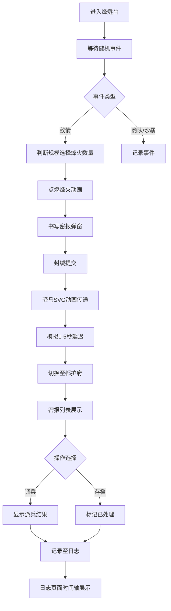

## 1. 产品概述

本项目是一个模拟唐代安西都护府烽燧传警系统的全栈Web应用，用户扮演戍卒在烽燧台值守，观察敌情、点燃烽火、传递密报，并可切换至都护府身份处理战报。

- 核心目的：通过沉浸式交互体验唐代边塞军事通讯制度，寓教于乐
- 目标用户：历史爱好者、游戏玩家、教育场景用户
- 产品价值：将枯燥的历史知识转化为互动体验，提升用户对唐代军事制度的理解

## 2. 核心功能

### 2.1 用户角色
| 角色 | 切换方式 | 核心权限 |
|------|----------|----------|
| 烽燧戍卒 | 路由切换 | 观察敌情、点燃烽火、书写密报 |
| 录事参军 | 路由切换 | 接收密报、调兵决策、存档处理 |

### 2.2 功能模块
1. **烽燧台页面**：CSS 3D土台展示、柴堆火焰动画、敌情事件提示、密报书写弹窗、驿马传递动画
2. **都护府页面**：密报列表展示、调兵/存档操作、派兵结果反馈
3. **日志页面**：时间轴布局、羊皮卷风格展示、筛选导出功能
4. **后端API**：随机事件生成、密报存储与延迟模拟、日志数据查询

### 2.3 页面详情
| 页面名称 | 模块名称 | 功能描述 |
|----------|----------|----------|
| 烽燧台 | 3D土台场景 | CSS 3D transforms实现远近效果，包含土台、矮墙、栅栏、柴堆 |
| 烽燧台 | 敌情事件系统 | 轮询后端API，随机触发吐蕃骑兵、马贼、商队、沙暴等事件 |
| 烽燧台 | 烽火点燃 | 点击按钮选择1/2/3堆烽火，火苗大小随数量变化，CSS闪烁动画 |
| 烽燧台 | 密报书写 | 绢帛材质弹窗，楷体/手写体，提交时封缄折叠动画 |
| 烽燧台 | 驿马传递 | SVG动画，马匹沿沙漠路线奔跑，速度随延迟变化 |
| 都护府 | 密报列表 | 卡片式布局，悬停古风边框阴影，点击展开详情 |
| 都护府 | 决策系统 | 调兵按钮显示派兵结果，存档按钮标记为已处理 |
| 日志 | 时间轴展示 | 左侧时间轴带图标，右侧详细记录，羊皮卷风格 |
| 日志 | 筛选导出 | 按日期/类型筛选，支持导出为文本文件 |

## 3. 核心流程

## 4. 用户界面设计

### 4.1 设计风格
- **主色调**：土黄#c2a37a（夯土色）、暗红#8b3a3a（边塞烽火）
- **背景**：羊皮纸颗粒纹理，营造古卷氛围
- **按钮风格**：圆角矩形，古朴木质纹理，按压缩放0.95效果
- **字体**：标题使用楷体/宋体，正文使用易读的衬线字体，密报使用手写体
- **布局风格**：错落有致的卡片布局，古风边框装饰
- **图标风格**：简约古风SVG图标（烽火、战马、长戟、卷轴）

### 4.2 页面设计概述
| 页面名称 | 模块名称 | UI元素 |
|----------|----------|--------|
| 烽燧台 | 3D场景 | CSS 3D透视土台，前景矮墙栅栏，远景沙漠天空，台顶柴堆 |
| 烽燧台 | 事件提示 | 卷轴式弹窗，顶部事件图标，内容区敌情描述 |
| 烽燧台 | 密报弹窗 | 绢帛材质纹理，竖排书写区域，封缄火漆印章效果 |
| 烽燧台 | 驿马动画 | SVG路径动画，沙漠剪影背景，马蹄扬尘效果 |
| 都护府 | 密报列表 | 卡片堆叠效果，悬停阴影加深，展开平滑过渡 |
| 都护府 | 决策按钮 | 朱红调兵按钮，墨色存档按钮，古风印章效果 |
| 日志 | 时间轴 | 羊皮卷展开效果，时间节点烽火图标，内容区卷轴纹理 |

### 4.3 响应式设计
- **桌面端**：完整CSS 3D烽燧台场景，三栏布局
- **平板端**：简化3D效果，双栏布局
- **移动端**：烽燧台改为俯视简化版，单栏滚动布局，触控区域放大至44x44px

### 4.4 动画表现
- **烽火动画**：多层渐变火焰，CSS animation闪烁，高度随数量变化
- **封缄动画**：CSS 3D折叠效果，从四角向中心折叠缩小消失
- **驿马动画**：SVG路径动画，马腿循环运动，背景视差滚动
- **列表展开**：max-height过渡配合opacity淡入
- **页面切换**：路由切换时淡入淡出效果
