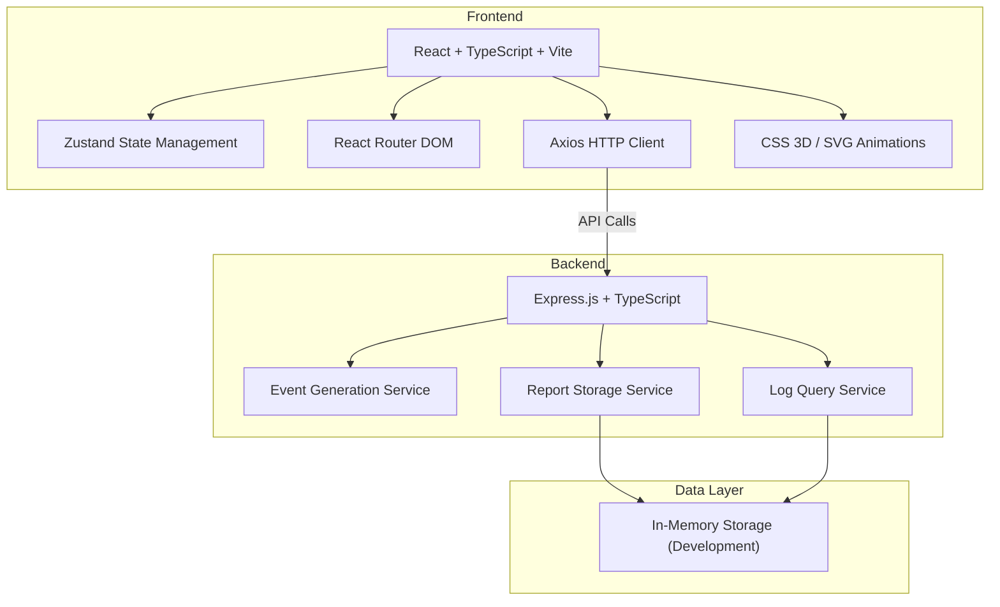
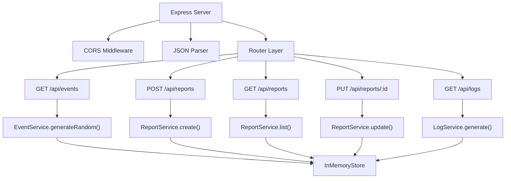
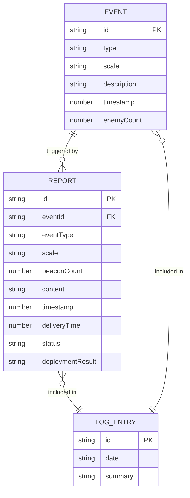

## 1. 架构设计



## 2. 技术说明

- **前端**：React@18 + TypeScript@5 + Vite@5
- **状态管理**：Zustand@4
- **路由**：react-router-dom@6
- **HTTP客户端**：axios@1
- **构建工具**：Vite@5 + @vitejs/plugin-react@4
- **后端**：Express@4 + TypeScript@5
- **数据存储**：开发环境使用内存存储，便于演示

## 3. 路由定义

| 路由 | 页面 | 功能 |
|------|------|------|
| `/` | 烽燧台页面 | 3D土台场景、敌情观察、烽火点燃、密报书写 |
| `/command` | 都护府页面 | 密报列表、调兵决策、存档处理 |
| `/logs` | 日志页面 | 时间轴展示、筛选、导出 |

## 4. API 定义

### 4.1 类型定义
```typescript
interface Event {
  id: string;
  type: 'enemy' | 'bandit' | 'caravan' | 'sandstorm';
  scale: 'small' | 'medium' | 'large';
  description: string;
  timestamp: number;
  enemyCount?: number;
}

interface Report {
  id: string;
  eventId: string;
  eventType: string;
  scale: string;
  beaconCount: number;
  content: string;
  timestamp: number;
  deliveryTime: number;
  status: 'pending' | 'processed' | 'deployed';
  deploymentResult?: string;
}

interface LogEntry {
  id: string;
  date: string;
  events: Event[];
  reports: Report[];
  summary: string;
}
```

### 4.2 接口定义

| 方法 | 路径 | 描述 | 请求 | 响应 |
|------|------|------|------|------|
| GET | `/api/events` | 获取随机事件 | - | `{ event: Event }` |
| POST | `/api/reports` | 提交密报 | `{ eventId, eventType, scale, beaconCount, content, timestamp }` | `{ success: boolean, reportId: string, deliveryDelay: number }` |
| GET | `/api/reports` | 获取密报列表 | - | `{ reports: Report[] }` |
| PUT | `/api/reports/:id` | 更新密报状态 | `{ status, deploymentResult? }` | `{ success: boolean, report: Report }` |
| GET | `/api/logs` | 获取日志数据 | `{ date? }` | `{ logs: LogEntry[] }` |

## 5. 服务端架构图



## 6. 数据模型

### 6.1 实体关系图



### 6.2 状态管理 (Zustand Store)

```typescript
interface AppState {
  currentEvent: Event | null;
  reports: Report[];
  userScore: number;
  beaconCount: number;
  isBeaconBurning: boolean;
  isDelivering: boolean;
  
  setCurrentEvent: (event: Event | null) => void;
  addReport: (report: Report) => void;
  updateReport: (id: string, data: Partial<Report>) => void;
  setBeaconCount: (count: number) => void;
  setBeaconBurning: (burning: boolean) => void;
  setDelivering: (delivering: boolean) => void;
  addScore: (points: number) => void;
}
```

### 6.3 目录结构

```
auto151/
├── package.json
├── vite.config.js
├── tsconfig.json
├── index.html
├── .trae/
│   └── documents/
│       ├── PRD.md
│       └── TECHNICAL_ARCHITECTURE.md
├── src/
│   ├── main.tsx
│   ├── App.tsx
│   ├── store/
│   │   └── useStore.ts
│   ├── types/
│   │   └── index.ts
│   ├── pages/
│   │   ├── BeaconTower.tsx
│   │   ├── CommandPost.tsx
│   │   └── DailyLog.tsx
│   ├── components/
│   │   ├── Beacon3D.tsx
│   │   ├── BeaconFlame.tsx
│   │   ├── ReportModal.tsx
│   │   ├── HorseAnimation.tsx
│   │   ├── EventAlert.tsx
│   │   ├── ReportCard.tsx
│   │   ├── TimelineItem.tsx
│   │   └── Layout/
│   │       └── Navbar.tsx
│   ├── utils/
│   │   ├── api.ts
│   │   └── constants.ts
│   └── styles/
│       ├── globals.css
│       └── animations.css
└── server/
    ├── package.json
    ├── tsconfig.json
    └── app.ts
```
