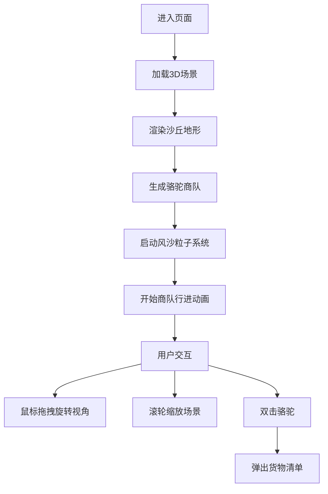

## 1. 产品概述

古代丝绸之路沙漠商队3D交互可视化项目，让用户以商队首领的视角，沉浸式体验从长安出发前往西域的沙漠商旅之旅。通过3D渲染技术重现古丝路沙漠风貌、骆驼商队行进和风沙流动效果，兼具教育意义与视觉美感。

## 2. 核心功能

### 2.1 用户角色
| 角色 | 注册方式 | 核心权限 |
|------|----------|----------|
| 访客用户 | 无需注册 | 3D场景浏览、视角控制、交互查看货物详情 |

### 2.2 功能模块
1. **主场景页面**：3D沙漠场景渲染、骆驼商队动画、沙丘地形、风沙粒子系统
2. **交互控制**：鼠标拖拽旋转视角、滚轮缩放、双击查看货物详情
3. **UI层**：货物清单弹窗、场景标题、操作提示

### 2.3 页面详情
| 页面名称 | 模块名称 | 功能描述 |
|----------|----------|----------|
| 主场景页面 | 3D沙漠场景 | 连绵起伏的沙丘地形，浅沙黄到深棕渐变，雾效营造纵深感 |
| 主场景页面 | 骆驼商队 | 5-7匹骆驼队列，沿正弦曲线缓慢行走，身体上下颠簸动画，驼峰与头部摆动 |
| 主场景页面 | 货物系统 | 每匹骆驼驮载不同颜色货物（红色波斯锦、绿色茶叶、蓝色瓷器），随骆驼晃动 |
| 主场景页面 | 风沙粒子 | 5000以内粒子系统，沿风向飘动，大小渐变，风向周期性变化 |
| 主场景页面 | 交互控制 | 鼠标拖拽旋转（带惯性）、滚轮缩放（带缓动）、双击骆驼弹出货物清单 |
| 主场景页面 | UI层 | 场景标题"丝路驼铃"、货物清单弹窗、操作提示文字 |

## 3. 核心流程

用户进入页面后，自动加载3D场景，骆驼商队从左向右缓慢行进，风沙持续飘动。用户可通过鼠标拖拽旋转视角观察商队不同角度，滚轮缩放查看细节。双击任意骆驼，弹出该骆驼驮载的货物清单说明。

## 4. 用户界面设计

### 4.1 设计风格
- **主色调**：浅沙黄 #e8d5a3、深棕色 #8b6b3a、天空蓝 #87ceeb
- **强调色**：红色 #c41e3a（波斯锦）、绿色 #2e7d32（茶叶）、蓝色 #1565c0（瓷器）
- **字体**：标题使用衬线字体（Noto Serif SC）营造古典氛围，正文使用清晰的无衬线字体
- **布局**：全屏3D场景，UI层悬浮于顶部和中央
- **视觉风格**：古典东方美学，沙漠暖色调，柔和光影，营造史诗感与沉浸感

### 4.2 页面设计概述
| 页面名称 | 模块名称 | UI元素 |
|----------|----------|--------|
| 主场景页面 | 场景标题 | 左上角"丝路驼铃"，渐隐显示，古典字体 |
| 主场景页面 | 操作提示 | 右下角小字提示，半透明，数秒后淡出 |
| 主场景页面 | 货物清单弹窗 | 中央半透明卡片，展示货物名称、颜色、历史背景说明 |
| 主场景页面 | 3D场景 | 暖色调沙漠，金色阳光照射方向，雾气营造远方朦胧感 |

### 4.3 响应式
- 桌面端优先，全屏沉浸式体验
- 支持不同分辨率自适应，保持16:9最佳比例
- 触摸设备支持双指缩放和滑动旋转

### 4.4 3D场景指引
- **环境**：晴朗沙漠天空，方向性暖光模拟正午阳光，柔和环境光补光
- **光照**：主光源（方向光）+ 半球光 + 环境光，阴影柔和开启
- **相机**：PerspectiveCamera，初始位置俯瞰商队，视野角度60度
- **相机运动**：OrbitControls支持拖拽旋转、滚轮缩放，启用阻尼惯性效果
- **构图**：商队位于画面黄金分割点，沙丘层次分明，近景中景远景清晰
- **交互**：鼠标悬停骆驼高亮，双击触发UI弹窗
- **后处理**：柔和雾化、色彩调整，保持60fps帧率
- **性能**：粒子数≤5000，BufferGeometry重用，剔除不可见物体
