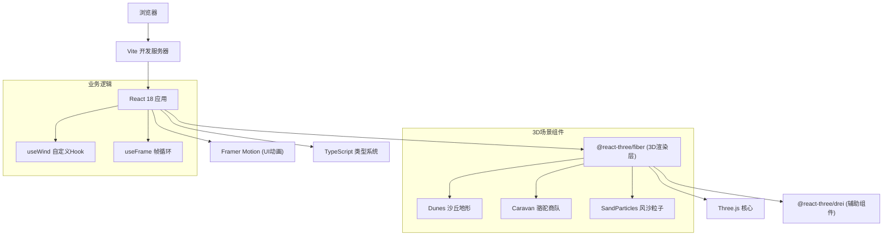

## 1. 架构设计



## 2. 技术描述

- **前端框架**：React@18.2.0 + TypeScript@5.4.0
- **构建工具**：Vite@5.2.0 + @vitejs/plugin-react@4.2.0
- **3D引擎**：Three@0.162.0 + @react-three/fiber@8.15.0 + @react-three/drei@9.99.0
- **动画库**：framer-motion@11.0.0
- **状态管理**：React 内置 useState/useRef，无需额外状态库
- **初始化方式**：Vite 手动配置完整项目结构

## 3. 路由定义

| 路由 | 用途 |
|------|------|
| / | 主场景页面，包含完整3D交互体验 |

## 4. 项目文件结构

```
├── package.json              # 项目依赖与脚本
├── vite.config.js            # Vite配置（React插件、路径别名）
├── tsconfig.json             # TypeScript配置（严格模式）
├── index.html                # 入口HTML页面
└── src/
    ├── main.tsx              # React应用入口
    ├── App.tsx               # 主应用组件（Canvas + UI层）
    ├── components/
    │   ├── Caravan.tsx       # 骆驼商队与货物组件
    │   ├── Dunes.tsx         # 沙丘地形组件
    │   └── SandParticles.tsx # 风沙粒子系统组件
    └── hooks/
        └── useWind.ts        # 风向变化自定义Hook
```

## 5. 核心技术实现

### 5.1 3D场景架构
- 使用 `<Canvas>` 作为渲染容器，配置相机、光照、雾化
- OrbitControls 提供视角控制，启用 enableDamping 实现惯性滑动
- useFrame 钩子驱动所有动画更新

### 5.2 沙丘地形实现
- PlaneGeometry 基础平面，顶点着色器实现随机高度位移
- 顶点颜色插值实现浅沙黄到深棕的渐变
- 较大分段数保证地形平滑度

### 5.3 骆驼商队动画
- 每匹骆驼由柱体（身体、腿）和球体（驼峰、头部）组合
- 正弦函数驱动上下颠簸和行走摆动
- 货物包使用不同颜色立方体，附加相对位移模拟晃动
- 队列沿X轴平移，超出边界重置位置实现循环

### 5.4 风沙粒子系统
- BufferGeometry 存储5000个粒子位置、大小、速度
- PointsMaterial 使用 additive blending 实现柔和效果
- useWind hook 生成周期性风向变化
- 粒子超出边界重置，实现无限流动效果

### 5.5 交互实现
- Raycaster 检测鼠标与骆驼碰撞
- 双击事件触发 Framer Motion 动画显示货物清单
- OrbitControls enableZoom 配合阻尼参数实现缩放缓动

## 6. 性能优化策略

1. **几何体复用**：骆驼组件中复用基础几何体（CylinderGeometry, SphereGeometry, BoxGeometry）
2. **BufferGeometry**：粒子系统使用 BufferGeometry 而非 Geometry
3. **粒子数量控制**：最大5000个粒子，根据距离动态调整可见性
4. **帧率控制**：useFrame 中使用 delta 时间控制动画速度
5. **阴影优化**：仅对主要物体投射和接收阴影
6. **材质复用**：相同颜色货物包共享材质实例

## 7. 类型定义

```typescript
interface CamelData {
  id: number;
  position: [number, number, number];
  cargo: {
    type: 'persian-silk' | 'tea' | 'porcelain';
    color: string;
    name: string;
    description: string;
  };
  phase: number;
}

interface WindState {
  direction: [number, number, number];
  strength: number;
}
```
