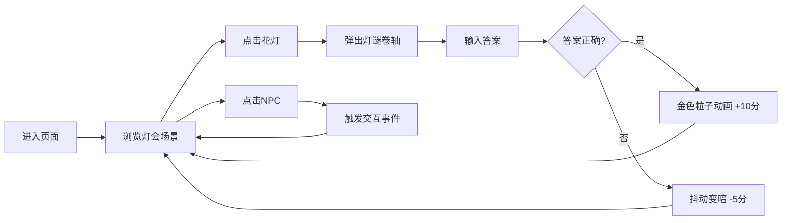

## 1. 产品概述

本项目是一个虚拟的唐代长安城元宵灯会交互观赏页面，让用户能在古风夜市中穿行赏灯、猜灯谜、看杂耍表演，体验盛唐元宵佳节的繁华盛景。

- 核心目标：打造沉浸式古风交互体验，让用户足不出户感受唐代元宵灯会的热闹氛围
- 目标用户：对中国传统文化、古风美学感兴趣的各年龄段用户
- 市场价值：传承和传播传统文化，提供创新性的文化体验产品

## 2. 核心功能

### 2.1 功能模块

1. **灯会主场景：横屏滚动夜市、青石板路、花灯木架、城楼烟花背景
2. **花灯交互：六角宫灯、兔儿灯、走马灯，点击查看灯谜
3. **猜灯谜模块：随机出题、积分系统、答对粒子动画反馈
4. **NPC交互：卖冰糖葫芦老者、舞狮艺人，独立动画序列
5. **响应式布局：桌面横屏滚动、移动端竖向瀑布流

### 2.2 页面详情

| 页面名称 | 模块名称 | 功能描述 |
|-----------|-------------|---------------------|
| 灯会主场景 | 场景滚动 | 鼠标拖拽/滚轮水平移动视角 |
| 灯会主场景 | 花灯系统 | 三种花灯类型、闪烁动画、点击交互 |
| 灯谜弹窗 | 答题系统 | 随机出题、答案判断、积分计算 |
| 灯谜弹窗 | 动画反馈 | 答对金色粒子、答错抖动变暗 |
| NPC系统 | NPC交互 | 老者讲故事、舞狮表演动画 |
| 界面系统 | 古风UI | 朱红暗金配色、木质纹理、楷体字体 |

## 3. 核心流程

用户进入页面 → 浏览灯会场景（拖拽/滚动移动视角 → 点击花灯 → 弹出灯谜卷轴 → 输入答案 → 判断对错 → 显示反馈动画 → 继续游览 → 点击NPC → 触发交互事件 → 获得积分

## 4. 用户界面设计

### 4.1 设计风格

- 主色调：朱红 `#c0392b`、暗金 `#d4ac0d`
- 背景色：宣纸色 `#fdf5e6`
- 按钮风格：木质纹理边框、墨迹笔触效果、圆角设计
- 字体：楷体 / Ma Shan Zheng（Google Fonts）
- 布局风格：卷轴式弹窗、古风景观层次、木质边框装饰
- 动画风格：花灯闪烁旋转、烟花绽放、NPC行走表演、粒子特效

### 4.2 页面设计概述

| 页面名称 | 模块名称 | UI元素 |
|-----------|-------------|-------------|
| 灯会主场景 | 背景层 | 青石板路、远处城楼、夜空烟花、宣纸纹理背景 |
| 灯会主场景 | 花灯层 | 六角宫灯（朱红）、兔儿灯（暖黄）、走马灯（多彩），悬挂于木架 |
| 灯会主场景 | NPC层 | 卖冰糖葫芦老者、舞狮艺人，带行走/站立/表演动画 |
| 灯谜弹窗 | 卷轴界面 | 古风卷轴边框、题目文字、输入框、提交按钮、积分显示 |
| 顶部UI | 信息栏 | 积分显示、操作提示 |

### 4.3 响应式设计

- 桌面端（>768px）：横屏滚动布局，横向长卷，鼠标拖拽/滚轮移动视角
- 移动端（≤768px）：竖向瀑布流布局，上下滑动浏览，花灯垂直排列
- 触控优化：增大点击区域，支持触摸滑动交互

## 5. 性能要求

- 帧率：稳定60fps
- 元素数量：花灯和NPC总数控制在20个以内
- 交互响应：点击和拖拽延迟≤100ms
- 动画优化：烟花使用CSS动画，花灯闪烁使用CSS transition
