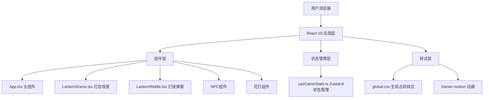

## 1. 架构设计



## 2. 技术栈说明

- 前端框架：React 18 + TypeScript
- 构建工具：Vite 5 + @vitejs/plugin-react
- 状态管理：Zustand
- 动画库：framer-motion
- 样式方案：原生CSS + CSS变量 + CSS动画
- 字体：Google Fonts - Ma Shan Zheng

## 3. 文件结构

```
auto154/
├── package.json
├── vite.config.js
├── tsconfig.json
├── index.html
├── src/
│   ├── main.tsx
│   ├── App.tsx
│   ├── components/
│   │   ├── LanternScene.tsx
│   │   └── LanternRiddle.tsx
│   ├── hooks/
│   │   └── useGameState.ts
│   └── styles/
│       └── global.css
```

## 4. 核心数据模型

### 4.1 灯谜数据结构

```typescript
interface Riddle {
  id: number;
  question: string;
  answer: string;
  hint?: string;
}
```

### 4.2 花灯数据结构

```typescript
interface Lantern {
  id: number;
  type: 'hexagonal' | 'rabbit' | 'revolving';
  color: string;
  position: { x: number; y: number };
  riddleId: number;
  isSolved: boolean;
}
```

### 4.3 NPC数据结构

```typescript
interface NPC {
  id: number;
  type: 'seller' | 'lionDancer';
  name: string;
  position: { x: number; y: number };
  dialogues: string[];
}
```

### 4.4 游戏状态

```typescript
interface GameState {
  score: number;
  currentRiddle: Riddle | null;
  solvedRiddles: number[];
  scrollPosition: number;
  activeNPC: NPC | null;
}
```

## 5. 性能优化方案

1. **动画优化**：烟花效果使用CSS `@keyframes`，花灯闪烁使用CSS `transition`
2. **元素数量控制**：花灯和NPC总数控制在20个以内
3. **GPU加速**：使用 `transform: translate3d` 提升滚动性能
4. **事件节流**：鼠标拖拽和滚轮事件使用节流处理
5. **组件优化**：使用React.memo优化花灯和NPC组件重渲染
