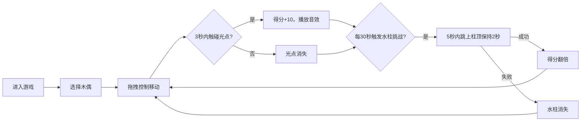

## 1. 产品概述

"汴梁水傀儡"是一款宋代勾栏风格的水上木偶戏交互游戏，让用户化身傀儡戏艺人，操控鱼、龙、虾、蟹四种木偶在虚拟水上舞台完成精彩表演。通过收集光点、完成水花挑战获得高分，体验传统文化与现代游戏的完美融合。

## 2. 核心特性

### 2.1 用户角色
| 角色 | 注册方式 | 核心权限 |
|------|----------|----------|
| 游戏玩家 | 无需注册，直接进入 | 操控木偶、完成表演挑战、查看得分 |

### 2.2 功能模块
1. **水上舞台**：圆形水池、水面波纹动画、木偶渲染、光点目标、水柱挑战
2. **控制面板**：木偶选择（金鱼、青龙、红蟹、白虾）、拖拽交互、动作释放
3. **得分系统**：光点收集得分、水花挑战翻倍、倒计时显示、最高分记录

### 2.3 页面详情
| 页面名称 | 模块名称 | 功能描述 |
|----------|----------|----------|
| 主游戏页面 | 水上舞台 | 渲染水池背景、木偶位置、水面波纹、光点目标、水柱挑战 |
| 主游戏页面 | 控制面板 | 木偶选择按钮、鼠标/触摸拖拽交互、动作释放按钮 |
| 主游戏页面 | 状态显示 | 左上角木牌分数、右上角铜锣倒计时、表演节奏提示 |

## 3. 核心流程

用户进入游戏 → 选择木偶角色 → 拖拽控制木偶移动 → 收集随机出现的金色光点获得分数 → 每30秒触发水柱挑战 → 操控木偶跳到水柱顶端保持平衡 → 成功得分翻倍 → 游戏持续进行

## 4. 用户界面设计

### 4.1 设计风格
- **主色调**：宣纸黄 #e8d5b7、栗色木框 #8b4513、墨色文字 #2f4f4f
- **水池色**：淡蓝水面 #a0d0ea、灰白石栏 #ccc0a0
- **按钮风格**：木雕纹理，内嵌阴影 box-shadow，圆角木牌造型
- **字体**：楷体/宋体类衬线字体，模拟古籍刻本风格
- **图标风格**：宋代纹样，铜锣、木牌、水纹等传统元素

### 4.2 页面设计概要
| 页面名称 | 模块名称 | UI元素 |
|----------|----------|----------|
| 主游戏页面 | 水上舞台 | 圆形水池、正弦波纹动画、木偶精灵、金色光点、水柱动画、水花粒子 |
| 主游戏页面 | 控制面板 | 四个木偶选择按钮（木雕风格）、动作释放按钮、拖拽提示 |
| 主游戏页面 | 状态显示 | 左上角木牌分数显示、右上角铜锣倒计时、挑战提示横幅 |

### 4.3 响应式设计
- **桌面端**：横屏布局，舞台居中，控制面板位于底部
- **移动端**：竖屏布局，舞台占上半部分，控制面板移至下方，触摸区域放大至至少 44px
- **帧率**：稳定 60fps，交互响应延迟 < 100ms
- **触摸优化**：拖拽区域放大，按钮最小 48x48px，防误触处理

### 4.4 动画与视觉效果
- **水面波纹**：多层正弦波叠加，循环滚动动画
- **木偶游动**：framer-motion 缓动曲线，尾部水花粒子（15-30个）
- **光点闪烁**：触碰时缩放 1.1 倍，持续 0.2s
- **水柱升起**：从水面向上生长动画，高度约 60px
- **木偶动作**：金鱼喷水圈、青龙摆尾、红蟹钳击、白虾弹跳，各有独特动画曲线
