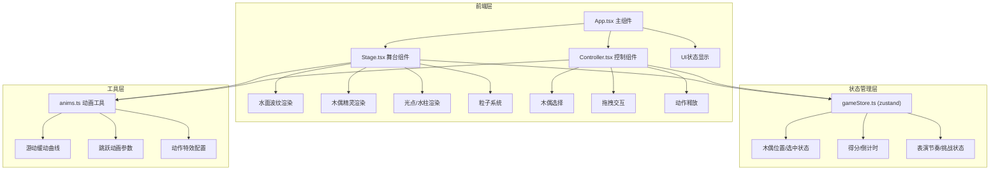

## 1. 架构设计



## 2. 技术选型

- **前端框架**：React 18 + TypeScript
- **构建工具**：Vite 5 + @vitejs/plugin-react
- **动画库**：framer-motion 11
- **状态管理**：zustand 4
- **音频**：Web Audio API（生成音效）
- **样式方案**：CSS Modules + CSS Variables

## 3. 目录结构

```
src/
├── components/
│   ├── Stage.tsx        # 水上舞台组件
│   └── Controller.tsx   # 控制面板组件
├── store/
│   └── gameStore.ts     # zustand 状态管理
├── utils/
│   └── anims.ts         # 动画工具函数
├── App.tsx              # 主游戏组件
└── main.tsx             # 应用入口
```

## 4. 核心数据模型

### 4.1 木偶类型定义
```typescript
type PuppetType = 'goldfish' | 'dragon' | 'crab' | 'shrimp';

interface Puppet {
  id: PuppetType;
  name: string;
  position: { x: number; y: number };
  velocity: { x: number; y: number };
  isSelected: boolean;
  action: 'idle' | 'swim' | 'jump' | 'attack';
  color: string;
  specialAttack: string;
}
```

### 4.2 游戏状态定义
```typescript
interface GameState {
  puppets: Puppet[];
  selectedPuppet: PuppetType;
  score: number;
  highScore: number;
  countdown: number;
  lightTargets: LightTarget[];
  waterPillar: WaterPillar | null;
  performanceRhythm: number;
  isChallengeActive: boolean;
  particles: Particle[];
}
```

### 4.3 粒子系统
```typescript
interface Particle {
  id: number;
  x: number;
  y: number;
  vx: number;
  vy: number;
  life: number;
  maxLife: number;
  size: number;
  color: string;
}
```

## 5. 性能优化策略

1. **requestAnimationFrame 动画循环**：统一动画更新，避免频繁重排重绘
2. **粒子池化**：控制粒子总数 15-30 个，复用粒子对象
3. **CSS transform 动画**：使用 GPU 加速属性
4. **will-change 提示**：对频繁动画元素添加优化提示
5. **throttle 拖拽事件**：限制拖拽事件频率，保持 60fps
6. **memo 组件优化**：使用 React.memo 避免不必要重渲染

## 6. 音效实现（Web Audio API）

```typescript
// "噗"声音效生成
const playPopSound = () => {
  const ctx = new AudioContext();
  const osc = ctx.createOscillator();
  const gain = ctx.createGain();
  osc.connect(gain);
  gain.connect(ctx.destination);
  osc.frequency.setValueAtTime(400, ctx.currentTime);
  osc.frequency.exponentialRampToValueAtTime(100, ctx.currentTime + 0.1);
  gain.gain.setValueAtTime(0.3, ctx.currentTime);
  gain.gain.exponentialRampToValueAtTime(0.01, ctx.currentTime + 0.1);
  osc.start(ctx.currentTime);
  osc.stop(ctx.currentTime + 0.1);
};
```
