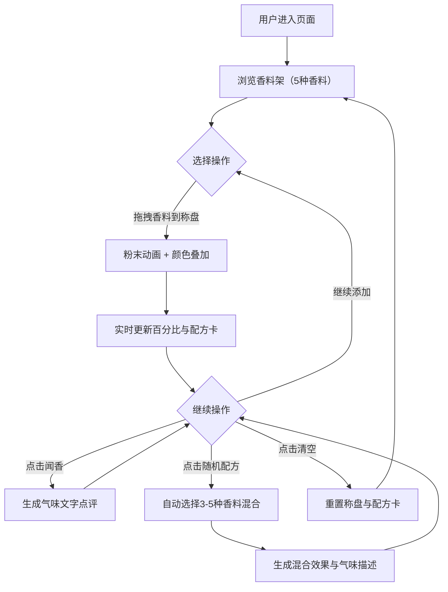

## 1. 产品概述

西市香坊是一款沉浸式的唐代香料互动可视化工具，用户可通过拖拽和点击在虚拟胡商摊位上挑选、混合来自西域的珍贵香料，体验盛唐时期丝绸之路的香料贸易文化。

- 核心价值：以游戏化互动方式展现唐代西市胡商文化，让用户直观了解香料特性与调和艺术
- 目标用户：历史文化爱好者、游戏化交互体验用户、教育场景学习者

## 2. 核心功能

### 2.1 功能模块
1. **香料架区域**：展示5种西域香料（胡椒、肉桂、丁香、豆蔻、藏红花）的陶罐容器，支持拖拽到称盘
2. **称重盘区域**：中央交互区，显示香料粉末堆积动画、混合颜色效果、实时百分比
3. **配方卡区域**：记录已混合香料比例，生成气味描述与点评
4. **交互控制区**：闻香按钮、随机配方按钮、清空重置功能

### 2.2 页面详情
| 页面名称 | 模块名称 | 功能描述 |
|-----------|-------------|---------------------|
| 主页面 | 香料架 | 可拖拽的香料陶罐，点击有粒子飞溅效果，悬停显示香料名称 |
| 主页面 | 称重盘 | 接收拖拽的香料，显示粉末堆积动画，颜色叠加混合效果，百分比实时更新 |
| 主页面 | 配方卡 | 显示当前混合配方，各香料比例，气味标签文字描述 |
| 主页面 | 控制按钮 | 闻香（生成气味点评）、随机配方（自动选择3-5种香料混合）、清空重置 |

## 3. 核心流程

用户打开页面 → 浏览香料架上的5种香料 → 拖拽香料罐到中央称盘 → 称盘显示粉末落入动画与颜色叠加 → 右侧配方卡实时更新比例与气味描述 → 可继续添加多种香料 → 点击"闻香"按钮查看综合气味点评 → 或点击"随机配方"自动生成神秘配方 → 点击"清空"重新开始

## 4. 用户界面设计

### 4.1 设计风格
- **主色调**：暗红（#8B0000）、金色（#DAA520）、土黄（#CD853F）
- **背景**：粗糙麻布纹理，营造唐代市场质感
- **按钮风格**：圆角矩形，暗红色填充配金色描边，悬停有光泽效果
- **字体**：采用具有古典韵味的字体组合，标题使用衬线字体，正文使用清晰易读的无衬线字体
- **布局**：桌面端三栏布局（香料架-称盘-配方卡），移动端垂直堆叠
- **视觉元素**：陶罐香料容器带微光泽，粉末粒子动画，丝绸质感的装饰边框

### 4.2 页面设计概述
| 页面名称 | 模块名称 | UI元素 |
|-----------|-------------|-------------|
| 主页面 | 香料架 | 陶罐图标（svg.js绘制）、彩色粉末标识、悬停浮起动画、拖拽半透明效果 |
| 主页面 | 称重盘 | 仿古铜色秤盘、粉末堆积层叠动画、颜色混合渐变、百分比数字动态更新 |
| 主页面 | 配方卡 | 卷轴风格卡片、香料比例条形图、气味标签云、金色装饰边角 |
| 主页面 | 控制按钮 | 中式风格按钮、点击波纹效果、禁用状态灰度显示 |

### 4.3 响应式设计
- **桌面端（≥1024px）**：三栏水平布局，比例约2:3:2，称盘居中放大显示
- **平板端（768px-1023px）**：三栏变为上下堆叠，香料架在上，称盘中，配方卡在下，每栏宽度100%
- **移动端（<768px）**：垂直堆叠布局，优化触控区域，拖拽改为点击添加模式
- **触控优化**：所有交互元素最小尺寸48x48px，支持触摸拖拽手势

### 4.4 动画与交互细节
- **拖拽过渡**：framer-motion实现平滑拖拽，拖拽时元素半透明缩放，放置时弹性动画
- **粉末动画**：香料落入称盘时，粒子飞散效果（AnimatePresence），颜色渐变叠加
- **点击反馈**：点击陶罐时，轻微震动+粉末粒子飞溅+CSS模拟的"敲击"视觉波纹
- **数字动画**：百分比变化时，数字滚动过渡效果
