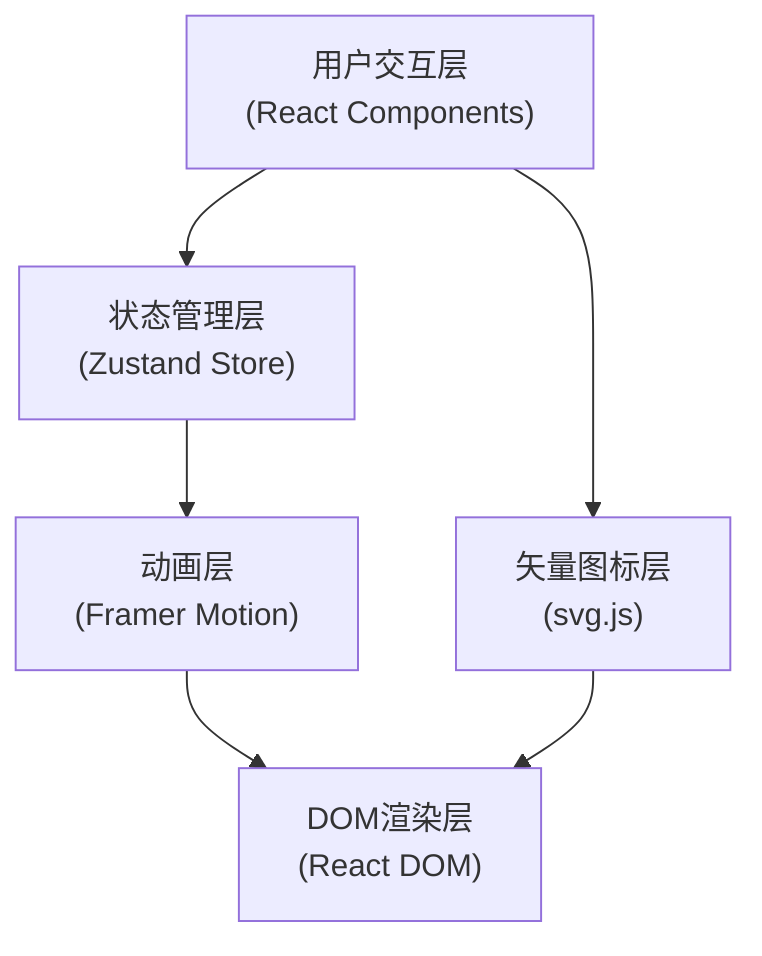

## 1. 架构设计



## 2. 技术描述

- **前端框架**：React@18 + TypeScript@5
- **构建工具**：Vite@5
- **状态管理**：zustand@4
- **动画库**：framer-motion@11
- **矢量图形**：svg.js@3
- **样式方案**：CSS Modules + CSS Variables
- **开发语言**：TypeScript 严格模式

## 3. 核心目录结构

```
src/
├── main.tsx              # 应用入口
├── App.tsx               # 主布局组件
├── index.css             # 全局样式与CSS变量
├── store/
│   └── spiceStore.ts     # Zustand状态管理
├── components/
│   ├── SpiceRack.tsx     # 香料架组件
│   ├── SpiceJar.tsx      # 单个香料罐组件
│   ├── Scale.tsx         # 称重盘组件
│   ├── PowderPile.tsx    # 粉末堆积组件
│   ├── RecipeCard.tsx    # 配方卡组件
│   ├── ParticleBurst.tsx # 粒子飞溅组件
│   └── ControlPanel.tsx  # 控制面板组件
├── utils/
│   ├── spiceData.ts      # 香料数据配置
│   ├── scentGenerator.ts # 气味描述生成器
│   └── colorMixer.ts     # 颜色混合算法
└── types/
    └── index.ts          # TypeScript类型定义
```

## 4. 数据模型

### 4.1 香料数据模型

```typescript
interface Spice {
  id: string;
  name: string;
  nameCN: string;
  color: string;
  scentTags: string[];
  description: string;
  origin: string; // 产地，西域风格描述
}

interface MixedSpice {
  spiceId: string;
  amount: number; // 百分比 0-100
}

interface SpiceState {
  spices: Spice[];
  mixture: MixedSpice[];
  scentDescription: string | null;
  isDragging: boolean;
  draggedSpiceId: string | null;
  particles: Particle[];
  
  // Actions
  addSpice: (spiceId: string, amount?: number) => void;
  removeSpice: (spiceId: string) => void;
  clearMixture: () => void;
  generateScent: () => void;
  randomRecipe: () => void;
  startDrag: (spiceId: string) => void;
  endDrag: () => void;
  addParticle: (x: number, y: number, color: string) => void;
  removeParticle: (id: string) => void;
}

interface Particle {
  id: string;
  x: number;
  y: number;
  color: string;
  vx: number;
  vy: number;
  life: number;
}
```

### 4.2 香料基础数据

```typescript
const SPICES: Spice[] = [
  {
    id: 'pepper',
    name: 'Pepper',
    nameCN: '胡椒',
    color: '#8B4513',
    scentTags: ['辛烈', '温暖', '醒神'],
    description: '来自波斯的黑色珍珠，辛辣中带着木质香气',
    origin: '波斯国'
  },
  {
    id: 'cinnamon',
    name: 'Cinnamon',
    nameCN: '肉桂',
    color: '#D2691E',
    scentTags: ['甘甜', '温暖', '醇厚'],
    description: '天竺国进贡的珍贵香料，甜香浓郁',
    origin: '天竺国'
  },
  {
    id: 'clove',
    name: 'Clove',
    nameCN: '丁香',
    color: '#8B0000',
    scentTags: ['浓烈', '芳香', '辛甜'],
    description: '摩鹿加群岛的丁香花蕾，香气逼人',
    origin: '摩鹿加'
  },
  {
    id: 'cardamom',
    name: 'Cardamom',
    nameCN: '豆蔻',
    color: '#9ACD32',
    scentTags: ['清新', '柠檬香', '柔和'],
    description: '西域小国的神秘香料，清香宜人',
    origin: '西域诸国'
  },
  {
    id: 'saffron',
    name: 'Saffron',
    nameCN: '藏红花',
    color: '#DC143C',
    scentTags: ['珍贵', '花香', '奇异'],
    description: '波斯高原的红色黄金，价比黄金',
    origin: '波斯高原'
  }
];
```

## 5. 核心算法

### 5.1 颜色混合算法

基于颜料减色混合原理，模拟真实香料粉末混合效果：

```typescript
function mixColors(colors: { color: string; ratio: number }[]): string {
  // 将RGB转换为CMY进行减色混合
  // 再转换回RGB，确保混合效果自然
  // 输入格式: [{ color: '#8B4513', ratio: 0.3 }, ...]
}
```

### 5.2 气味描述生成器

基于香料比例和气味标签，生成诗意的气味描述：

```typescript
function generateScentDescription(mixture: MixedSpice[], spices: Spice[]): string {
  // 1. 找出占比最高的2-3种香料
  // 2. 组合它们的气味标签
  // 3. 生成符合唐代风格的诗意描述
  // 如："辛烈的胡椒为主调，辅以肉桂的甘甜，藏红花的异香若隐若现"
}
```

### 5.3 随机配方生成器

```typescript
function generateRandomRecipe(spices: Spice[]): MixedSpice[] {
  // 1. 随机选择3-5种香料
  // 2. 为每种香料分配随机百分比（总和为100%）
  // 3. 确保主要香料占比较高，形成层次
}
```

## 6. 动画实现方案

### 6.1 拖拽交互
- 使用 framer-motion 的 `useDrag` hook 实现拖拽
- 拖拽过程中元素半透明 + 轻微缩放
- 落点检测使用 `useInView` 或坐标计算
- 放置时弹性动画 `type: "spring", stiffness: 300, damping: 20`

### 6.2 粒子动画
- 使用 `AnimatePresence` 管理粒子生命周期
- 粒子飞出方向随机，速度衰减
- 粒子消失时淡出缩小
- 60fps 性能优化：使用 `transform` 和 `opacity` 动画

### 6.3 粉末堆积
- 多层径向渐变模拟粉末堆积效果
- 新香料添加时，高度动画过渡
- 颜色使用 CSS 变量实时更新混合色

## 7. 性能优化

- **帧率保障**：所有动画使用 `transform` 和 `opacity`，避免触发重排
- **状态隔离**：Zustand store 使用 selector 避免不必要重渲染
- **粒子池化**：粒子组件复用，避免频繁创建销毁
- **惰性计算**：颜色混合和气味描述按需计算，使用 useMemo 缓存
- **虚拟列表**：香料架数量固定，无需虚拟化

## 8. 无障碍支持

- 所有交互元素支持键盘导航（Tab/Enter/Space）
- 图片和图标添加 alt 文本
- 颜色对比度符合 WCAG AA 标准
- ARIA 角色和状态属性完整
- 支持屏幕阅读器读取配方信息
