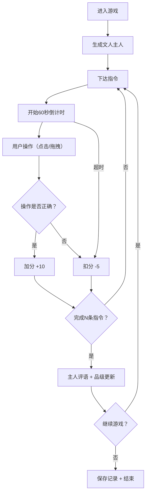

## 1. 产品概述
"明式书斋·书童录"是一款模拟明代文人书斋生活的互动管理web应用。用户扮演书童，在限时内完成主人（系统随机生成的文人）下达的各项指令，通过精准操作获得评分和品级晋升。

- 核心价值：沉浸式体验明代文人书斋文化，训练反应力和操作精准度
- 目标用户：对中国传统文化感兴趣、喜爱休闲益智类游戏的玩家

## 2. 核心功能

### 2.1 用户角色
| 角色 | 注册方式 | 核心权限 |
|------|----------|----------|
| 书童（玩家） | 直接进入游戏 | 执行指令、查看成绩、查看历史记录 |

### 2.2 功能模块
1. **书斋全景区**：CSS Grid布局模拟书斋分区，展示书案、书架、画缸、琴台、茶寮等区域
2. **指令面板**：倒计时显示、指令文字展示、提示按钮
3. **操作区**：拖拽交互、物品点击、多步动作执行
4. **评分系统**：正确/错误判定、得分累计、品级晋升
5. **后台记录**：游戏得分、用时、评语历史记录

### 2.3 页面详情
| 页面名称 | 模块名称 | 功能描述 |
|----------|----------|----------|
| 主游戏页面 | 书斋全景 | 俯视视角展示书斋各区域，物品以扁平木刻风格图标呈现 |
| 主游戏页面 | 指令面板 | 显示当前指令、60秒倒计时、提示按钮 |
| 主游戏页面 | 操作区 | 实现物品拖拽、点击选择、多步操作序列 |
| 主游戏页面 | 状态显示 | 当前得分、品级、主人评语弹窗 |
| 历史记录面板 | 数据记录 | 展示历史游戏得分、用时、评语 |

## 3. 核心流程
用户进入游戏后，系统随机生成文人主人并下达第一条指令。用户需在60秒内通过点击/拖拽物品到正确位置或按顺序执行多步动作完成指令。完成正确得分，超时或错放扣分。每完成若干指令，主人给予评语，累计品级从"洒扫童子"升至"翰林侍书"。

## 4. 用户界面设计

### 4.1 设计风格
- **主色调**：素雅宣纸色 #f5f0e1 与竹青色 #6b8e23
- **辅助色**：深棕 #5d4037、墨黑 #212121、朱红 #c62828（用于错误提示）
- **背景**：淡淡的宣纸纹理，仿木刻版画风格
- **图标**：扁平风格带细致阴影，仿明代木刻版画质感
- **按钮**：圆角4px，竹青色填充，hover时加深，点击时有"咔嗒"视觉反馈
- **字体**：标题用楷体/仿宋，正文用思源宋体
- **布局**：三栏布局 - 顶部书斋全景（60%高度），左侧指令面板（20%宽度），右侧操作区（80%宽度）

### 4.2 页面设计概述
| 页面名称 | 模块名称 | UI元素 |
|----------|----------|--------|
| 主游戏页面 | 书斋全景 | CSS Grid分区，物品图标，点击放大变色反馈，半透明拖拽轨迹 |
| 主游戏页面 | 指令面板 | 倒计时圆环动画，指令文字滑入动画，提示按钮 |
| 主游戏页面 | 操作区 | 拖拽目标区域高亮，操作步骤指示器 |
| 主游戏页面 | 状态区 | 得分数字跳动动画，品级徽章，评语弹窗淡入淡出 |

### 4.3 交互动效
- **指令出现**：从顶部滑入，带缓动效果
- **倒计时结束**：红色闪烁动画
- **点击物品**：轻微放大（scale: 1.1）+ 颜色加深 + 阴影增强
- **拖拽物品**：半透明轨迹跟随，opacity: 0.7
- **正确操作**：绿色光晕 + 轻微弹跳
- **错误操作**：红色抖动 + 扣分数字飘出
- **帧率**：60fps，所有交互响应 < 100ms

### 4.4 响应式
桌面端优先，适配1280px及以上屏幕宽度。移动端采用堆叠布局，三栏改为垂直排列。

### 4.5 品级体系
| 品级 | 所需积分 |
|------|----------|
| 洒扫童子 | 0 |
| 侍墨童子 | 50 |
| 伴读书童 | 100 |
| 文房管事 | 200 |
| 知书房事 | 350 |
| 翰林院侍书 | 500 |
