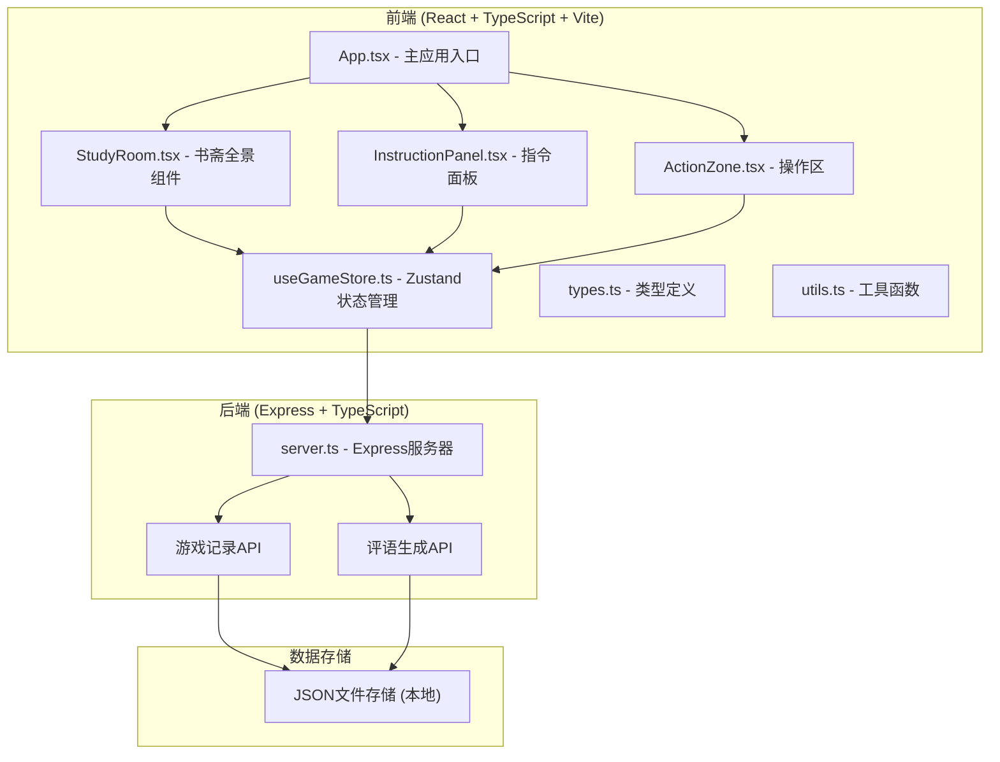
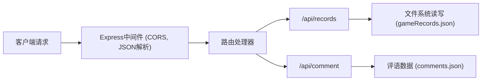
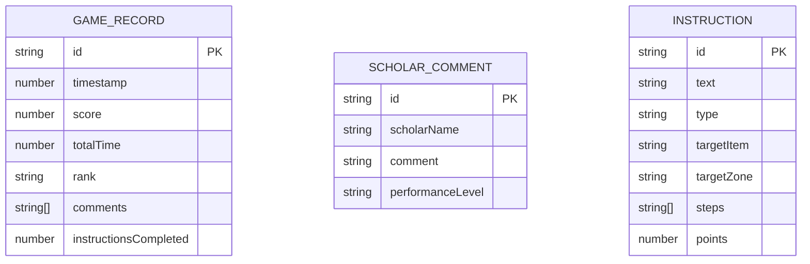

## 1. 架构设计



## 2. 技术描述

- **前端**：React 18 + TypeScript + Vite 5 + Zustand 4
- **构建工具**：Vite 5
- **后端**：Express 4 + TypeScript
- **状态管理**：Zustand
- **样式方案**：CSS Modules + CSS Variables
- **图标**：Lucide React（自定义明代风格）
- **数据持久化**：本地JSON文件存储（模拟）
- **包管理器**：npm

## 3. 目录结构

```
auto157/
├── package.json
├── vite.config.ts
├── tsconfig.json
├── index.html
├── src/
│   ├── main.tsx
│   ├── App.tsx
│   ├── types.ts
│   ├── store/
│   │   └── useGameStore.ts
│   ├── components/
│   │   ├── StudyRoom.tsx
│   │   ├── InstructionPanel.tsx
│   │   ├── ActionZone.tsx
│   │   └── GameHistory.tsx
│   ├── utils/
│   │   └── gameUtils.ts
│   └── styles/
│       ├── variables.css
│       └── animations.css
├── server/
│   └── server.ts
└── data/
    └── gameRecords.json
```

## 4. 路由定义

| 路由 | 用途 |
|------|------|
| / | 主游戏页面 |
| /api/records (POST) | 保存游戏记录 |
| /api/records (GET) | 获取游戏历史 |
| /api/comment (GET) | 获取随机主人评语 |

## 5. API 定义

### 5.1 类型定义

```typescript
// 游戏指令类型
interface GameInstruction {
  id: string;
  text: string;
  type: 'drag' | 'click' | 'sequence';
  targetItem: string;
  targetZone: string;
  steps?: string[];
  points: number;
}

// 游戏记录类型
interface GameRecord {
  id: string;
  timestamp: number;
  score: number;
  totalTime: number;
  rank: string;
  comments: string[];
  instructionsCompleted: number;
}

// 游戏状态类型
interface GameState {
  isPlaying: boolean;
  score: number;
  rank: string;
  currentInstruction: GameInstruction | null;
  timeRemaining: number;
  completedInstructions: number;
  gameHistory: GameRecord[];
  selectedItem: string | null;
  stepIndex: number;
}
```

### 5.2 API 请求/响应

#### POST /api/records
**请求体**：
```typescript
{
  score: number;
  totalTime: number;
  rank: string;
  comments: string[];
  instructionsCompleted: number;
}
```

**响应**：
```typescript
{
  success: boolean;
  recordId: string;
}
```

#### GET /api/records
**响应**：
```typescript
{
  records: GameRecord[];
}
```

#### GET /api/comment
**查询参数**：`?performance=good|bad|normal`

**响应**：
```typescript
{
  comment: string;
  scholarName: string;
}
```

## 6. 服务器架构



## 7. 数据模型

### 7.1 实体关系



### 7.2 初始数据

**评语数据 (comments.json)**：
```json
{
  "good": [
    { "scholarName": "文徵明", "comment": "孺子可教也，日后必成大器。" },
    { "scholarName": "唐伯虎", "comment": "心思缜密，行事有度，甚好。" },
    { "scholarName": "祝允明", "comment": "进退有据，颇有章法。" }
  ],
  "normal": [
    { "scholarName": "文徵明", "comment": "尚可，仍需勤勉。" },
    { "scholarName": "唐伯虎", "comment": "中规中矩，再加把劲。" }
  ],
  "bad": [
    { "scholarName": "文徵明", "comment": "粗心大意，成何体统！" },
    { "scholarName": "唐伯虎", "comment": "慌慌张张，成何体统！" }
  ]
}
```

**指令数据 (instructions.json)**：
```json
[
  {
    "id": "inst_001",
    "text": "取《论语》一卷并置于案上",
    "type": "drag",
    "targetItem": "book_lunyu",
    "targetZone": "desk",
    "points": 10
  },
  {
    "id": "inst_002",
    "text": "煮一壶龙井茶送至琴台",
    "type": "sequence",
    "targetItem": "tea_longjing",
    "targetZone": "qin_table",
    "steps": ["wash_teapot", "boil_water", "steep_tea", "serve"],
    "points": 15
  }
]
```
