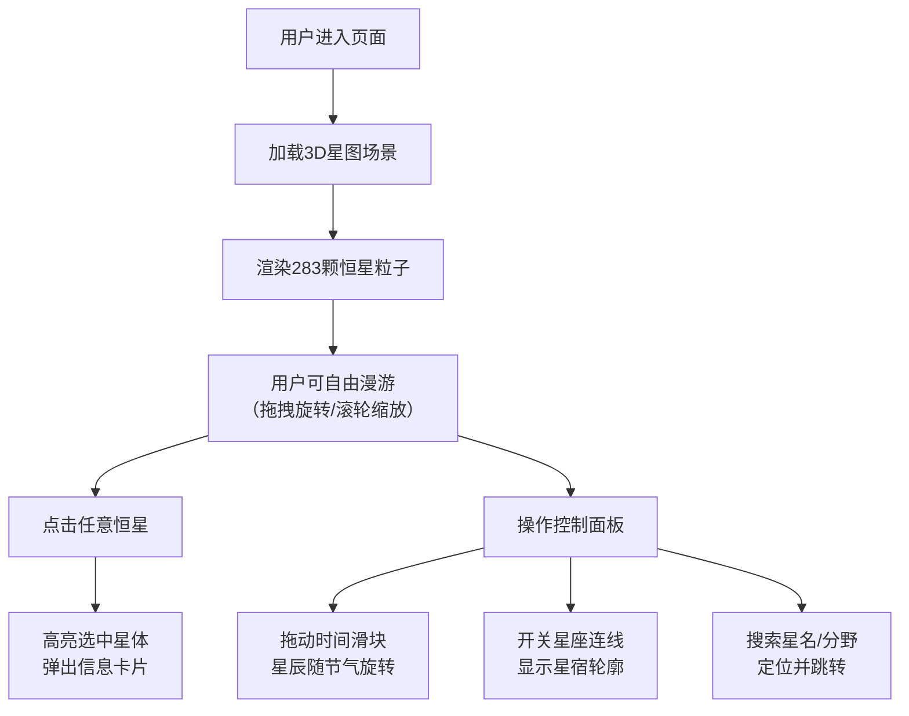

## 1. 产品概述

璇玑玉衡·星宿图是一个沉浸式的宋代星宿3D交互可视化平台，让用户以北宋司天监天文官的视角，在三维浑天仪环境中漫游观测二十八宿及古代恒星的分布，感受中华传统天文文化的魅力。

- **主要用途**：文化教育、天文科普、互动展示
- **目标用户**：天文爱好者、历史文化研究者、学生、普通公众
- **核心价值**：以现代3D技术重现中国古代天文成就，让传统文化可交互、可感知

## 2. 核心功能

### 2.1 用户角色

| 角色 | 注册方式 | 核心权限 |
|------|----------|----------|
| 访客用户 | 无需注册 | 完整浏览、交互、搜索功能 |

### 2.2 功能模块

1. **3D星图主场景**：浑天仪环境、283颗恒星渲染、自由视角漫游
2. **恒星交互系统**：点击查看详情、高亮显示、信息卡片动画
3. **控制面板**：时间滑块、星座连线开关、星宿搜索过滤
4. **视觉效果系统**：古风界面、星光闪烁、金线轨迹、响应式布局

### 2.3 页面详情

| 页面名称 | 模块名称 | 功能描述 |
|---------|----------|----------|
| 主界面 | 3D星图场景 | 渲染283颗恒星，支持拖拽旋转、滚轮缩放、点击交互 |
| 主界面 | 信息卡片 | 显示星名、星等、分野、西方星座，带淡入弹性动画 |
| 主界面 | 左侧控制面板 | 时间滑块（正月-腊月）控制星辰周年旋转 |
| 主界面 | 左侧控制面板 | 星座连线开关，显示/隐藏星宿轮廓线 |
| 主界面 | 左侧控制面板 | 搜索框，按星名或分野过滤并跳转 |
| 主界面 | 古风UI | 羊皮卷底色、墨迹边框、篆书字体、宣纸按压动效 |

## 3. 核心流程

## 4. 用户界面设计

### 4.1 设计风格

**古风宋代天文主题**：
- **主色调**：深空蓝(#0a0e27) → 暗夜黑(#000000) 渐变背景
- **点缀色**：星金(#d4af37)、朱砂(#a32638)、玉石青(#5f9ea0)
- **UI底色**：羊皮卷米黄(#f5e6c8)、墨迹深灰(#2c2c2c)
- **按钮样式**：圆角矩形，墨迹边框，按压时模仿宣纸褶皱微动画
- **字体**：篆书字体用于星名标签，楷体用于说明文字
- **布局**：全屏沉浸式3D场景，左侧固定控制面板，信息卡片浮动显示

### 4.2 页面设计概览

| 页面名称 | 模块名称 | UI元素 |
|---------|----------|--------|
| 主界面 | 3D星图 | 283颗闪烁星点（白→淡蓝渐变）、金线星座连线、深空渐变背景 |
| 主界面 | 信息卡片 | 羊皮卷底色、墨迹边框、星名篆书、星等★表示、分野印章样式 |
| 主界面 | 控制面板 | 羊皮卷底色、篆书标题、滑块金线装饰、开关玉扣样式、搜索古砚造型 |
| 主界面 | 动效 | 星光闪烁shader、信息卡弹性出现、按钮宣纸褶皱、星辰缓慢旋转 |

### 4.3 响应式设计

- **大屏(≥1920x1080)**：全屏星图，左侧固定控制面板(320px宽)
- **平板(768-1919px)**：控制面板改为可拖拽浮动面板，默认收起可展开
- **手机(<768px)**：控制面板改为底部弹出简洁栏，只保留核心功能，触摸友好

### 4.4 3D场景设计

- **环境**：深空渐变背景，无HDRI，营造纯净夜空感
- **光照**：环境光+微弱点光源，突出星光自发光效果
- **相机**：默认北极上方俯视，支持OrbitControls自由旋转缩放
- **构图**：星辰均匀分布在天球面上，二十八宿形成明显星群
- **交互**：点击星体发射射线检测，高亮选中星体发光强度
- **动画**：shader实现星光闪烁（低频微闪），时间轴控制整体缓慢旋转
- **性能**：粒子系统渲染283颗星，保持60fps，shader计算闪烁效果
