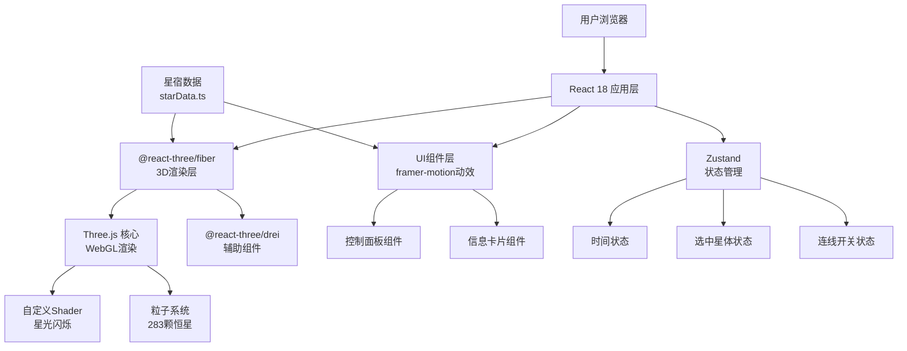

## 1. 架构设计



## 2. 技术描述

- **前端框架**：React 18 + TypeScript
- **构建工具**：Vite 5 + @vitejs/plugin-react
- **3D引擎**：Three.js + @react-three/fiber + @react-three/drei
- **状态管理**：Zustand
- **动画库**：framer-motion
- **样式方案**：CSS Modules + CSS Variables（古风主题）
- **初始化方式**：Vite React TypeScript 模板

## 3. 项目结构

```
src/
├── main.tsx              # 应用入口
├── App.tsx               # 主应用组件
├── store/
│   └── useStore.ts       # Zustand状态管理
├── data/
│   └── starData.ts       # 283颗恒星数据
├── components/
│   ├── StarField.tsx     # 恒星粒子系统
│   ├── ConstellationLines.tsx  # 星座连线
│   ├── ControlPanel.tsx  # 控制面板
│   ├── InfoCard.tsx      # 信息卡片
│   └── shaders/
│       └── starShader.ts # 星光闪烁Shader
├── types/
│   └── index.ts          # TypeScript类型定义
└── styles/
    ├── global.css        # 全局样式与主题变量
    └── fonts.css         # 古风字体引入
```

## 4. 数据模型

### 4.1 恒星数据结构

```typescript
interface Star {
  id: string;           // 唯一标识
  name: string;         // 星名（如"心宿二"）
  constellation: string; // 所属星宿（如"心宿"）
  westernConstellation: string; // 西方星座（如"天蝎座"）
  magnitude: number;    // 星等（0-6，越小越亮）
  ra: number;           // 赤经（0-360度）
  dec: number;          // 赤纬（-90~90度）
  fenye: string;        // 分野（如"豫州"）
  isMain: boolean;      // 是否为二十八宿主星
}

interface Constellation {
  name: string;         // 星宿名（如"角宿"）
  stars: string[];      // 主星ID列表
  lines: [number, number][]; // 连线索引对
}
```

### 4.2 应用状态

```typescript
interface AppState {
  timeMonth: number;          // 当前月份（0-11）
  showConstellationLines: boolean; // 是否显示连线
  selectedStarId: string | null;   // 选中星体ID
  searchQuery: string;        // 搜索关键词
  setTimeMonth: (month: number) => void;
  toggleConstellationLines: () => void;
  setSelectedStarId: (id: string | null) => void;
  setSearchQuery: (query: string) => void;
}
```

## 5. 核心组件说明

### 5.1 StarField.tsx
- 使用THREE.Points + BufferGeometry创建粒子系统
- 自定义Vertex/Fragment Shader实现星光闪烁和颜色渐变
- 根据星等计算粒子大小和亮度
- 集成raycaster实现点击交互

### 5.2 ConstellationLines.tsx
- 使用THREE.CatmullRomCurve3创建贝塞尔曲线
- 每帧根据相机距离动态调整线条粗细
- 半透明金色材质，配合深度测试

### 5.3 ControlPanel.tsx
- 时间滑块：映射到天球旋转角度（每月30度）
- 开关组件：framer-motion实现平滑过渡
- 搜索框：实时过滤星体，支持拼音/中文
- 响应式：根据屏幕尺寸切换布局模式

### 5.4 InfoCard.tsx
- framer-motion实现淡入+弹性动画
- 跟随选中星体的3D屏幕坐标
- 古风UI：羊皮卷纹理、墨迹边框、篆书字体

## 6. 性能优化

- **粒子系统**：单个Points对象渲染283颗星，避免多次draw call
- **Shader动画**：GPU计算闪烁效果，不占用CPU资源
- **状态隔离**：Zustand选择器避免不必要重渲染
- **事件节流**：鼠标移动/滚动事件使用throttle
- **内存管理**：组件卸载时dispose所有Three.js资源
