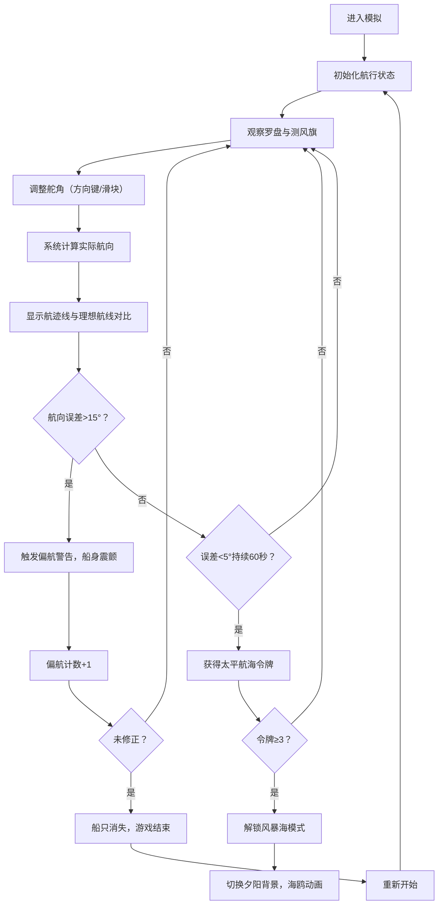

## 1. 产品概述

古代罗盘针位与海上测风定向互动模拟项目，让用户在虚拟宋代海船上扮演火长（领航员），通过观察罗盘磁针摆动和测风旗飘动幅度，实时推算航向偏差并发出纠偏指令。在风浪中校准方位，保持航向稳定60秒即可获得"太平航海"令牌。

- 核心目标：寓教于乐，重现宋代航海技术，让用户体验古代航海家的挑战
- 目标用户：对历史、航海、科学感兴趣的大众用户
- 市场价值：传统文化与互动科技结合，具有教育意义和传播价值

## 2. 核心功能

### 2.1 用户角色
| 角色 | 注册方式 | 核心权限 |
|------|---------|---------|
| 火长（领航员） | 无需注册，直接进入 | 操控舵角、观察罗盘、读取仪表、完成挑战 |

### 2.2 功能模块
1. **海景俯视窗口**：左侧40%区域，包含动态波浪、船只位置、航迹线显示
2. **罗盘放大视图**：右侧60%区域，包含铜质罗盘、彩色磁针、24个针位刻度
3. **航海仪表区**：右侧60%区域下方，包含风速、航向误差、航行时间、偏航次数
4. **舵角控制系统**：键盘方向键或屏幕拖拽控制舵角
5. **成就系统**："太平航海"令牌累积、风暴海模式解锁
6. **视觉反馈系统**：偏航警告、船身震颤、海鸥动画、夕阳背景

### 2.3 页面详情
| 页面名称 | 模块名称 | 功能描述 |
|---------|---------|----------|
| 主界面 | 海景俯视窗口 | Canvas绘制动态波浪，船只随波浪浮动旋转，航迹线对比理想航线 |
| 主界面 | 罗盘放大视图 | 铜质罗盘盘面，24个针位刻度，彩色磁针随船体摇摆，抖动与波浪同步 |
| 主界面 | 航海仪表区 | 显示蒲福风级（1-5级，金色）、航向误差（大于10度红色闪烁）、航行时间、偏航次数 |
| 主界面 | 舵角控制系统 | 方向键或滑块控制舵角（-30°到+30°，步进2°），金属光泽悬停反馈 |
| 主界面 | 成就系统 | 航向误差<5°持续60秒获得令牌，3次后解锁风暴海模式 |
| 主界面 | 视觉反馈 | 偏航>15°触发警告，船身震颤，夕阳背景，海鸥剪影 |

## 3. 核心流程

用户进入页面后，自动开始航行模拟。通过观察罗盘针位偏移和测风旗偏转角度，使用方向键调整舵角，保持航向误差在安全范围内。当误差累计超过15度时船只偏航消失。成功保持航向稳定60秒即可获得令牌，累积三次解锁更高难度的风暴海模式。

## 4. 用户界面设计

### 4.1 设计风格
- **主色调**：深木褐色#2a1a0a铺底、铜金色#b87333勾勒边框、帆布色#d4a76a作为仪表背景
- **辅助色**：柚木色#6b4e3a、桅杆棕#5d3a1a、象牙白#fffff0、罗盘红#cc0000、罗盘蓝#0000cc、警告红#8b0000、黄金色#ffd700
- **字体**：采用衬线字体营造古风，标题使用书法风格字体增强历史感
- **布局**：横向两栏布局，左侧40%海景窗口，右侧60%罗盘和仪表
- **交互**：控件悬停有金属光泽渐变，点击有弹簧动效

### 4.2 页面设计概述
| 页面名称 | 模块名称 | UI元素 |
|---------|---------|--------|
| 主界面 | 海景俯视窗口 | 暗蓝-深绿渐变海面，动态波浪，船只剖面图，白色虚线航迹，黄色实线理想航线，偏航时红色闪烁 |
| 主界面 | 罗盘放大视图 | 铜质外圈#b87333，象牙白内圈#fffff0，24个30°间隔针位标记，每5°微刻，红蓝彩色磁针，随船体摇摆±3° |
| 主界面 | 航海仪表区 | 帆布色背景#d4a76a，铜金色边框，蒲福风级金色数字#ffd700，航向误差>10度红色背景闪烁，航行时间秒表，偏航次数计数器 |
| 主界面 | 舵角控制 | 滑块+方向按钮，步进2°，范围-30°到+30°，悬停金属光泽渐变，点击弹簧动效 |
| 主界面 | 成就展示 | 青铜色令牌#cd7f32，圆形渐变，中央刻"太平"二字，获得时缩放动画 |
| 主界面 | 风暴海模式 | 夕阳红背景#e9967a，海鸥剪影飞行动画，波浪增幅30%，罗盘摆动翻倍 |

### 4.3 响应式
- 桌面端优先，保持横向两栏布局
- 移动端自适应为纵向布局，海景窗口在上，罗盘和仪表在下
- 触控优化：舵角滑块支持触摸拖拽，支持虚拟方向按钮

### 4.4 视觉与动效设计
- **波浪渲染**：Canvas绘制，暗蓝#1a3a5a至深绿#1a4a2a渐变，波高0.5-1.5单位，周期3-5秒，方向动态变化
- **船体动画**：绕X轴±4°旋转，Y轴±2°浮动，与波浪同步
- **罗盘抖动**：与船体运动同步，磁针左右摆动约3°
- **测风旗**：CSS动画模拟飘动，帆布色#d4a76a，随风速变换飘动幅度
- **警告动效**：航向误差>15°时航迹线渐变深红#8b0000并闪烁，船身震颤
- **令牌获得**：缩放+旋转动画，青铜色渐变光泽
- **海鸥动画**：CSS关键帧实现剪影飞行，翅膀拍动效果

### 4.5 性能要求
- 海面波浪和罗盘动画帧率保持55fps以上
- 使用requestAnimationFrame保证时序
- Canvas绘制优化，避免不必要的重绘
- 所有动画流畅，无卡顿或帧率骤降
