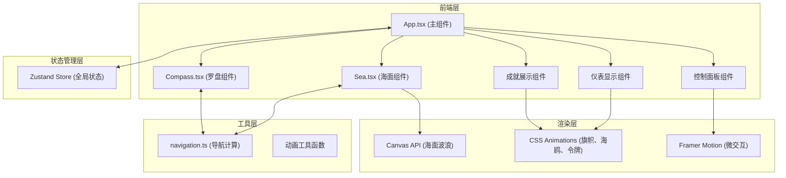

## 1. 架构设计



## 2. 技术描述

- **前端框架**: React@18 + TypeScript@5 + Vite@5
- **状态管理**: zustand@4
- **动画库**: framer-motion@11
- **样式方案**: 原生CSS + CSS变量 + CSS Modules
- **图形渲染**: Canvas 2D API
- **构建工具**: Vite@5 + @vitejs/plugin-react@4
- **包管理器**: npm
- **后端服务**: 无（纯前端项目）

### 技术选型理由
- **React 18**: 组件化开发，支持Concurrent Mode优化渲染性能
- **TypeScript**: 类型安全，减少运行时错误，提升代码可维护性
- **Zustand**: 轻量级状态管理，API简洁，避免不必要的重渲染
- **Framer Motion**: 声明式动画，支持spring物理动效，简化微交互实现
- **Canvas 2D**: 高性能波浪渲染，支持60fps动画
- **Vite**: 极速开发体验，HMR毫秒级更新

## 3. 目录结构

```
├── src/
│   ├── components/
│   │   ├── Compass.tsx          # 罗盘组件：绘制盘面、磁针、刻度、抖动动画
│   │   ├── Sea.tsx              # 海面组件：Canvas波浪、船只、航迹线
│   │   ├── Dashboard.tsx        # 航海仪表：风速、航向误差、时间、偏航次数
│   │   ├── RudderControl.tsx    # 舵角控制：滑块、方向按钮
│   │   ├── TokenBadge.tsx       # 令牌徽章：CSS绘制青铜令牌
│   │   ├── WindFlag.tsx         # 测风旗：CSS动画飘动效果
│   │   └── Seagull.tsx          # 海鸥剪影：CSS关键帧动画
│   ├── store/
│   │   └── useNavigationStore.ts  # Zustand状态管理
│   ├── utils/
│   │   └── navigation.ts        # 导航计算模块
│   ├── hooks/
│   │   ├── useAnimationFrame.ts # RAF钩子
│   │   └── useKeyboardControl.ts # 键盘控制钩子
│   ├── styles/
│   │   └── theme.css            # 全局样式主题、CSS变量、动画关键帧
│   ├── types/
│   │   └── index.ts             # TypeScript类型定义
│   ├── App.tsx                  # 主组件：布局组合、状态管理
│   └── main.tsx                 # 应用入口
├── package.json
├── vite.config.js
├── tsconfig.json
└── index.html
```

## 4. 核心数据模型

### 4.1 状态定义

```typescript
interface NavigationState {
  // 舵角：-30度到+30度，步进2度
  rudderAngle: number;
  // 风速等级：0-5级，动态随机变化
  windSpeed: number;
  // 风向角度：0-360度
  windDirection: number;
  // 测风旗偏转角度：0-90度
  flagDeflection: number;
  // 当前航向误差：-180到+180度
  headingError: number;
  // 理想航线角度：固定为0度（正北）
  idealHeading: number;
  // 实际航向角度
  actualHeading: number;
  // 航行时间：秒
  sailingTime: number;
  // 累计偏航次数
  yawCount: number;
  // 令牌数量
  tokenCount: number;
  // 误差小于5度的持续时间
  stableDuration: number;
  // 是否已解锁风暴海模式
  stormModeUnlocked: boolean;
  // 是否处于风暴海模式
  isStormMode: boolean;
  // 船体姿态
  shipMotion: {
    rollX: number;  // 绕X轴旋转：±4度
    pitchY: number; // 绕Y轴旋转：±2度
    heaveZ: number; // 垂直浮动
  };
  // 波浪参数
  waveParams: {
    direction: number;  // 波浪方向
    amplitude: number;  // 波高
    period: number;     // 周期
  };
  // 船身震颤效果
  isShaking: boolean;
  // 游戏是否结束
  isGameOver: boolean;
}
```

### 4.2 计算模块接口

```typescript
// navigation.ts
export interface NavigationCalculation {
  // 根据舵角、风速计算实际航向
  calculateActualHeading: (
    rudderAngle: number,
    windSpeed: number,
    windDirection: number,
    currentHeading: number
  ) => number;
  
  // 计算航向误差
  calculateHeadingError: (
    actualHeading: number,
    idealHeading: number
  ) => number;
  
  // 计算船体摇摆幅度对罗盘的影响
  calculateCompassJitter: (
    shipRoll: number,
    windSpeed: number,
    isStormMode: boolean
  ) => { x: number; y: number; rotation: number };
  
  // 计算测风旗偏转角度
  calculateFlagDeflection: (
    windSpeed: number,
    windDirection: number,
    shipHeading: number
  ) => number;
  
  // 随机生成风速和方向变化
  generateWindChange: (
    currentWindSpeed: number,
    currentWindDirection: number,
    timeDelta: number,
    isStormMode: boolean
  ) => { windSpeed: number; windDirection: number };
  
  // 随机生成波浪参数变化
  generateWaveChange: (
    currentParams: WaveParams,
    timeDelta: number,
    isStormMode: boolean
  ) => WaveParams;
  
  // 计算船体运动姿态
  calculateShipMotion: (
    waveParams: WaveParams,
    time: number,
    windSpeed: number
  ) => ShipMotion;
}
```

## 5. 状态管理设计

```typescript
// useNavigationStore.ts
import { create } from 'zustand';
import { 
  calculateActualHeading, 
  calculateHeadingError,
  calculateCompassJitter,
  calculateFlagDeflection,
  generateWindChange,
  generateWaveChange,
  calculateShipMotion
} from '../utils/navigation';

interface NavigationStore extends NavigationState {
  // Actions
  setRudderAngle: (angle: number) => void;
  incrementRudderAngle: (delta: number) => void;
  update: (timeDelta: number) => void;
  resetGame: () => void;
  toggleStormMode: () => void;
}

// update方法主循环逻辑：
// 1. 更新风速和风向（随机变化）
// 2. 更新波浪参数
// 3. 计算船体运动姿态
// 4. 计算实际航向（受舵角、风速、随机偏航影响）
// 5. 计算航向误差
// 6. 更新航行时间
// 7. 检查稳定持续时间，发放令牌
// 8. 检查偏航警告
// 9. 检查游戏结束条件
```

## 6. 关键组件实现方案

### 6.1 Compass.tsx (罗盘组件)
- **技术实现**: SVG + CSS transforms
- **核心元素**: 铜质外圈、象牙白内圈、24个30°针位刻度、每5°微刻
- **动画**: 磁针随船体摇摆±3°，抖动与波浪同步
- **Props**: 
  - `headingError`: 航向误差
  - `compassJitter`: 罗盘抖动参数
  - `isStormMode`: 风暴模式标记
- **性能**: 使用transform动画，避免layout重排

### 6.2 Sea.tsx (海面组件)
- **技术实现**: Canvas 2D API + requestAnimationFrame
- **渲染内容**: 动态波浪、船只位置、航迹线、理想航线
- **波浪算法**: 多层正弦波叠加，创建真实海浪效果
- **Props**:
  - `waveParams`: 波浪参数
  - `shipMotion`: 船体姿态
  - `headingError`: 航向误差
  - `actualHeading`: 实际航向
  - `isStormMode`: 风暴模式
- **性能优化**: 
  - 离屏Canvas预渲染渐变
  - 只在必要时重绘
  - 使用devicePixelRatio适配高清屏

### 6.3 Dashboard.tsx (仪表组件)
- **技术实现**: React + CSS变量 + Framer Motion
- **显示内容**: 蒲福风级（金色数字）、航向误差（>10°红色闪烁）、航行时间、偏航次数
- **动画**: 数值变化时的平滑过渡，警告闪烁效果

### 6.4 RudderControl.tsx (舵角控制)
- **技术实现**: React + Framer Motion
- **交互方式**: 键盘方向键、滑块拖拽、按钮点击
- **步进**: 2度每次
- **范围**: -30°到+30°
- **动效**: 悬停金属光泽渐变，点击spring动效

## 7. 性能优化策略

1. **Canvas渲染优化**:
   - 使用`requestAnimationFrame`驱动所有动画循环
   - 波浪数据计算与渲染分离，缓存计算结果
   - 多层波浪叠加时限制层数（最多3层）

2. **React重渲染优化**:
   - 使用Zustand的`shallow`比较器选择状态
   - 组件使用`React.memo`包裹
   - 回调函数使用`useCallback`缓存

3. **CSS动画优化**:
   - 只对`transform`和`opacity`属性做动画
   - 使用`will-change`提示浏览器优化
   - 避免在动画中触发layout和paint

4. **帧率监控**:
   - 实现FPS监控逻辑
   - 低帧率时自动降低波浪复杂度
   - 保证最低55fps

## 8. 动画时序控制

所有动画统一使用`requestAnimationFrame`驱动，主循环在`App.tsx`中实现：

```typescript
// 主循环时序
const animationLoop = useCallback(() => {
  const now = performance.now();
  const delta = (now - lastTimeRef.current) / 1000; // 转换为秒
  lastTimeRef.current = now;
  
  // 限制最大delta，防止标签页切换后大跳
  const clampedDelta = Math.min(delta, 0.1);
  
  // 更新状态
  updateNavigation(clampedDelta);
  
  // 继续循环
  animationFrameRef.current = requestAnimationFrame(animationLoop);
}, [updateNavigation]);
```
