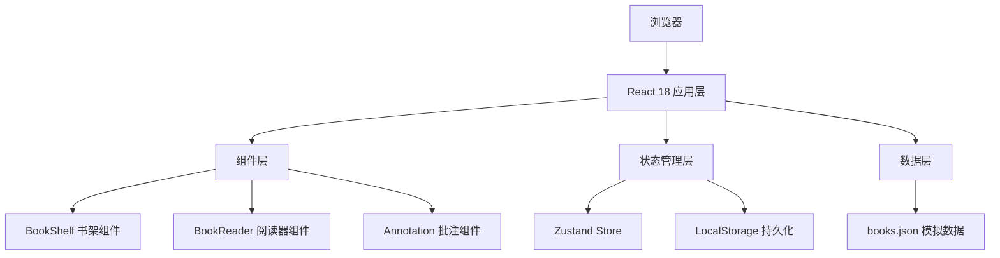

## 1. 架构设计



## 2. 技术栈说明

- **前端框架**：React 18 + TypeScript 5
- **构建工具**：Vite 5 + @vitejs/plugin-react
- **状态管理**：Zustand 4（轻量级状态管理，支持 persist 中间件）
- **动画库**：Framer Motion 11（流畅的翻页动画、过渡效果）
- **样式方案**：CSS Modules / 内联样式 + CSS 变量（主题色控制）
- **数据存储**：LocalStorage（批注持久化）
- **数据源**：静态 JSON 文件模拟古籍数据

## 3. 项目结构

```
├── package.json          # 项目依赖和脚本
├── vite.config.js        # Vite 配置
├── tsconfig.json         # TypeScript 配置（严格模式）
├── index.html            # 入口HTML
└── src/
    ├── main.tsx          # 应用入口
    ├── App.tsx           # 根组件
    ├── components/
    │   ├── BookShelf.tsx # 书架组件（虚拟滚动）
    │   └── BookReader.tsx# 阅读器组件（双页布局、翻页动画）
    ├── store/
    │   └── useBookStore.ts # Zustand 状态管理
    └── data/
        └── books.json    # 古籍模拟数据
```

## 4. 核心数据模型

### 4.1 古籍数据模型

```typescript
interface Book {
  id: string;
  title: string;           // 书名
  author: string;          // 作者
  dynasty: string;         // 朝代
  category: 'jing' | 'shi' | 'zi' | 'ji';  // 经史子集
  coverColor: string;      // 书脊颜色
  pages: BookPage[];       // 书页内容
}

interface BookPage {
  pageNum: number;
  originalText: string;    // 古籍原文（分段）
  translation: string;     // 现代译文
  annotations: Annotation[]; // 批注
}

interface Annotation {
  id: string;
  bookId: string;
  pageNum: number;
  startOffset: number;     // 文本起始位置
  endOffset: number;       // 文本结束位置
  text: string;            // 高亮文本
  note: string;            // 批注内容
  createdAt: number;       // 创建时间
}
```

### 4.2 应用状态模型

```typescript
interface BookState {
  books: Book[];
  selectedBookId: string | null;
  currentPage: number;
  annotations: Record<string, Annotation>;
  isReading: boolean;
  
  // Actions
  selectBook: (id: string) => void;
  closeBook: () => void;
  nextPage: () => void;
  prevPage: () => void;
  addAnnotation: (annotation: Omit<Annotation, 'id' | 'createdAt'>) => void;
  updateAnnotation: (id: string, note: string) => void;
  deleteAnnotation: (id: string) => void;
}
```

## 5. 性能优化策略

### 5.1 虚拟滚动实现

- 使用 `useRef` + `useState` 计算滚动位置
- 维护 `visibleStartIndex` 和 `visibleEndIndex`
- 只渲染可视区域内约 20 本书籍卡片
- 使用 `scroll-behavior: smooth` 和自定义惯性滚动

### 5.2 动画性能

- Framer Motion 使用 `will-change` 提示浏览器优化
- 翻页动画使用 CSS `transform` 和 `opacity`，避免重排重绘
- 限制帧率在 60fps，使用 `layout` 动画仅在必要时触发

### 5.3 状态优化

- Zustand 使用 `persist` 中间件自动同步到 localStorage
- 使用选择器（selectors）避免不必要的重渲染
- 批注数据按需加载，不预加载全部内容

## 6. 核心交互实现

### 6.1 翻页动画

- 使用 Framer Motion 的 `AnimatePresence` 包裹书页
- 翻页时应用 `rotateY` 旋转 + `perspective` 透视效果
- 书页卷曲效果使用 `borderRadius` 动画模拟

### 6.2 文本选择批注

- 监听 `mouseup` 事件获取选中文本
- 使用 `window.getSelection()` 获取选择范围
- 创建高亮 `<span>` 包裹选中文本
- 弹出批注编辑框，支持保存和取消

### 6.3 惯性滚动

- 监听 `wheel` 事件，累积滚动速度
- 使用 `requestAnimationFrame` 实现平滑减速
- 滚动结束时应用阻尼效果
