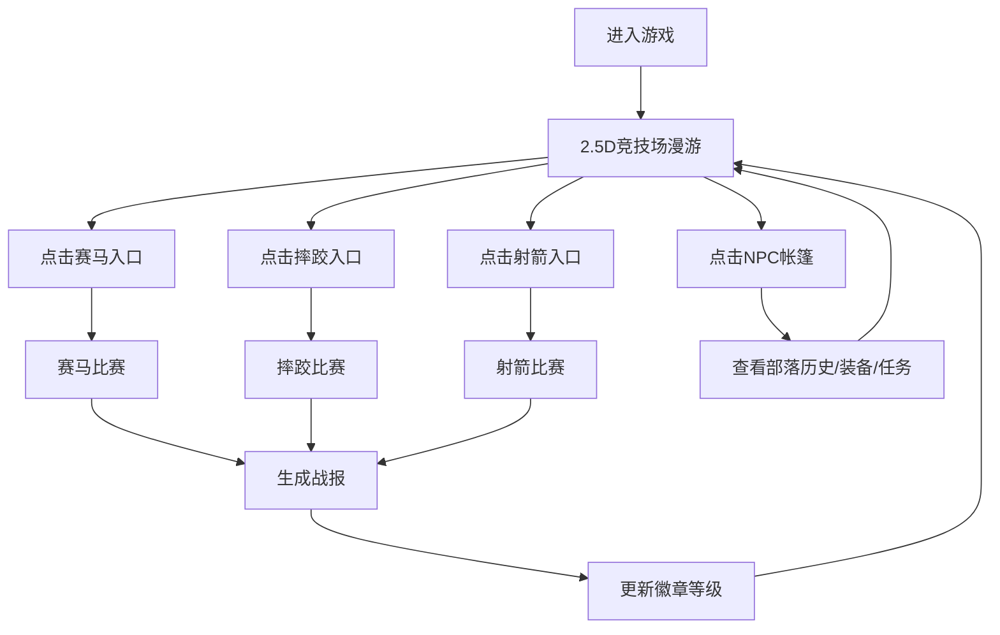

## 1. 产品概述

本产品是一款模拟古代欧亚大陆草原游牧民族"那达慕"竞技大会的全栈Web应用。用户扮演一位部落勇士，在虚拟的草原竞技场上参加赛马、摔跤、射箭三项经典比赛，体验游牧民族的传统竞技文化。

- **核心目的**：通过游戏化方式展示草原游牧文化，提供沉浸式的竞技体验
- **目标用户**：对草原文化感兴趣的游戏玩家、历史文化爱好者
- **市场价值**：将传统民族文化与现代游戏交互结合，创造独特的文化体验产品

## 2. 核心功能

### 2.1 用户角色

| 角色 | 注册方式 | 核心权限 |
|------|----------|----------|
| 部落勇士 | 无需注册，直接进入游戏 | 参加三项竞技比赛、自由漫游竞技场、与NPC互动、查看战报 |

### 2.2 功能模块

1. **竞技场主页**：2.5D俯视角草原漫游，三项比赛入口，NPC帐篷交互
2. **赛马比赛**：空格键节奏按压保持马匹速度与耐力的竞技游戏
3. **摔跤比赛**：鼠标点击对手不同部位积累伤害的对战游戏
4. **射箭比赛**：鼠标瞄准+蓄力释放的射击游戏
5. **战报系统**：比赛分数计算、排名展示、部落徽章升级

### 2.3 页面详情

| 页面名称 | 模块名称 | 功能描述 |
|----------|----------|----------|
| 竞技场主页 | 2.5D草原漫游 | 鼠标拖动视角移动，点击帐篷触发NPC对话，点击比赛入口进入对应赛事 |
| 竞技场主页 | 比赛入口 | 赛马、摔跤、射箭三项比赛的快速入口，带有草原风格的图标和动画 |
| 竞技场主页 | 部落状态 | 显示当前徽章等级、累计分数、历史战绩 |
| 赛马比赛 | 节奏按键系统 | 空格键控制快慢两档，保持节奏维持速度，耐力条管理 |
| 赛马比赛 | 马匹控制 | 速度仪表、耐力条、对手马匹实时位置 |
| 摔跤比赛 | 部位点击系统 | 点击对手头/身/腿三个部位造成不同伤害，积累伤害击败对手 |
| 摔跤比赛 | 对战界面 | 双方血条、攻击冷却、连击奖励提示 |
| 射箭比赛 | 瞄准系统 | 鼠标移动准星瞄准靶心，风力影响箭头轨迹 |
| 射箭比赛 | 蓄力释放 | 按住左键蓄力，松开释放箭头，蓄力条显示力度等级 |
| 战报页面 | 分数统计 | 各项比赛得分、总分、排名展示 |
| 战报页面 | 评分细节 | 每项比赛的详细评分依据和计算过程 |
| 战报页面 | 徽章系统 | 从青铜→白银→黄金的徽章升级动画和展示 |
| 战报页面 | 粒子特效 | 比赛结束时的庆祝粒子动画 |

## 3. 核心流程

**用户流程描述**：
用户进入游戏后，首先来到2.5D俯视角的草原竞技场，可以自由拖动视角浏览。用户可以点击三个比赛入口之一进入对应赛事，完成比赛后系统自动计算分数并生成战报，根据总分更新部落徽章等级。用户也可以点击竞技场中的帐篷NPC，查看部落历史、进行装备买卖或接受挑战任务。所有交互完成后返回竞技场继续游戏。

## 4. 用户界面设计

### 4.1 设计风格

**草原游牧主题风格**：
- **主色调**：草绿 `#7c9c5e`（草原）、天蓝 `#5b8ba0`（天空）、土棕 `#8b6a4a`（土地/皮革）
- **辅助色**：米白 `#f5e6c8`（羊皮）、深红 `#a04030`（部落旗帜）、金色 `#d4a84b`（徽章）
- **按钮风格**：仿兽皮/木纹纹理，3D立体凹陷效果，悬停时微亮，按下时明显凹陷
- **边框风格**：模仿皮革缝合线，带有锯齿状装饰边
- **字体**：标题使用具有民族特色的衬线字体，正文使用清晰易读的无衬线字体
- **背景**：带有风吹草动CSS动画的草原背景，点缀毡帐、马群、鹰的装饰元素

### 4.2 页面设计概览

| 页面名称 | 模块名称 | UI元素 |
|----------|----------|--------|
| 竞技场主页 | 2.5D草原 | 渐变天空+动画草浪+可拖动视角+帐篷NPC+比赛入口图标+浮动鹰群 |
| 赛马比赛 | 比赛界面 | 仿皮革仪表盘+速度指针+绿色耐力条+三匹马并排奔跑+节奏提示圈 |
| 摔跤比赛 | 对战界面 | 两位勇士对战立绘+点击部位高亮+红色血条+连击数显示+攻击冷却圈 |
| 射箭比赛 | 射击界面 | 移动准星+渐变蓄力条+飘动的靶子+风力指示器+箭头发射轨迹 |
| 战报页面 | 结果展示 | 兽皮卷轴样式+金色排名数字+徽章升级动画+彩色粒子特效+详细分数列表 |

### 4.3 响应式设计

- **设计原则**：桌面端优先，平板适配
- **断点**：1024px（平板）、1280px（桌面）
- **适配策略**：
  - 桌面端（≥1280px）：完整2.5D场景，三栏布局
  - 平板端（1024px-1279px）：两栏布局，适当缩小场景尺寸，优化触控交互
  - 保持60fps帧率，所有动画使用CSS transform和opacity属性
- **触控优化**：增大可点击区域，支持触摸拖动和长按

### 4.4 2.5D场景设计

- **环境**：蓝绿渐变天空，多层草浪动画（近中远三层不同速度），远处山脉剪影
- **相机**：固定俯视角45度，鼠标拖动平移场景
- **光照**：柔和的日光效果，物体带有轻微投影
- **元素**：蒙古包帐篷（可点击）、比赛入口拱门、漫步的马群、盘旋的鹰
- **动画**：草浪随风摆动（正弦波动画）、马群缓慢移动、鹰在空中盘旋
- **性能**：使用CSS transform实现动画，避免重排重绘，目标帧率60fps

### 4.5 交互动效

- **按钮反馈**：悬停时translateY(-2px) + 亮度提升，按下时translateY(2px) + 凹陷阴影
- **点击反馈**：所有可点击元素点击时产生Ripple波纹效果
- **蓄力条**：从草绿到金黄的渐变填充，带有脉冲动画
- **比赛结束**：金色粒子从屏幕中心向外扩散，类似烟花效果
- **页面切换**：使用framer-motion实现平滑的淡入淡出和滑动过渡
