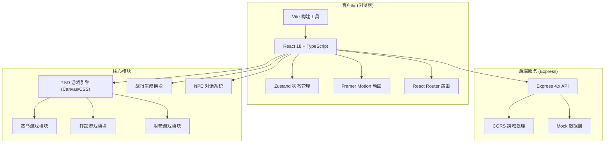
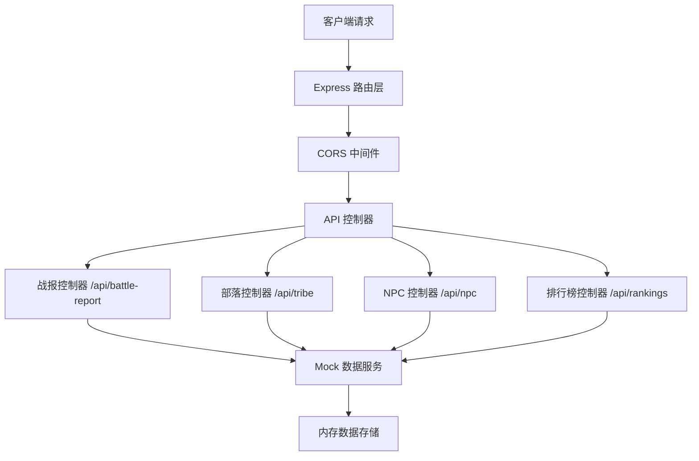
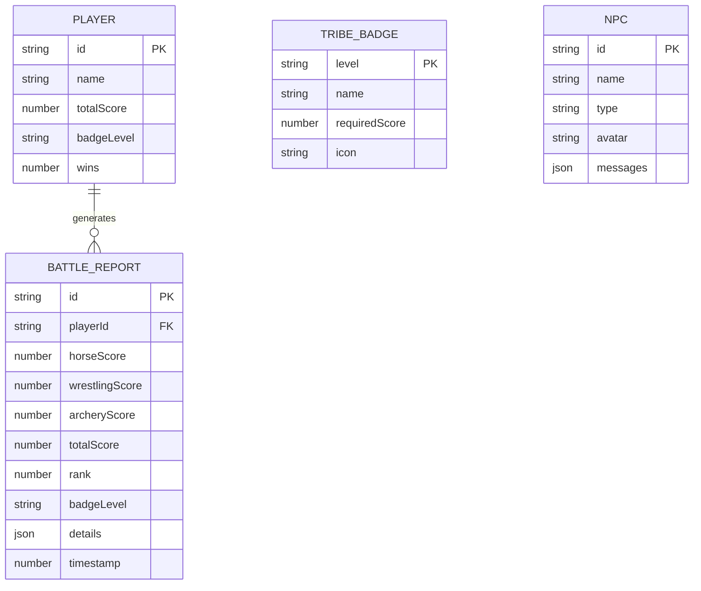

## 1. 架构设计



## 2. 技术描述

### 前端技术栈
- **框架**: React 18 + TypeScript 5.x
- **构建工具**: Vite 5.x
- **状态管理**: Zustand 4.x
- **动画库**: Framer Motion 11.x
- **路由**: React Router DOM 6.x
- **样式**: CSS Modules + CSS Variables
- **游戏渲染**: HTML5 Canvas 2D + CSS Transform

### 后端技术栈
- **框架**: Express 4.x
- **跨域**: CORS 2.x
- **数据**: 内存 Mock 数据，不连接数据库

### 初始化方式
- 使用 `npm create vite@latest` 初始化 React + TypeScript 项目
- 手动配置后端 Express 服务

## 3. 路由定义

| 路由 | 页面组件 | 功能描述 |
|------|----------|----------|
| `/` | `Arena.tsx` | 2.5D竞技场主页面，草原漫游和比赛入口 |
| `/horse-racing` | `HorseRacing.tsx` | 赛马比赛页面 |
| `/wrestling` | `Wrestling.tsx` | 摔跤比赛页面 |
| `/archery` | `Archery.tsx` | 射箭比赛页面 |
| `/battle-report` | `BattleReport.tsx` | 战报展示页面 |

## 4. API 定义

### 类型定义
```typescript
// 游戏分数接口
interface GameScore {
  horseRacing: number;
  wrestling: number;
  archery: number;
  total: number;
}

// 战报接口
interface BattleReport {
  id: string;
  playerName: string;
  scores: GameScore;
  rank: number;
  badgeLevel: 'bronze' | 'silver' | 'gold';
  details: {
    horseRacing: { time: number; speed: number; stamina: number };
    wrestling: { damage: number; hits: number; combo: number };
    archery: { accuracy: number; totalScore: number; arrows: number };
  };
  timestamp: number;
}

// 部落徽章接口
interface TribeBadge {
  level: 'bronze' | 'silver' | 'gold';
  name: string;
  requiredScore: number;
  icon: string;
}

// NPC对话接口
interface NPCDialog {
  id: string;
  name: string;
  type: 'history' | 'shop' | 'quest';
  avatar: string;
  messages: string[];
  options?: { text: string; action: string }[];
}

// 部落信息接口
interface TribeInfo {
  name: string;
  history: string;
  badge: TribeBadge;
  totalScore: number;
  wins: number;
}
```

### API 端点

| 方法 | 路径 | 请求参数 | 返回类型 | 描述 |
|------|------|----------|----------|------|
| `GET` | `/api/battle-report/:id` | `id: string` | `BattleReport` | 获取指定战报详情 |
| `POST` | `/api/battle-report` | `scores: GameScore` | `BattleReport` | 提交分数并生成战报 |
| `GET` | `/api/tribe/info` | 无 | `TribeInfo` | 获取部落信息和徽章状态 |
| `POST` | `/api/tribe/badge` | `totalScore: number` | `TribeBadge` | 根据总分更新徽章等级 |
| `GET` | `/api/npc/:id` | `id: string` | `NPCDialog` | 获取NPC对话内容 |
| `GET` | `/api/rankings` | 无 | `BattleReport[]` | 获取排行榜数据 |

## 5. 服务器架构



### 模块说明
- **路由层**: Express Router 定义 API 端点
- **中间件层**: CORS 处理、请求日志、错误处理
- **控制器层**: 处理业务逻辑，参数验证
- **数据服务层**: Mock 数据生成和管理
- **存储层**: 内存变量存储，不持久化

## 6. 数据模型

### 6.1 数据模型定义



### 6.2 数据初始化脚本

后端启动时自动初始化以下 Mock 数据：

```typescript
// 徽章等级配置
const BADGE_LEVELS: TribeBadge[] = [
  { level: 'bronze', name: '青铜勇士', requiredScore: 0, icon: '🥉' },
  { level: 'silver', name: '白银勇士', requiredScore: 500, icon: '🥈' },
  { level: 'gold', name: '黄金勇士', requiredScore: 1000, icon: '🥇' },
];

// NPC 数据
const NPC_DATA: NPCDialog[] = [
  {
    id: 'historian',
    name: '老族长',
    type: 'history',
    avatar: '👴',
    messages: [
      '欢迎来到草原，年轻的勇士！',
      '我们的部落有着千年的历史...',
      '那达慕大会是我们最神圣的竞技盛会。'
    ]
  },
  {
    id: 'merchant',
    name: '马市商人',
    type: 'shop',
    avatar: '🧔',
    messages: ['看看我的好马！都是千里挑一的骏马！'],
    options: [
      { text: '购买汗血宝马 (+10赛马分)', action: 'buy_horse' },
      { text: '离开', action: 'close' }
    ]
  },
  {
    id: 'questmaster',
    name: '千夫长',
    type: 'quest',
    avatar: '💂',
    messages: ['勇士，你愿意接受挑战吗？'],
    options: [
      { text: '接受挑战 (三项各+50分)', action: 'accept_quest' },
      { text: '拒绝', action: 'close' }
    ]
  }
];

// 排行榜模拟数据
const MOCK_RANKINGS: BattleReport[] = [
  { id: '1', playerName: '巴特尔', scores: { horseRacing: 350, wrestling: 380, archery: 320, total: 1050 }, rank: 1, badgeLevel: 'gold', ... },
  { id: '2', playerName: '铁木真', scores: { horseRacing: 320, wrestling: 350, archery: 310, total: 980 }, rank: 2, badgeLevel: 'silver', ... },
  // ... 更多模拟数据
];
```

## 7. 项目文件结构

```
├── package.json                 # 项目配置和依赖
├── vite.config.js              # Vite 构建配置
├── tsconfig.json               # TypeScript 配置（严格模式）
├── index.html                  # 入口HTML
├── src/
│   ├── main.tsx               # React 入口
│   ├── App.tsx                # 根组件，路由配置
│   ├── pages/
│   │   ├── Arena.tsx          # 竞技场主页面
│   │   ├── HorseRacing.tsx    # 赛马比赛
│   │   ├── Wrestling.tsx      # 摔跤比赛
│   │   ├── Archery.tsx        # 射箭比赛
│   │   └── BattleReport.tsx   # 战报页面
│   ├── components/
│   │   ├── GameCanvas.tsx     # 2.5D 游戏画布
│   │   ├── LeatherButton.tsx  # 皮革风格按钮
│   │   ├── StaminaBar.tsx     # 耐力条组件
│   │   ├── HealthBar.tsx      # 血条组件
│   │   ├── ChargeBar.tsx      # 蓄力条组件
│   │   ├── Particles.tsx      # 粒子特效
│   │   └── BadgeDisplay.tsx   # 徽章展示
│   ├── store/
│   │   └── useGameStore.ts    # Zustand 游戏状态
│   ├── types/
│   │   └── game.ts            # 类型定义
│   ├── utils/
│   │   ├── animation.ts       # 动画工具函数
│   │   └── api.ts             # API 请求封装
│   └── styles/
│       └── globals.css        # 全局样式和 CSS 变量
└── server/
    └── index.ts               # Express 后端服务
```

## 8. 性能优化策略

### 8.1 渲染性能
- 使用 `requestAnimationFrame` 进行游戏循环
- 所有动画使用 `transform` 和 `opacity`，避免触发重排
- Canvas 渲染使用离屏缓冲，减少绘制调用
- React 组件使用 `React.memo` 避免不必要重渲染

### 8.2 状态管理
- Zustand 状态切片，减少订阅范围
- 游戏高频数据使用 ref 而非 state
- 批量更新状态，减少 React 渲染次数

### 8.3 资源优化
- SVG 图标替代图片资源
- CSS 动画优先于 JS 动画
- 懒加载非关键页面组件
- 使用 `will-change` 提升动画性能

### 8.4 帧率保障
- 目标帧率 60fps
- 游戏逻辑更新与渲染分离
- 复杂计算使用 Web Worker（如需要）
- 性能监控：FPS 指示器（开发模式）
