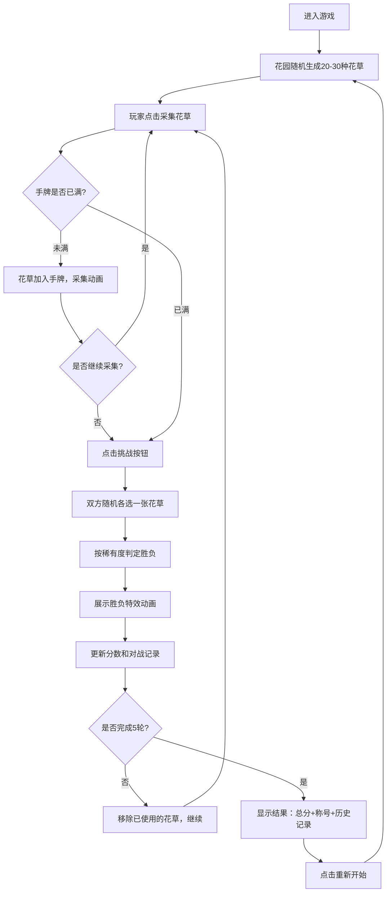

## 1. 产品概述

斗草争芳是一款唐代风格的斗百草交互游戏，玩家化身唐代少女在曲江池畔的庭院花园中采摘花草，与AI对手进行花草对决。游戏融合了传统文化与现代交互体验，让用户感受古代斗草游戏的乐趣。

- **主要目的**：提供沉浸式的唐代斗草文化体验，通过采集、对战的核心玩法带来休闲娱乐价值
- **目标用户**：对传统文化感兴趣的休闲游戏玩家，喜欢国风美学的用户群体
- **市场价值**：传承和传播中国古代斗草文化，填补国风休闲小游戏的细分市场

## 2. 核心功能

### 2.1 用户角色

| 角色 | 注册方式 | 核心权限 |
|------|----------|----------|
| 玩家 | 无需注册，直接进入游戏 | 采摘花草、发起对战、查看对战历史、获得称号评定 |

### 2.2 功能模块

1. **花园场景**：随机生成20-30种花草，点击采集，花草消失并加入手牌
2. **手牌区域**：显示已采集的花草卡片，最多持有5张，支持查看详情
3. **对战区域**：玩家与AI随机选花草对决，按稀有度判定胜负，展示特效动画
4. **结果展示**：5轮对战结束后显示总分、排名称号、对战历史记录
5. **游戏控制**：挑战按钮、重新开始游戏

### 2.3 页面详情

| 页面名称 | 模块名称 | 功能描述 |
|----------|----------|----------|
| 主游戏页面 | 花园场景模块 | 随机生成花草分布，点击采集动画，花草数量显示 |
| 主游戏页面 | 手牌区域模块 | 圆形团扇样式卡片，花草信息展示，最多5张限制 |
| 主游戏页面 | 对战区域模块 | 双方花草对决，稀有度比较，胜负特效动画，分数统计 |
| 主游戏页面 | 结果弹窗模块 | 总分显示，称号评定（花魁/探花/榜眼等），对战历史回合记录 |
| 主游戏页面 | 游戏控制模块 | 挑战按钮，重新开始按钮，当前轮次显示 |

## 3. 核心流程

## 4. 用户界面设计

### 4.1 设计风格

- **主色调**：淡粉 `#fce4ec`、嫩绿 `#c8e6c9`，辅以深棕 `#5d4037` 作为文字和边框色
- **背景**：仿绢画纹理，使用细腻的噪点和半透明叠加效果
- **按钮风格**：水墨晕染边缘效果，圆角设计，悬停时有淡色晕开动画
- **卡片风格**：圆形团扇样式，竹质边框纹理，内圆展示花草图案
- **字体**：标题使用楷体或书法风格字体，正文使用优雅的宋体，字号层次分明
- **动画风格**：采集时轻快放大旋转，胜负时草叶飞散/枯萎褪色效果，整体流畅优雅

### 4.2 页面设计概述

| 页面名称 | 模块名称 | UI元素 |
|----------|----------|--------|
| 主游戏页面 | 花园场景 | 绢画纹理背景，花草随机分布，悬停提示名称和稀有度，点击采集动画 |
| 主游戏页面 | 手牌区域 | 底部横向排列5张团扇卡片，悬停放大，已选中高亮效果 |
| 主游戏页面 | 对战区域 | 中央位置，左右两侧展示双方花草，中间VS标识，胜负时特效绽放 |
| 主游戏页面 | 结果弹窗 | 居中淡入，顶部金色称号，中部分数统计，底部可滚动对战历史 |
| 主游戏页面 | 游戏控制 | 顶部状态栏显示轮次/分数，右下角浮动挑战按钮 |

### 4.3 响应式

- **桌面优先设计**，适配常见屏幕分辨率（1280px及以上）
- **移动端适配**：响应式布局，花园区域自适应，手牌区在小屏上调整大小和排列
- **触摸优化**：增大花草可点击区域，支持触摸采集和滑动查看手牌

### 4.4 视觉特效

- **环境氛围**：柔和的暖色调光效，模拟唐代庭院的温馨氛围
- **花草动画**：微风轻拂效果，花草轻微摇摆，增添生机
- **采集特效**：点击时花草旋转放大1.2倍，伴随淡金色光晕，然后优雅飞入手牌区
- **胜负特效**：胜者花草周围绽放彩色叶瓣飞散动画，败者花草逐渐褪色枯萎并缩小
- **对战历史**：每条记录显示对决的花草缩略图和结果标识
