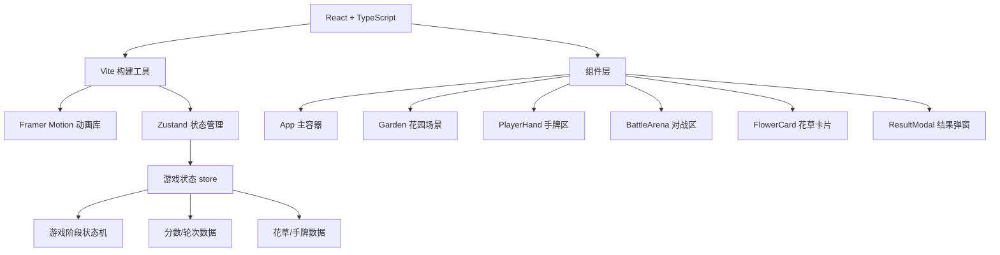

## 1. 架构设计



## 2. 技术描述

- **前端框架**：React@18 + TypeScript@5
- **构建工具**：Vite@5 + @vitejs/plugin-react
- **状态管理**：Zustand@4
- **动画库**：Framer Motion@11
- **样式方案**：CSS Modules + CSS Variables
- **初始化方式**：使用 Vite 官方 React + TypeScript 模板

## 3. 目录结构

```
src/
├── main.tsx              # 应用入口
├── App.tsx               # 主容器组件
├── types/
│   └── game.ts           # 类型定义
├── store/
│   └── gameStore.ts      # Zustand 状态管理
├── components/
│   ├── Garden.tsx        # 花园场景
│   ├── PlayerHand.tsx    # 玩家手牌区
│   ├── BattleArena.tsx   # 对战区域
│   ├── FlowerCard.tsx    # 花草卡片组件
│   ├── FlowerSVG.tsx     # 花草SVG图案
│   └── ResultModal.tsx   # 结果弹窗
├── data/
│   └── flowers.ts        # 花草数据配置
├── utils/
│   └── gameLogic.ts      # 游戏逻辑工具函数
└── styles/
    └── global.css        # 全局样式
```

## 4. 数据模型

### 4.1 核心类型定义

```typescript
// 花草稀有度
type Rarity = 'common' | 'rare' | 'exotic';

// 花草数据
interface Flower {
  id: string;
  name: string;
  rarity: Rarity;
  pattern: string; // SVG图案标识
  color: string;
  description: string;
}

// 手牌中的花草
interface HandFlower extends Flower {
  instanceId: string;
  collectedAt: number;
}

// 对战记录
interface BattleRecord {
  round: number;
  playerFlower: Flower;
  aiFlower: Flower;
  winner: 'player' | 'ai' | 'draw';
}

// 游戏阶段
type GamePhase = 'collecting' | 'battling' | 'result';

// 游戏状态
interface GameState {
  phase: GamePhase;
  round: number;
  playerScore: number;
  aiScore: number;
  gardenFlowers: Flower[];
  playerHand: HandFlower[];
  battleRecords: BattleRecord[];
  currentBattle: {
    playerFlower: Flower | null;
    aiFlower: Flower | null;
    result: 'player' | 'ai' | 'draw' | null;
  } | null;
}
```

### 4.2 花草数据配置

花草库包含20-30种唐代常见花卉，每种配有：
- 名称：芍药、芙蓉、萱草、菖蒲、车前子、蔷薇、牡丹、菊花等
- 稀有度分布：普通60%、珍品30%、异种10%
- 图案类型：花瓣型、穗状型、放射型、星型、心形等
- 配色：每种花草有独特的主色调

## 5. 状态管理 Actions

```typescript
interface GameActions {
  // 初始化/重置游戏
  initGame: () => void;
  
  // 采集花草
  collectFlower: (flowerId: string) => void;
  
  // 发起对战
  startBattle: () => void;
  
  // 判定胜负
  resolveBattle: () => void;
  
  // 进入下一轮
  nextRound: () => void;
  
  // 显示结果
  showResult: () => void;
  
  // 重新开始
  restartGame: () => void;
}
```

## 6. 胜负判定逻辑

```typescript
// 稀有度权重
const RARITY_WEIGHT = {
  common: 1,
  rare: 2,
  exotic: 3
};

function determineWinner(
  playerFlower: Flower, 
  aiFlower: Flower
): 'player' | 'ai' | 'draw' {
  const playerWeight = RARITY_WEIGHT[playerFlower.rarity];
  const aiWeight = RARITY_WEIGHT[aiFlower.rarity];
  
  if (playerWeight > aiWeight) return 'player';
  if (playerWeight < aiWeight) return 'ai';
  
  // 同稀有度时比较图案
  if (playerFlower.pattern === aiFlower.pattern) return 'draw';
  
  // 图案不同时随机决定
  return Math.random() > 0.5 ? 'player' : 'ai';
}
```

## 7. 称号评定

| 胜率 | 称号 |
|------|------|
| 100% | 花魁 |
| 80% - 99% | 探花 |
| 60% - 79% | 榜眼 |
| 40% - 59% | 进士 |
| 20% - 39% | 秀才 |
| 0% - 19% | 白丁 |

## 8. 性能优化

- 使用 React.memo 优化组件重渲染
- Framer Motion 使用 layout animations 保持 60fps
- 花草SVG图案预渲染，避免重复绘制
- 动画使用 transform 和 opacity 触发 GPU 加速
- 限制同时进行的动画数量，避免性能下降
