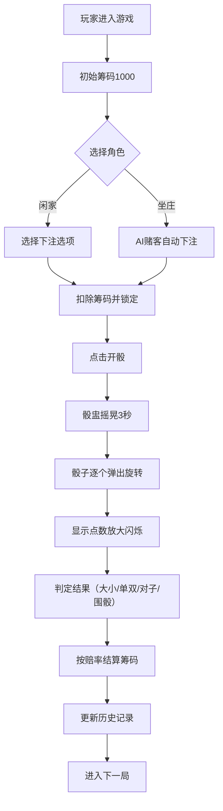

## 1. 产品概述
宋代临安府骰宝（骰子博戏）交互游戏，玩家可在瓦舍赌坊内坐庄或下注，体验古代市井博戏文化。

- 还原宋代市井赌坊氛围，三枚骰子赌大小、单双、点数组合
- 目标用户为游戏爱好者与文化体验者，兼具娱乐性与历史文化展示价值

## 2. 核心功能

### 2.1 用户角色
| 角色 | 进入方式 | 核心权限 |
|------|---------|----------|
| 玩家 | 直接进入 | 下注、坐庄、查看历史记录 |
| 庄家 | 点击坐庄按钮 | 收取赌注、按规则赔付、控制掷骰节奏 |
| AI赌客 | 系统自动生成 | 自动下注、模拟真实赌坊氛围 |

### 2.2 功能模块
1. **赌桌主界面**：三栏布局（庄家区、赌桌区、下注区），骰盅动画，骰子投掷与点数显示
2. **下注系统**：多选项下注（大、小、单、双、对子、围骰），筹码飞入动画，赔率显示
3. **庄家模式**：玩家坐庄，AI赌客自动下注，庄家筹码管理
4. **历史记录**：近5局开奖结果与下注记录滚动列表
5. **视觉反馈**：粒子特效、筹码滚动动画、CSS音效模拟

### 2.3 页面详情
| 页面名称 | 模块名称 | 功能描述 |
|---------|---------|----------|
| 游戏主界面 | 庄家区 | 显示庄家头像、筹码总数、坐庄/下庄按钮 |
| 游戏主界面 | 赌桌区 | 骰盅摇晃动画（3秒）、骰子弹出旋转、点数显示与放大闪烁 |
| 游戏主界面 | 下注区 | 筹码图标、赔率数字、点击下注、多选支持、筹码飞入动画 |
| 游戏主界面 | 历史记录 | 近5局开奖结果、下注记录、滚动列表展示 |
| 游戏主界面 | 筹码特效 | 数字滚动、赢钱铜钱散落、输钱灰色雾化、开骰金色粒子 |

## 3. 核心流程
玩家进入游戏 → 初始筹码1000 → 选择下注选项并下注 → 点击开骰/庄家掷骰 → 骰盅摇晃3秒 → 骰子逐个弹出停稳 → 显示点数并判定结果 → 按赔率结算筹码 → 更新历史记录 → 进入下一局

## 4. 界面设计

### 4.1 设计风格
- **主色调**：暗红#8b3a3a、旧铜钱色#b8860b、青砖灰#6b6b6b
- **辅助色**：象牙白#f5f0e0（骰子）、竹编纹理（骰盅）、粗麻布纹理（背景）
- **字体**：使用具有古风韵味的字体，标题用书法风格字体，正文用宋体/仿宋风格
- **布局**：三栏式桌面布局，响应式适配移动端
- **动效**：framer-motion实现流畅60fps动画，筹码飞入、骰子旋转、粒子特效

### 4.2 页面设计概述
| 页面名称 | 模块名称 | UI元素 |
|---------|---------|--------|
| 游戏主界面 | 整体布局 | 三栏布局：左侧庄家区30%、中间赌桌区40%、右侧下注区30%，粗麻布纹理背景，暗红边框装饰 |
| 游戏主界面 | 庄家区 | 古风水墨头像、筹码数字滚动、木质纹理按钮、底部历史记录滚动列表 |
| 游戏主界面 | 赌桌区 | 暗红色赌桌布质感、竹编骰盅、三枚象牙白骰子、金色粒子喷出、铜钱散落特效 |
| 游戏主界面 | 下注区 | 筹码图标（圆形铜钱样式）、赔率金色数字、点击光效、筹码飞入动画 |
| 游戏主界面 | 历史记录 | 青砖灰底色、卷轴样式、逐局结果条目 |

### 4.3 响应式设计
- **桌面端**：三栏布局，左侧庄家区、中间赌桌、右侧下注区
- **平板端**：下注区缩小宽度，赌桌自适应
- **移动端**：赌桌区域自动缩放，下注区变为底部横栏，庄家区移至顶部，保持60fps动画流畅度
- **触摸优化**：加大按钮可点击区域，支持滑动查看历史记录

### 4.4 动画与特效
- **骰盅动画**：单手摇晃3秒（rotation + translateY 循环），揭开时向上滑动消失
- **骰子动画**：逐个弹出（scale + rotate + bounce），点数放大闪烁1秒
- **筹码动画**：从账户飞入投注区（translate + scale），金属碰撞光效（box-shadow闪烁）
- **结算特效**：赢钱时铜钱旋转散落（多元素 rotate + translateY），输钱时灰色雾化消散（opacity + blur）
- **开骰特效**：金色粒子从盅内喷出（多元素随机方向 translate + opacity 渐变）
