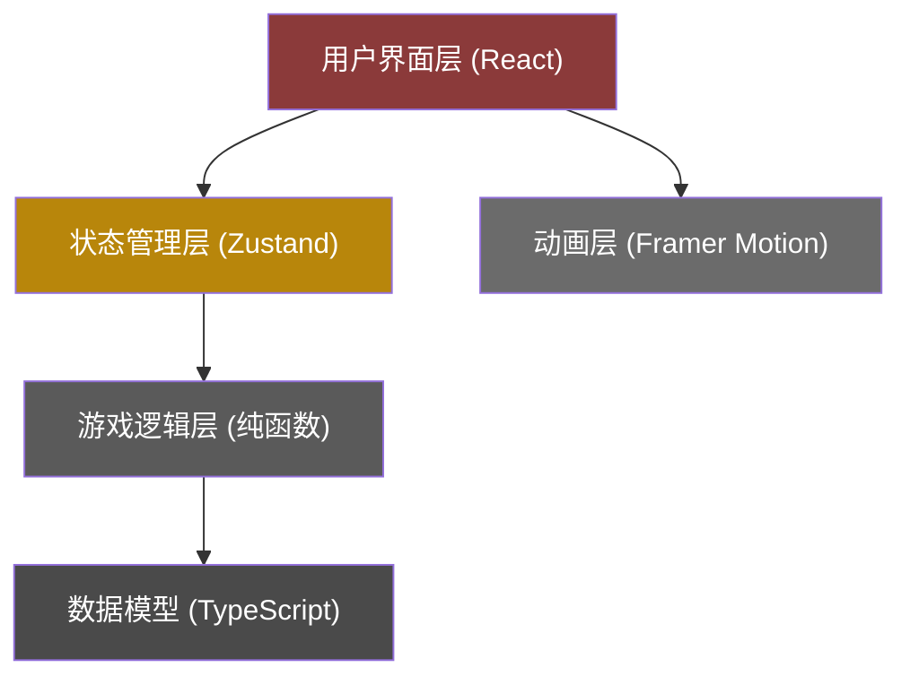

## 1. 架构设计



## 2. 技术选型

- **前端框架**：React 18 + TypeScript 5
- **构建工具**：Vite 5
- **状态管理**：Zustand 4
- **动画库**：Framer Motion 11
- **开发语言**：TypeScript（严格模式）
- **样式方案**：CSS Modules + CSS Variables
- **无后端**：纯前端游戏，所有逻辑在客户端运行

### 依赖包说明
- `react` / `react-dom`：核心UI框架
- `typescript`：类型安全
- `vite` / `@vitejs/plugin-react`：构建工具与React支持
- `framer-motion`：流畅动画实现
- `zustand`：轻量级状态管理

## 3. 文件结构

```
auto163/
├── package.json
├── vite.config.js
├── tsconfig.json
├── index.html
└── src/
    ├── main.tsx           # 应用入口
    ├── App.tsx            # 主组件，三栏布局
    ├── components/
    │   ├── DiceBoard.tsx     # 骰子投掷动画与点数显示
    │   ├── BettingPanel.tsx  # 下注选项与赔率面板
    │   ├── BankerArea.tsx    # 庄家区组件
    │   ├── HistoryPanel.tsx  # 历史记录组件
    │   ├── Chip.tsx          # 筹码组件
    │   └── Dice.tsx          # 单个骰子组件
    ├── store/
    │   └── gameStore.ts      # Zustand状态管理
    ├── utils/
    │   └── gameLogic.ts      # 游戏逻辑（掷骰、判定、赔率计算）
    ├── types/
    │   └── game.ts           # TypeScript类型定义
    └── styles/
        ├── variables.css     # CSS变量（颜色、动画时长）
        └── global.css        # 全局样式
```

## 4. 数据模型

### 4.1 类型定义

```typescript
// 骰子点数
type DiceValue = 1 | 2 | 3 | 4 | 5 | 6;

// 下注选项
type BetOption = 'big' | 'small' | 'odd' | 'even' | 'pair' | 'triple';

// 单条下注记录
interface Bet {
  id: string;
  option: BetOption;
  amount: number;
  playerId: string;
}

// 玩家/AI
interface Player {
  id: string;
  name: string;
  avatar: string;
  chips: number;
  isBanker: boolean;
  isAI: boolean;
}

// 游戏状态
type GamePhase = 'betting' | 'rolling' | 'revealing' | 'settling';

// 单局历史记录
interface GameHistory {
  id: string;
  dice: [DiceValue, DiceValue, DiceValue];
  result: {
    big: boolean;
    small: boolean;
    odd: boolean;
    even: boolean;
    pair: boolean;
    triple: boolean;
  };
  bets: Bet[];
  timestamp: number;
}

// 游戏Store
interface GameState {
  // 玩家状态
  currentPlayer: Player;
  aiPlayers: Player[];
  banker: Player | null;
  
  // 游戏状态
  phase: GamePhase;
  dice: [DiceValue, DiceValue, DiceValue];
  bets: Bet[];
  history: GameHistory[];
  
  // 操作方法
  placeBet: (option: BetOption, amount: number) => void;
  rollDice: () => void;
  becomeBanker: () => void;
  leaveBanker: () => void;
  startNewRound: () => void;
}
```

### 4.2 赔率表
| 选项 | 赔率 | 说明 |
|------|------|------|
| 大 | 1:1 | 点数和10-18 |
| 小 | 1:1 | 点数和3-9 |
| 单 | 1:1 | 点数和为奇数 |
| 双 | 1:1 | 点数和为偶数 |
| 对子 | 1:8 | 两枚骰子点数相同 |
| 围骰 | 1:24 | 三枚骰子点数相同 |

## 5. 核心算法

### 5.1 掷骰逻辑
```typescript
function rollDice(): [DiceValue, DiceValue, DiceValue] {
  return [
    Math.floor(Math.random() * 6) + 1 as DiceValue,
    Math.floor(Math.random() * 6) + 1 as DiceValue,
    Math.floor(Math.random() * 6) + 1 as DiceValue,
  ];
}
```

### 5.2 结果判定
```typescript
function calculateResult(dice: [DiceValue, DiceValue, DiceValue]) {
  const sum = dice[0] + dice[1] + dice[2];
  const sorted = [...dice].sort((a, b) => a - b);
  
  return {
    big: sum >= 10 && sum <= 18,
    small: sum >= 3 && sum <= 9,
    odd: sum % 2 === 1,
    even: sum % 2 === 0,
    pair: sorted[0] === sorted[1] || sorted[1] === sorted[2],
    triple: sorted[0] === sorted[1] && sorted[1] === sorted[2],
    sum,
  };
}
```

### 5.3 筹码结算
```typescript
function calculatePayout(bet: Bet, result: GameResult): number {
  const odds: Record<BetOption, number> = {
    big: 1,
    small: 1,
    odd: 1,
    even: 1,
    pair: 8,
    triple: 24,
  };
  
  const won = result[bet.option];
  return won ? bet.amount * (odds[bet.option] + 1) : 0;
}
```

## 6. 动画实现要点

1. **60fps保证**：使用transform和opacity属性，避免触发重排重绘
2. **will-change优化**：对动画元素提前声明
3. **GPU加速**：translate3d启用硬件加速
4. **动画时长**：骰盅摇晃3000ms，骰子弹出500ms/个，结算特效800ms
5. **缓动函数**：使用cubic-bezier自定义曲线，模拟真实物理运动

## 7. 性能优化

- **组件拆分**：细粒度组件，避免不必要重渲染
- **memo优化**：对纯展示组件使用React.memo
- **状态选择**：Zustand使用selector精确订阅状态
- **动画节流**：使用framer-motion的animate功能自动优化
- **内存管理**：历史记录只保留最近5局
