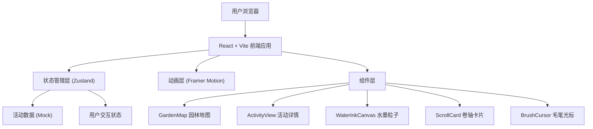

## 1. 架构设计



## 2. 技术栈说明
- **前端框架**：React 18 + TypeScript
- **构建工具**：Vite 5
- **状态管理**：Zustand 4
- **动画库**：Framer Motion 11
- **样式方案**：CSS Modules + CSS Variables
- **SVG渲染**：原生SVG + React组件

## 3. 目录结构

```
src/
├── main.tsx              # 应用入口
├── App.tsx               # 根组件，路由与全局状态
├── store/
│   └── useAppStore.ts    # Zustand 全局状态管理
├── pages/
│   ├── GardenMap.tsx     # 园林地图页面
│   └── ActivityView.tsx  # 活动详情页面
├── components/
│   ├── WaterInkCanvas.tsx  # 水墨粒子动画
│   ├── ScrollCard.tsx      # 卷轴卡片组件
│   ├── BrushCursor.tsx     # 毛笔跟随光标
│   ├── RippleEffect.tsx    # 水墨涟漪效果
│   └── TypewriterText.tsx  # 逐字显示文字
├── data/
│   └── activities.ts       # 活动与古文数据
├── types/
│   └── index.ts            # TypeScript 类型定义
└── styles/
    ├── global.css          # 全局样式与CSS变量
    └── silk-texture.css    # 绢本质感纹理
```

## 4. 路由定义
| 路由 | 页面 | 说明 |
|------|------|------|
| `/` | GardenMap | 园林地图首页 |
| `/activity/:id` | ActivityView | 活动详情页，id为活动类型 |

## 5. 状态管理（Zustand Store）

```typescript
interface AppState {
  // 当前活动ID
  currentActivity: ActivityType | null;
  // 背景主题色
  themeColor: string;
  // 字幕速度 (ms/字)
  textSpeed: number;
  // 水墨粒子启用状态
  particlesEnabled: boolean;
  
  // Actions
  setCurrentActivity: (id: ActivityType | null) => void;
  setThemeColor: (color: string) => void;
  setTextSpeed: (speed: number) => void;
  toggleParticles: () => void;
}
```

## 6. 数据模型

### 6.1 活动类型定义
```typescript
type ActivityType = 'qin' | 'qi' | 'shu' | 'hua';

interface Activity {
  id: ActivityType;
  name: string;           // 活动名称：抚琴、对弈、挥毫、赏画
  areaName: string;       // 区域名称：竹林、曲水、石桌、亭台
  themeColor: string;     // 主题色
  descriptions: string[]; // 古文描述库（约100字/条，随机选取）
  svgPath: string;        // SVG区域路径
  position: { x: number; y: number }; // 区域中心坐标
}
```

### 6.2 粒子数据
```typescript
interface InkParticle {
  id: number;
  x: number;
  y: number;
  vx: number;
  vy: number;
  size: number;
  opacity: number;
  life: number;
  maxLife: number;
}
```

## 7. 性能优化策略

### 7.1 动画性能
- 使用 `transform` 和 `opacity` 实现GPU加速动画
- Framer Motion 使用 `will-change` 提示浏览器优化
- 水墨粒子使用 Canvas 2D 渲染，requestAnimationFrame 循环
- 粒子数量严格控制在 200 以内，超出时回收旧粒子

### 7.2 渲染优化
- React.memo 包裹频繁重渲染的组件
- 使用 useMemo/useCallback 缓存计算结果与回调函数
- SVG 区域使用事件委托，减少事件监听器

### 7.3 响应式实现
- 使用 CSS Media Queries 实现布局切换
- 动态调整 SVG viewBox 适配不同屏幕
- 移动端禁用部分复杂动画以保证流畅度

## 8. 核心组件实现要点

### 8.1 WaterInkCanvas
- 使用 `useRef` 管理 Canvas 上下文
- `useEffect` 启动动画循环，清理时取消
- 粒子池复用机制，避免频繁GC
- 离屏 Canvas 预渲染墨点纹理

### 8.2 ScrollCard（卷轴卡片）
- Framer Motion `animate` 控制 scaleY 动画
- `initial={{ scaleY: 0 }}` → `animate={{ scaleY: 1 }}`
- `transformOrigin: "center"` 实现中心展开
- 退出时 `exit={{ scaleY: 0 }}` 反向收起

### 8.3 GardenMap
- SVG `polygon` 定义可点击区域
- `onClick` 触发涟漪动画与路由跳转
- `onMouseEnter` 显示区域名称 Tooltip
- CSS `filter: url(#ink-filter)` 实现水墨滤镜效果

## 9. 动画时间线配置

| 动画 | 时长 | 缓动函数 | 延迟 |
|------|------|----------|------|
| 背景色渐变 | 1500ms | easeInOutCubic | 0ms |
| 水墨涟漪 | 800ms | easeOut | 0ms |
| 卷轴展开 | 600ms | easeOutBack | 200ms |
| 逐字显示 | 可变（速度控制） | linear | 800ms |
| 毛笔跟随 | 与文字同步 | easeOut | 0ms |
| 粒子生成 | 持续 | - | 0ms |
