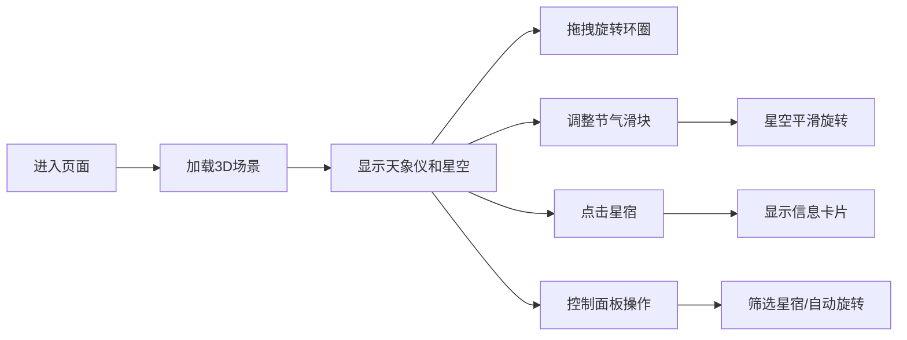

## 1. 产品概述
清代"天象仪"3D交互可视化项目，让用户以钦天监官员的视角，在三维空间中操作古代天文仪器，观察四季星空变化，学习中国古代天文知识。
- 核心目的：通过沉浸式3D交互体验，传承和展示中国古代天文学成就
- 目标用户：天文爱好者、历史文化爱好者、教育工作者和学生

## 2. 核心功能

### 2.1 用户角色
| 角色 | 注册方式 | 核心权限 |
|------|----------|----------|
| 访客用户 | 无需注册 | 完整浏览和交互所有功能 |

### 2.2 功能模块
1. **3D天象仪场景**：浑天仪环圈模型、星空背景、星宿点光源渲染
2. **控制面板**：节气滑块、星宿筛选、自动旋转开关
3. **交互系统**：拖拽旋转、缩放、星宿点击查询、窥管角度显示
4. **信息展示**：星宿信息卡片、节气名称显示、选中星宿状态栏

### 2.3 页面详情
| 页面名称 | 模块名称 | 功能描述 |
|-----------|-------------|---------------------|
| 主场景页 | 3D天象仪 | 支持鼠标拖拽旋转环圈、滚轮缩放、点击星宿查看详情 |
| 主场景页 | 控制面板 | 节气滑块控制星空旋转、星宿筛选、自动旋转开关 |
| 主场景页 | 信息栏 | 底部显示当前节气和选中星宿信息 |

## 3. 核心流程
用户打开页面后，首先看到居中的3D天象仪和星空背景。用户可以：
1. 鼠标拖拽旋转浑天仪环圈，观察不同角度
2. 调整左侧节气滑块，观看星空随四季变化
3. 点击任意星宿，弹出信息卡片显示名称、星等和分野
4. 使用控制面板筛选特定星宿群，开启自动旋转模式

## 4. 用户界面设计

### 4.1 设计风格
- **主色调**：暗红 #4a1a1a，金色 #d4af37
- **背景色**：深灰蓝 #1a1a2e
- **UI风格**：仿清代宫廷漆器风格，半透明金色边框，精细云纹纹理
- **字体**：使用楷体/宋体类衬线字体体现古风，标题使用书法风格字体
- **动效**：缓动曲线ease-in-out，呼吸闪烁动画，光晕扩散效果

### 4.2 页面设计概述
| 页面名称 | 模块名称 | UI元素 |
|-----------|-------------|-------------|
| 主场景页 | 3D场景 | 居中布局，占80%宽度，金色环圈，点光源星星，铜锈纹理 |
| 主场景页 | 控制面板 | 左侧悬浮，半透明暗红背景，金色边框，云纹底纹 |
| 主场景页 | 信息栏 | 底部固定，金色文字，显示节气和星宿信息 |
| 主场景页 | 信息卡片 | 点击星宿弹出，金色边框，暗红标题，星等分野详情 |

### 4.3 响应性
- 桌面端优先设计，支持1920x1080及以上分辨率
- 自适应窗口大小，3D场景随视口调整
- 移动端可简化控制面板布局，但核心交互保持完整

### 4.4 3D场景指导
- **环境**：深空背景，使用深蓝色到黑色的渐变，添加微弱星云效果
- **光照**：环境光+金色平行光模拟日光，点光源渲染每颗星星
- **相机**：透视相机，初始距离适中，支持OrbitControls控制
- **焦距元素**：天象仪环圈组为视觉中心，星空为背景
- **交互**：拖拽旋转带惯性阻尼，缩放限制最小最大距离
- **后处理**：Bloom效果增强星星光晕，轻微色调映射
- **性能**：星星数量≤3000，环圈使用LOD优化
