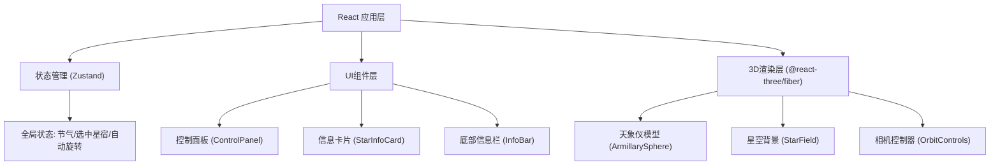
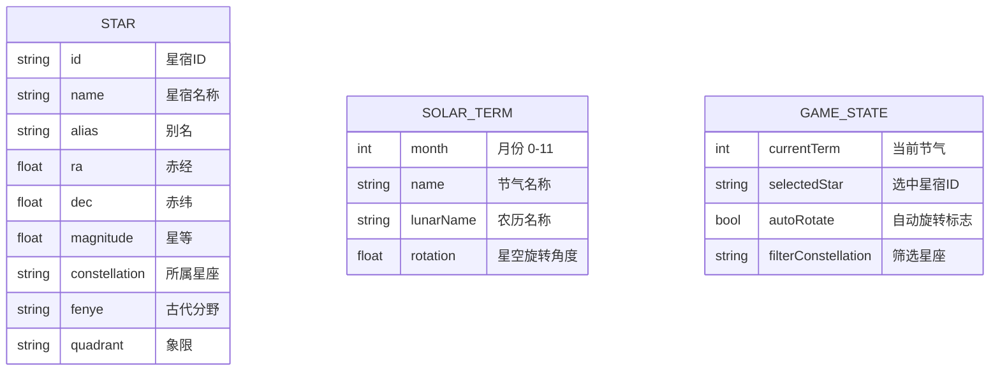

## 1. 架构设计



## 2. 技术描述
- **前端框架**：React@18 + TypeScript@5 + Vite@5
- **3D引擎**：Three.js@0.160 + @react-three/fiber@8 + @react-three/drei@9
- **状态管理**：Zustand@4
- **动画库**：Framer Motion@11
- **样式方案**：Tailwind CSS@3 + CSS自定义属性
- **初始化工具**：Vite create react-ts 模板

## 3. 路由定义
| 路由 | 用途 |
|-------|---------|
| / | 主场景页面，包含3D天象仪和所有交互控件 |

## 4. 数据模型

### 4.1 数据模型定义



### 4.2 星宿数据结构
```typescript
interface Star {
  id: string;
  name: string;
  alias?: string;
  ra: number;        // 赤经 (度)
  dec: number;       // 赤纬 (度)
  magnitude: number; // 星等
  constellation: string;
  fenye: string;     // 分野
  quadrant: string;  // 象限 东宫/南宫/西宫/北宫
}

interface StarStore {
  currentTerm: number;           // 0-11 对应十二月
  selectedStar: Star | null;
  autoRotate: boolean;
  filterConstellation: string;
  setCurrentTerm: (term: number) => void;
  setSelectedStar: (star: Star | null) => void;
  setAutoRotate: (auto: boolean) => void;
  setFilterConstellation: (filter: string) => void;
}
```

### 4.3 核心常量
```typescript
// 二十四节气（简化为十二月节气）
const SOLAR_TERMS = [
  { month: 0, name: '立春', rotation: 0 },
  { month: 1, name: '惊蛰', rotation: 30 },
  { month: 2, name: '清明', rotation: 60 },
  { month: 3, name: '立夏', rotation: 90 },
  { month: 4, name: '芒种', rotation: 120 },
  { month: 5, name: '小暑', rotation: 150 },
  { month: 6, name: '立秋', rotation: 180 },
  { month: 7, name: '白露', rotation: 210 },
  { month: 8, name: '寒露', rotation: 240 },
  { month: 9, name: '立冬', rotation: 270 },
  { month: 10, name: '大雪', rotation: 300 },
  { month: 11, name: '小寒', rotation: 330 },
];

// 三垣二十八宿
const CONSTELLATIONS = [
  '紫微垣', '太微垣', '天市垣',
  '角宿', '亢宿', '氐宿', '房宿', '心宿', '尾宿', '箕宿', // 东方青龙
  '斗宿', '牛宿', '女宿', '虚宿', '危宿', '室宿', '壁宿', // 北方玄武
  '奎宿', '娄宿', '胃宿', '昴宿', '毕宿', '觜宿', '参宿', // 西方白虎
  '井宿', '鬼宿', '柳宿', '星宿', '张宿', '翼宿', '轸宿', // 南方朱雀
];
```

## 5. 项目文件结构
```
d:\Solocoder\VersionFast\tasks\auto165
├── package.json
├── vite.config.ts
├── tsconfig.json
├── index.html
├── tailwind.config.js
├── postcss.config.js
└── src/
    ├── main.tsx
    ├── App.tsx
    ├── index.css
    ├── components/
    │   ├── ArmillarySphere.tsx
    │   ├── StarField.tsx
    │   ├── ControlPanel.tsx
    │   ├── StarInfoCard.tsx
    │   └── InfoBar.tsx
    ├── store/
    │   └── gameStore.ts
    ├── data/
    │   └── stars.ts
    └── utils/
        └── astronomy.ts
```
