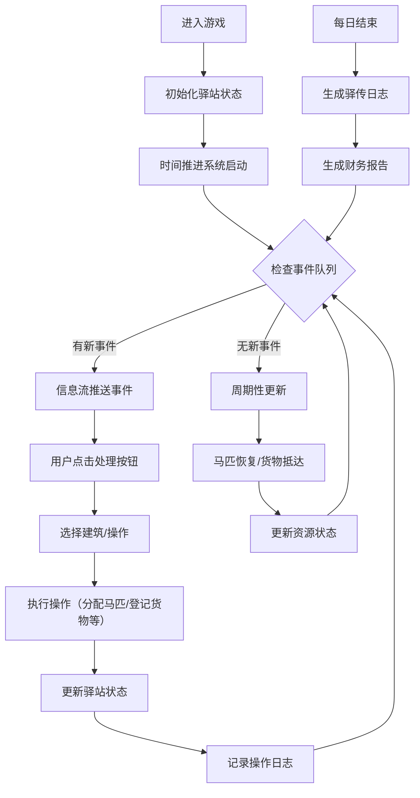

## 1. 产品概述

丝路驿传·河西驿站是一款模拟古代丝绸之路驿站管理的沉浸式Web应用。用户扮演河西走廊驿站的驿丞，管理商队接待、马匹调配、货物登记与突发事件处理，体验古代邮驿系统的运作。

- 核心价值：通过角色扮演与模拟经营，让用户深入了解丝绸之路的历史文化与驿传制度
- 目标用户：历史爱好者、模拟经营游戏玩家、文化教育学习者

## 2. 核心功能

### 2.1 用户角色

| 角色 | 注册方式 | 核心权限 |
|------|----------|----------|
| 驿丞 | 直接进入 | 全权管理驿站所有事务，调配资源，处理事件 |

### 2.2 功能模块

1. **驿站沙盘系统**：SVG绘制的俯视全景图，可交互点击马厩、仓库、客舍等建筑
2. **时间推进系统**：1秒模拟一刻钟，自动触发周期性事件
3. **事件系统**：随机生成商队抵达、公文传递、灾害警报等事件，需限时处理
4. **资源管理系统**：马匹分配、货物登记、食宿安排的完整管理流程
5. **日志报告系统**：每日驿传日志、财务收支报告自动生成
6. **建筑管理弹窗**：点击建筑弹出管理界面，执行具体操作

### 2.3 页面详情

| 页面名称 | 模块名称 | 功能描述 |
|---------|----------|----------|
| 主界面 | 驿站沙盘 | SVG交互地图，显示马厩、仓库、客舍、驿馆、鼓楼等建筑，点击可管理 |
| 主界面 | 动态信息流 | 实时显示抵达事件、任务指令、处理按钮，带滚动动画 |
| 主界面 | 状态栏 | 显示当前时间、驿站资金、马匹数量、事件倒计时 |
| 建筑弹窗 | 马厩管理 | 查看马匹状态、分配马匹、治疗病马、补充马匹 |
| 建筑弹窗 | 仓库管理 | 货物登记入库、出库盘点、查看库存、收取保管费 |
| 建筑弹窗 | 客舍管理 | 安排住宿、登记客人、收取食宿费用 |
| 报告面板 | 驿传日志 | 每日事件记录、操作历史、重要事件标记 |
| 报告面板 | 财务报告 | 收支明细、利润统计、各项费用汇总 |

## 3. 核心流程

用户主要操作流程：
1. 观察信息流中的事件提醒
2. 点击事件处理按钮或直接点击沙盘建筑
3. 在弹出的管理面板中执行具体操作
4. 资源状态实时更新，操作记录自动存入日志
5. 每日结束时查看运营报告，调整经营策略

## 4. 用户界面设计

### 4.1 设计风格

- **主色调**：敦煌壁画土红 `#b83a3a`、石绿 `#4b9b6a`、土黄 `#d4a76a`、墨黑 `#2a1810`
- **辅助色**：宣纸米白 `#f5e6d3`、木棕 `#8b6914`、青铜灰 `#6b7b8c`
- **按钮设计**：古代符节样式，青铜质感，边缘有回纹装饰
- **面板设计**：木质纹理背景，卷轴边框，古纸质感内页
- **字体**：标题使用书法风格字体，正文使用宋体/衬线字体
- **动画**：墨迹扩散悬停效果、卷轴展开过渡、印章盖下动画
- **整体风格**：古风典雅，敦煌壁画美学，沉浸式历史氛围

### 4.2 页面设计概述

| 页面名称 | 模块名称 | UI元素 |
|---------|----------|--------|
| 主界面 | 整体布局 | 上下两栏卷轴布局，上栏70%沙盘，下栏30%信息流 |
| 主界面 | 驿站沙盘 | SVG绘制，古地图风格，建筑高亮可交互，点击有波纹效果 |
| 主界面 | 动态信息流 | 卷轴样式，事件卡片从右侧滑入，新事件有红印标记 |
| 主界面 | 状态栏 | 顶部卷轴横条，显示时间（年月日时辰）、银两、马匹数 |
| 建筑弹窗 | 马厩管理 | 木质面板，马匹状态图标，符节按钮，墨迹动画 |
| 建筑弹窗 | 仓库管理 | 账本样式，货物列表，入库出库符节按钮 |
| 建筑弹窗 | 客舍管理 | 客房布局图，客人状态，登记按钮 |
| 报告面板 | 驿传日志 | 古籍书页样式，竖排标题，日期盖章 |
| 报告面板 | 财务报告 | 账册样式，收支明细表格，红笔批注 |

### 4.3 响应式设计

- **桌面端**：上下两栏布局，沙盘占70%高度，信息流占30%
- **平板端**：保持上下布局，调整比例为6:4
- **手机端**：沙盘缩成全屏可拖拽视图，信息流改为底部抽屉，点击展开
- **触摸优化**：增大点击区域至48x48px，添加触摸反馈动画

## 5. 性能与交互要求

### 5.1 性能指标

- 交互响应延迟 < 100ms
- 界面切换流畅无卡顿（60fps）
- 事件队列处理无阻塞
- 内存占用稳定，无内存泄漏

### 5.2 交互体验

- 所有按钮点击有即时视觉反馈
- 弹窗出现有卷轴展开动画
- 事件处理有确认盖章效果
- 资源数字变化有平滑过渡动画
- 沙盘点击有涟漪扩散效果
