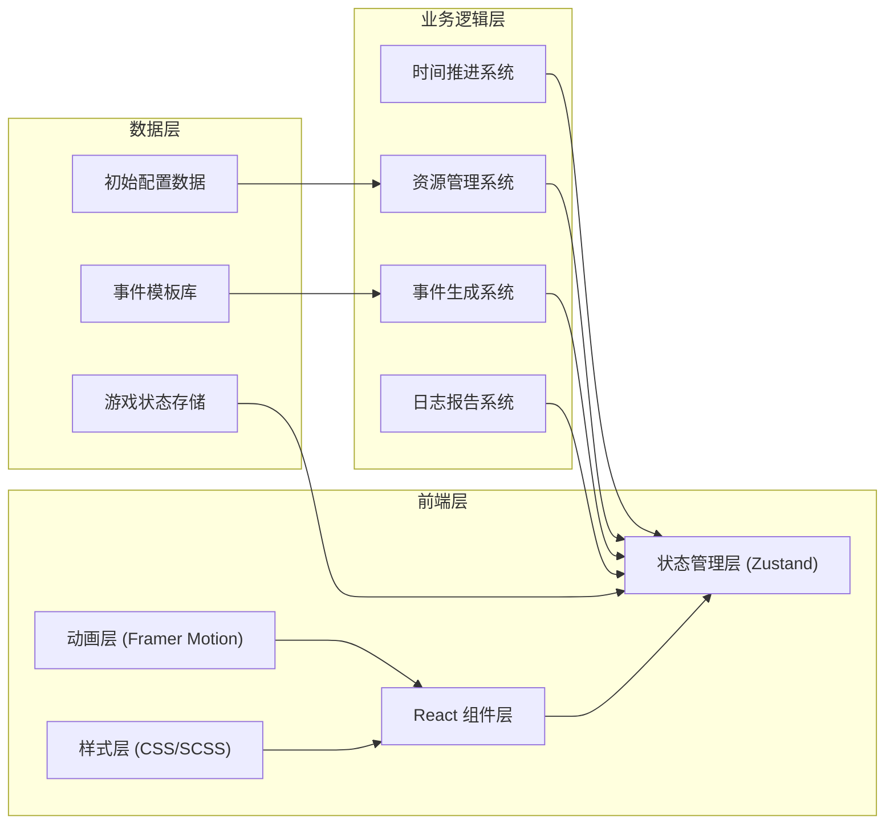
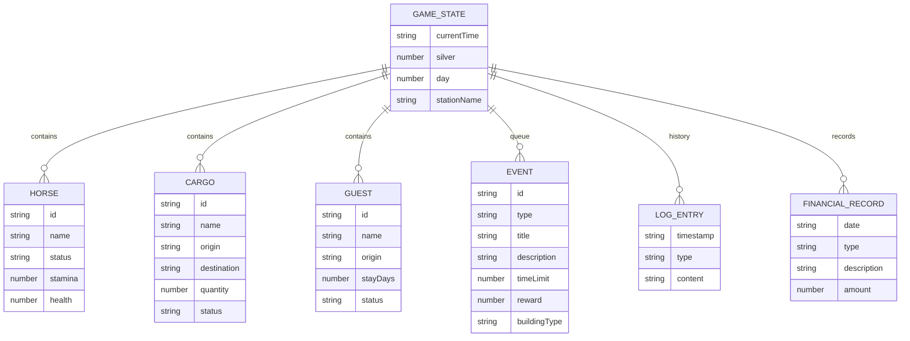

## 1. 架构设计



整体架构采用单向数据流设计，Zustand作为单一状态管理中心，所有组件通过订阅状态更新，确保数据一致性和性能优化。

## 2. 技术描述

- **前端框架**：React@18 + TypeScript@5
- **构建工具**：Vite@5 + @vitejs/plugin-react@4
- **状态管理**：Zustand@4（轻量级，不可变更新，支持selector优化渲染）
- **动画库**：Framer Motion@11（流畅的组件动画、手势支持、SVG动画）
- **样式方案**：CSS Modules + CSS Variables（主题色统一管理）
- **初始化方式**：手动配置完整项目结构（非脚手架生成）

## 3. 目录结构

```
src/
├── main.tsx              # 应用入口
├── App.tsx               # 主布局组件
├── store/
│   └── gameStore.ts      # Zustand全局状态管理
├── components/
│   ├── StationMap.tsx    # 驿站沙盘SVG组件
│   ├── EventLog.tsx      # 事件日志组件
│   ├── StatusBar.tsx     # 顶部状态栏
│   ├── BuildingModal.tsx # 建筑管理弹窗
│   ├── DailyReport.tsx   # 每日报告面板
│   └── InkButton.tsx     # 符节按钮通用组件
├── types/
│   └── index.ts          # TypeScript类型定义
├── utils/
│   ├── timeSystem.ts     # 时间推进系统
│   ├── eventGenerator.ts # 随机事件生成器
│   └── reportGenerator.ts# 报告生成工具
├── data/
│   ├── events.ts         # 事件模板库
│   └── initialState.ts   # 初始状态配置
└── styles/
    ├── variables.css     # CSS变量（主题色）
    ├── animations.css    # 动画关键帧
    └── global.css        # 全局样式
```

## 4. 路由定义

| 路由 | 用途 |
|------|------|
| / | 主游戏界面（唯一入口，单页应用） |

本应用为单页应用，所有功能通过组件弹窗和面板切换实现，无需多路由。

## 5. 数据模型

### 5.1 核心数据结构



### 5.2 TypeScript 类型定义

```typescript
// 核心类型
export type GameTime = {
  year: number;
  month: number;
  day: number;
  quarter: number; // 0-95 表示一天96个一刻钟
};

export type Horse = {
  id: string;
  name: string;
  status: 'healthy' | 'tired' | 'sick' | 'assigned';
  stamina: number;
  health: number;
};

export type Cargo = {
  id: string;
  name: string;
  origin: string;
  destination: string;
  quantity: number;
  status: 'stored' | 'in_transit' | 'delivered';
  storageFee: number;
};

export type Guest = {
  id: string;
  name: string;
  origin: string;
  stayDays: number;
  status: 'staying' | 'checked_out' | 'reserved';
  fee: number;
};

export type GameEvent = {
  id: string;
  type: 'merchant' | 'official' | 'emergency' | 'disaster' | 'random';
  title: string;
  description: string;
  timeLimit: number; // 秒
  reward: number;
  penalty: number;
  buildingType: 'stable' | 'warehouse' | 'inn' | 'all';
  handled: boolean;
  createdAt: number;
};

export type LogEntry = {
  id: string;
  timestamp: string;
  type: 'event' | 'operation' | 'system' | 'finance';
  content: string;
};

export type FinancialRecord = {
  id: string;
  date: string;
  type: 'income' | 'expense';
  category: string;
  description: string;
  amount: number;
};

export type GameState = {
  currentTime: GameTime;
  silver: number;
  day: number;
  stationName: string;
  horses: Horse[];
  cargoes: Cargo[];
  guests: Guest[];
  events: GameEvent[];
  logs: LogEntry[];
  financialRecords: FinancialRecord[];
  activeModal: string | null;
  selectedBuilding: string | null;
  isPaused: boolean;
};
```

## 6. 状态管理设计

### 6.1 Zustand Store 设计

```typescript
// 选择器模式，避免不必要的重渲染
export const useHorses = () => useGameStore(state => state.horses);
export const useEvents = () => useGameStore(state => state.events);
export const useSilver = () => useGameStore(state => state.silver);

// Action 设计
type GameActions = {
  advanceTime: () => void;
  addEvent: (event: GameEvent) => void;
  handleEvent: (eventId: string) => void;
  assignHorse: (horseId: string) => void;
  storeCargo: (cargo: Cargo) => void;
  checkInGuest: (guest: Guest) => void;
  addLog: (type: LogType, content: string) => void;
  addFinancialRecord: (record: Omit<FinancialRecord, 'id'>) => void;
  setActiveModal: (modal: string | null) => void;
  setSelectedBuilding: (building: string | null) => void;
  togglePause: () => void;
  generateDailyReport: () => void;
};
```

### 6.2 性能优化策略

1. **不可变更新**：所有状态更新使用展开运算符或immer，确保引用变化正确
2. **Selector 粒度**：使用细粒度selector，组件只订阅需要的状态片段
3. **事件防抖**：快速操作使用防抖处理，避免频繁状态更新
4. **虚拟列表**：事件日志和历史记录使用虚拟滚动，只渲染可见区域
5. **React.memo**：纯组件使用memo包裹，props不变时跳过渲染
6. **requestAnimationFrame**：动画和时间推进使用RAF，确保流畅

## 7. 核心系统设计

### 7.1 时间推进系统

- 1秒 = 1刻钟（15分钟）
- 96刻钟 = 1天
- 每次推进更新所有周期性状态：马匹体力恢复、客人住宿天数递减
- 每日结束触发：生成日报、财务结算、资源重置检查

### 7.2 随机事件系统

- 每30秒（真实时间）生成一个随机事件
- 事件类型权重：商队40%、公文20%、紧急20%、灾害10%、随机10%
- 事件带倒计时，超时未处理触发惩罚
- 事件关联特定建筑，引导用户操作

### 7.3 财务系统

- 收入：马匹租赁费、货物保管费、客食宿费、事件奖励
- 支出：马匹治疗费、饲料费、人员薪俸、事件惩罚
- 每日自动结算，生成收支明细

## 8. 动画与交互设计

### 8.1 墨迹扩散动画

```css
@keyframes inkSpread {
  0% { transform: scale(0); opacity: 0.8; }
  100% { transform: scale(3); opacity: 0; }
}

.ink-button::after {
  content: '';
  position: absolute;
  border-radius: 50%;
  background: radial-gradient(circle, rgba(184,58,58,0.6) 0%, transparent 70%);
  animation: inkSpread 0.6s ease-out forwards;
}
```

### 8.2 卷轴展开动画

```typescript
const scrollVariants = {
  hidden: { scaleY: 0, transformOrigin: 'top' },
  visible: { 
    scaleY: 1, 
    transition: { duration: 0.5, ease: [0.22, 1, 0.36, 1] }
  },
  exit: { 
    scaleY: 0, 
    transformOrigin: 'bottom',
    transition: { duration: 0.3 }
  }
};
```

## 9. 响应式适配策略

- 使用CSS Grid + Flexbox布局，配合媒体查询
- 断点设计：`768px`（平板）、`480px`（手机）
- 移动端使用CSS变量动态调整沙盘缩放比例
- 抽屉组件使用Framer Motion的手势拖拽支持
