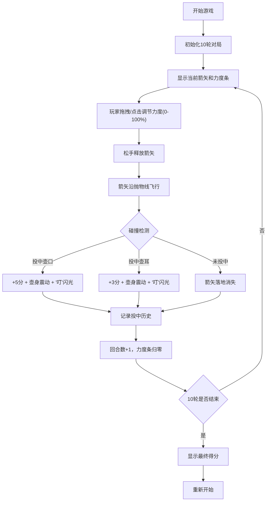

## 1. 产品概述
投壶雅戏是一款基于Web的古代投壶互动游戏，玩家在虚拟汉唐宴席场景中投掷箭矢，通过控制力度和方向将箭矢投入壶口或壶耳获得分数。

- 主要用途：休闲娱乐、传统文化体验
- 目标用户：对传统文化感兴趣的玩家、休闲游戏爱好者
- 产品价值：通过数字化形式传承古代投壶游戏文化，提供轻松有趣的互动体验

## 2. 核心功能

### 2.1 功能模块
1. **游戏主界面**：壶区展示、箭矢投掷区、计分板三栏布局
2. **投掷控制系统**：力度条调节、方向控制、抛物线投掷动画
3. **碰撞检测系统**：壶口、壶耳碰撞区域判定
4. **计分系统**：积分计算、回合管理、历史记录
5. **视觉反馈系统**：击中特效、震动动画、箭矢落地效果

### 2.2 页面详情
| 页面名称 | 模块名称 | 功能描述 |
|---------|----------|---------|
| 游戏主界面 | 壶区 | 居中显示3D竹壶，包含壶口和壶耳碰撞区域 |
| 游戏主界面 | 箭矢投掷区 | 显示当前箭矢、力度条，支持点击/拖拽控制投掷 |
| 游戏主界面 | 计分板 | 显示本轮得分、总积分、剩余轮次、历史投中记录 |

## 3. 核心流程

## 4. 用户界面设计

### 4.1 设计风格
- **主色调**：朱红 #c0392b、檀木 #8b4513、宣纸 #f5e6c8
- **背景**：浅黄麻布纹理（CSS生成）
- **字体**：使用具有古典韵味的字体，标题大气，正文典雅
- **按钮风格**：圆角古典按钮，带有木质纹理边框
- **壶身质感**：木纹渐变模拟青铜/陶器质感，竹绿色箭矢带纵向条纹
- **力度条**：橙黄渐变，带有平滑的交互反馈

### 4.2 页面设计
| 页面名称 | 模块名称 | UI元素 |
|---------|----------|--------|
| 游戏主界面 | 壶区 | 3D竹壶（高200px，壶口直径80px），壶耳对称位于壶口两侧20px处 |
| 游戏主界面 | 箭矢投掷区 | 箭矢组件、力度条（0-100%）、投掷按钮 |
| 游戏主界面 | 计分板 | 本轮得分、总积分、剩余轮次、投中历史列表 |

### 4.3 响应式适配
- **桌面端**：左中右三栏布局，壶区和箭矢区等比例放大
- **iPad/平板**：保持三栏布局，适当调整间距
- **小屏**：计分板折叠为底部横条，壶区和投掷区上下排列

### 4.4 动画与交互
- 箭矢投出：沿抛物线平滑飞行（framer-motion keyframes）
- 击中效果：壶身轻微震动 + "叮"闪光（CSS动画）
- 未击中：箭矢落地插在地上并缓缓消失
- 力度条交互：鼠标悬停和拖动有平滑缩放和颜色变化，松手后瞬间归零弹回

## 5. 性能要求
- 帧率保持60fps，动画流畅无卡顿
- 投掷后状态更新在1帧内完成
- 所有动画使用CSS或framer-motion实现，避免性能瓶颈
