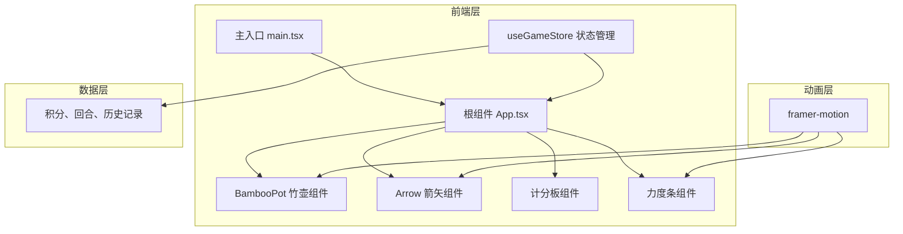

## 1. 架构设计



## 2. 技术描述
- **前端框架**：React@18 + TypeScript
- **构建工具**：Vite + @vitejs/plugin-react
- **状态管理**：zustand@4
- **动画库**：framer-motion@10
- **样式方案**：CSS Modules / Tailwind CSS（CSS变量定义主题色）
- **碰撞检测**：Canvas + 几何计算

## 3. 项目结构
```
├── index.html              # 入口页面，标题"投壶雅戏"
├── package.json            # 依赖配置
├── vite.config.js          # Vite配置
├── tsconfig.json           # TypeScript配置（严格模式）
└── src/
    ├── main.tsx            # 渲染根组件
    ├── App.tsx             # 游戏主组件
    ├── components/
    │   ├── BambooPot.tsx   # 竹壶3D视觉组件
    │   ├── Arrow.tsx       # 箭矢投掷动画组件
    │   ├── ScoreBoard.tsx  # 计分板组件
    │   └── PowerBar.tsx    # 力度条组件
    ├── store/
    │   └── useGameStore.ts # zustand状态管理
    ├── hooks/
    │   └── useCollision.ts # 碰撞检测Hook
    └── types/
        └── game.ts         # 游戏类型定义
```

## 4. 核心类型定义

```typescript
// src/types/game.ts
export interface ThrowRecord {
  id: number;
  round: number;
  score: number;
  hitType: 'mouth' | 'ear' | 'miss';
  timestamp: number;
}

export interface GameState {
  totalScore: number;
  currentRound: number;
  maxRounds: number;
  currentRoundScore: number;
  records: ThrowRecord[];
  isPlaying: boolean;
  isAnimating: boolean;
}

export interface GameActions {
  startGame: () => void;
  resetGame: () => void;
  recordThrow: (hitType: 'mouth' | 'ear' | 'miss') => void;
  setAnimating: (value: boolean) => void;
}

export type HitArea = 'mouth' | 'ear' | 'miss';

export interface Position {
  x: number;
  y: number;
}
```

## 5. 状态管理设计

```typescript
// src/store/useGameStore.ts
import { create } from 'zustand';
import { GameState, GameActions, ThrowRecord } from '../types/game';

type Store = GameState & GameActions;

export const useGameStore = create<Store>((set, get) => ({
  totalScore: 0,
  currentRound: 1,
  maxRounds: 10,
  currentRoundScore: 0,
  records: [],
  isPlaying: false,
  isAnimating: false,
  
  startGame: () => set({ isPlaying: true }),
  
  resetGame: () => set({
    totalScore: 0,
    currentRound: 1,
    currentRoundScore: 0,
    records: [],
    isPlaying: true,
    isAnimating: false,
  }),
  
  recordThrow: (hitType) => {
    const { currentRound, records } = get();
    const scoreMap = { mouth: 5, ear: 3, miss: 0 };
    const score = scoreMap[hitType];
    
    const newRecord: ThrowRecord = {
      id: Date.now(),
      round: currentRound,
      score,
      hitType,
      timestamp: Date.now(),
    };
    
    set((state) => ({
      totalScore: state.totalScore + score,
      currentRoundScore: score,
      records: [...state.records, newRecord],
      currentRound: Math.min(state.currentRound + 1, state.maxRounds + 1),
      isAnimating: false,
    }));
  },
  
  setAnimating: (value) => set({ isAnimating: value }),
}));
```

## 6. 碰撞检测算法

```typescript
// src/hooks/useCollision.ts
export const useCollision = () => {
  // 壶口区域：圆形，直径80px
  const isInMouth = (pos: Position, potCenter: Position): boolean => {
    const distance = Math.sqrt(
      Math.pow(pos.x - potCenter.x, 2) + 
      Math.pow(pos.y - potCenter.y, 2)
    );
    return distance <= 40; // 半径40px
  };
  
  // 壶耳区域：左右两个圆形，直径30px，距离壶口中心60px
  const isInEar = (pos: Position, potCenter: Position): 'left' | 'right' | null => {
    const leftEarCenter = { x: potCenter.x - 60, y: potCenter.y };
    const rightEarCenter = { x: potCenter.x + 60, y: potCenter.y };
    
    const leftDist = Math.sqrt(
      Math.pow(pos.x - leftEarCenter.x, 2) + 
      Math.pow(pos.y - leftEarCenter.y, 2)
    );
    const rightDist = Math.sqrt(
      Math.pow(pos.x - rightEarCenter.x, 2) + 
      Math.pow(pos.y - rightEarCenter.y, 2)
    );
    
    if (leftDist <= 15) return 'left';
    if (rightDist <= 15) return 'right';
    return null;
  };
  
  const checkHit = (arrowPos: Position, potCenter: Position): 'mouth' | 'ear' | 'miss' => {
    if (isInMouth(arrowPos, potCenter)) return 'mouth';
    if (isInEar(arrowPos, potCenter)) return 'ear';
    return 'miss';
  };
  
  return { checkHit, isInMouth, isInEar };
};
```

## 7. 抛物线计算

```typescript
// 抛物线轨迹计算
export const calculateParabola = (
  startX: number,
  startY: number,
  endX: number,
  endY: number,
  height: number,
  t: number
): { x: number; y: number; rotation: number } => {
  const x = startX + (endX - startX) * t;
  const y = startY + (endY - startY) * t - height * Math.sin(Math.PI * t);
  
  // 计算切线角度用于箭矢旋转
  const dx = endX - startX;
  const dy = (endY - startY) - height * Math.PI * Math.cos(Math.PI * t);
  const rotation = Math.atan2(dy, dx) * (180 / Math.PI);
  
  return { x, y, rotation };
};
```

## 8. 性能优化策略
1. **组件拆分**：将壶、箭矢、力度条拆分为独立组件，避免不必要的重渲染
2. **状态隔离**：使用zustand的selector只订阅必要的状态
3. **动画优化**：使用framer-motion的GPU加速属性（transform、opacity）
4. **碰撞检测**：只在箭矢落地时进行一次碰撞检测，而非每帧检测
5. **CSS优化**：使用CSS变量管理主题色，避免重复计算
