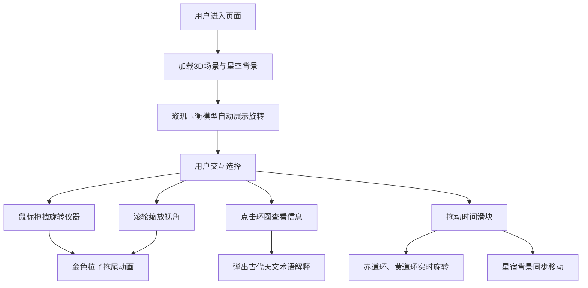

## 1. 产品概述

本项目是一个沉浸式宋代"璇玑玉衡"天文观测仪3D交互可视化平台，让用户以北宋司天监官员的身份，在三维空间中操作古代天文仪器，探索星空奥秘。

- **核心价值**：通过现代3D技术复现中国古代天文仪器，融合科普教育与文化传承
- **目标用户**：天文爱好者、历史文化研究者、学生及普通大众
- **产品定位**：交互式文化科普Web应用

## 2. 核心功能

### 2.1 用户角色
| 角色 | 注册方式 | 核心权限 |
|------|----------|----------|
| 访客用户 | 无需注册 | 完整体验所有3D交互功能、查看天文说明 |

### 2.2 功能模块
1. **3D天文观测仪**：可交互的璇玑玉衡模型（地平环、子午环、赤道环、黄道环、窥管）
2. **星空背景系统**：动态二十八星宿与北极星粒子背景
3. **时间控制系统**：年历滑块（正月-腊月）控制天体运行
4. **信息展示系统**：环圈刻度、节气说明、古代天文术语解释
5. **视角控制系统**：鼠标拖拽旋转、滚轮缩放、响应式适配

### 2.3 页面详情
| 页面名称 | 模块名称 | 功能描述 |
|----------|----------|----------|
| 主场景 | 3D画布 | 全屏渲染璇玑玉衡模型与星空背景，支持鼠标交互 |
| 主场景 | 控制面板 | 右下角浮动面板，包含时间滑块与选中环圈信息弹窗 |
| 主场景 | 信息弹窗 | 点击环圈弹出天文术语解释，悬浮显示刻度数值 |

## 3. 核心流程

用户进入页面后，首先看到精心布置的3D璇玑玉衡模型在深邃的星空背景中缓缓旋转。用户可以：
- 用鼠标拖拽整体旋转仪器
- 滚动滚轮缩放视角
- 点击各个环圈查看详细说明
- 拖动时间滑块观察星空变化

## 4. 用户界面设计

### 4.1 设计风格
- **主色调**：古朴铜绿 `#6b8e23`、深空蓝 `#1a1a3e`
- **点缀色**：金色 `#ffd700` 用于粒子发光与高亮
- **字体**：采用古典风格字体搭配现代无衬线字体，营造宋韵古风
- **视觉效果**：金属质感环圈、发光粒子、景深效果、古铜纹理
- **整体氛围**：庄重典雅，还原北宋司天监观星意境

### 4.2 页面设计概述
| 页面名称 | 模块名称 | UI元素 |
|----------|----------|--------|
| 主场景 | 3D画布 | 铜绿金属环圈、深空背景、金色粒子、发光效果、流畅动画 |
| 主场景 | 控制面板 | 半透明深色面板、古铜色滑块、传统宋体标题、金色边框 |
| 主场景 | 信息弹窗 | 悬浮卡片、古雅边框、渐变背景、渐入渐出动画 |

### 4.3 响应式
- **桌面端**：左侧3D场景占满屏幕，右下角浮动控制面板
- **移动端**：控制面板折叠为底部固定栏，3D场景自动调整相机视口，触控手势支持
- **触控优化**：支持双指缩放、单指旋转，按钮尺寸适配触控操作

### 4.4 3D场景设计
- **环境**：深空背景，微弱星芒，营造夜间观星氛围
- **光照**：暖色主光模拟月光，环境光补充细节，环圈自发光效果
- **相机**：初始视角45度俯角，OrbitControls控制，限制俯仰角度
- **构图**：璇玑玉衡居中，星空背景环绕，视觉焦点突出仪器本身
- **交互**：悬停高亮、点击脉冲、旋转粒子拖尾、平滑过渡动画
- **后处理**：Bloom发光效果、轻微色差、景深，增强沉浸感
- **性能**：LOD层级细节、粒子数量限制200以内、帧率锁定60fps
