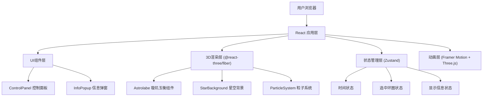

## 1. 架构设计

本项目采用纯前端单页应用架构，基于React + Three.js生态构建3D交互体验。



## 2. 技术描述

- **前端框架**：React@18 + TypeScript@5
- **构建工具**：Vite@5
- **3D渲染引擎**：Three.js@0.160 + @react-three/fiber@8 + @react-three/drei@9
- **动画库**：Framer Motion@11
- **状态管理**：Zustand@4
- **样式方案**：TailwindCSS@3 + CSS变量
- **性能优化**：Three.js LOD、InstancedMesh、帧率限制

## 3. 目录结构

```
src/
├── components/
│   ├── Astrolabe.tsx          # 璇玑玉衡3D模型组件
│   ├── StarBackground.tsx     # 星空粒子背景
│   ├── ControlPanel.tsx       # 控制面板组件
│   └── InfoPopup.tsx          # 信息弹窗组件
├── store/
│   └── useAppStore.ts         # Zustand状态管理
├── data/
│   ├── constellations.ts      # 二十八宿数据
│   └── astronomicalTerms.ts   # 天文术语数据
├── hooks/
│   └── useParticleSystem.ts   # 粒子系统自定义Hook
├── App.tsx                    # 主应用组件
├── main.tsx                   # 应用入口
└── index.css                  # 全局样式
```

## 4. 核心数据结构

### 4.1 环圈数据类型
```typescript
interface RingData {
  id: string;
  name: string;
  chineseName: string;
  radius: number;
  rotation: [number, number, number];
  color: string;
  description: string;
  markings: Marking[];
}

interface Marking {
  angle: number;
  label: string;
  value: string;
}
```

### 4.2 星宿数据类型
```typescript
interface Constellation {
  id: string;
  name: string;
  chineseName: string;
  position: [number, number, number];
  stars: Star[];
}

interface Star {
  position: [number, number, number];
  size: number;
  brightness: number;
}
```

### 4.3 应用状态类型
```typescript
interface AppState {
  currentMonth: number; // 0-11 对应正月到腊月
  selectedRing: string | null;
  showInfo: boolean;
  hoveredMarking: Marking | null;
  setCurrentMonth: (month: number) => void;
  setSelectedRing: (ringId: string | null) => void;
  setShowInfo: (show: boolean) => void;
  setHoveredMarking: (marking: Marking | null) => void;
}
```

## 5. 性能优化策略

1. **LOD层级细节**：为环圈模型创建不同精度层级
2. **粒子数量控制**：总粒子数不超过200个
3. **帧率限制**：使用Three.js的Clock与requestAnimationFrame控制在60fps
4. **几何体复用**：使用InstancedMesh渲染重复元素
5. **材质优化**：合并材质，减少draw call
6. **响应式相机**：根据屏幕尺寸动态调整相机参数

## 6. 配置文件说明

### package.json 核心依赖
```json
{
  "dependencies": {
    "react": "^18.2.0",
    "react-dom": "^18.2.0",
    "three": "^0.160.0",
    "@react-three/fiber": "^8.15.0",
    "@react-three/drei": "^9.92.0",
    "framer-motion": "^11.0.0",
    "zustand": "^4.5.0"
  },
  "devDependencies": {
    "typescript": "^5.3.0",
    "vite": "^5.0.0",
    "@vitejs/plugin-react": "^4.2.0",
    "tailwindcss": "^3.4.0",
    "@types/three": "^0.160.0"
  }
}
```

### vite.config.js 配置要点
- React插件启用
- 路径别名配置
- 开发服务器端口配置

### tsconfig.json 配置要点
- 严格模式启用
- JSX语法支持
- 路径别名映射
