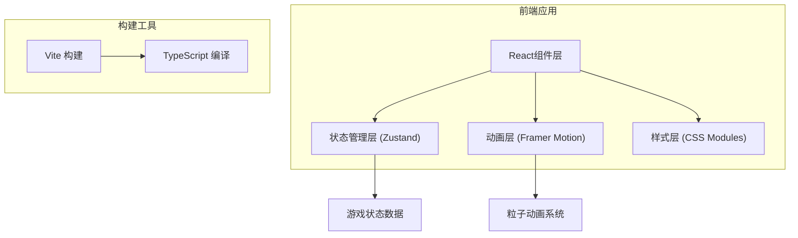

## 1. Architecture Design



## 2. Technology Description
- **前端框架**: React@18 + TypeScript@5
- **构建工具**: Vite@5 + @vitejs/plugin-react@4
- **状态管理**: Zustand@4
- **动画库**: framer-motion@11
- **样式方案**: CSS Modules + CSS Variables
- **初始化方式**: npm create vite@latest

## 3. 目录结构定义
```
src/
├── main.tsx              # 应用入口
├── App.tsx               # 主布局组件
├── store/
│   └── teaGameStore.ts   # 游戏状态管理
├── components/
│   ├── TeaSelection.tsx  # 选茶面板
│   ├── BrewingProcess.tsx # 制作流程
│   ├── ResultPanel.tsx   # 结果面板
│   ├── TeaHouse.tsx      # 茶寮背景装饰
│   ├── ProgressBar.tsx   # 步骤进度条
│   ├── GrindingStep.tsx  # 碾茶步骤
│   ├── PouringStep.tsx   # 点茶步骤
│   └── WhiskingStep.tsx  # 击拂步骤
├── types/
│   └── index.ts          # TypeScript类型定义
├── utils/
│   └── scoring.ts        # 评分算法
└── styles/
    ├── global.css        # 全局样式与CSS变量
    └── animations.css    # 动画关键帧定义
```

## 4. 状态模型定义

### 4.1 核心状态
```typescript
type TeaType = 'longjing' | 'biluochun' | 'dahongpao' | 'tieguanyin';

type GameStep = 'selection' | 'grinding' | 'pouring' | 'whisking' | 'result';

interface Tea {
  id: TeaType;
  name: string;
  description: string;
  baseScore: { color: number; aroma: number; taste: number };
}

interface StepMetrics {
  grinding: { clicks: number; duration: number; accuracy: number };
  pouring: { holdTime: number; waterAmount: number; stability: number };
  whisking: { clicks: number; speed: number; rhythm: number };
}

interface ScoreResult {
  color: number;
  aroma: number;
  taste: number;
  total: number;
  comment: string;
}

interface TeaGameState {
  currentStep: GameStep;
  selectedTea: TeaType | null;
  stepMetrics: StepMetrics;
  score: ScoreResult | null;
  setCurrentStep: (step: GameStep) => void;
  selectTea: (tea: TeaType) => void;
  updateGrindingMetrics: (metrics: Partial<StepMetrics['grinding']>) => void;
  updatePouringMetrics: (metrics: Partial<StepMetrics['pouring']>) => void;
  updateWhiskingMetrics: (metrics: Partial<StepMetrics['whisking']>) => void;
  calculateScore: () => void;
  resetGame: () => void;
}
```

## 5. 评分算法设计

### 5.1 碾茶评分
- 点击次数：15-25次为最佳（8-10分），过多或过少扣分
- 操作时长：10-20秒为最佳
- 综合得分 = 次数分 * 0.6 + 时长分 * 0.4

### 5.2 点茶评分
- 水量控制：按住时间对应水量，达到目标值（60-80%）为最佳
- 稳定性：按住过程中移动偏差小者得分高
- 综合得分 = 水量分 * 0.7 + 稳定分 * 0.3

### 5.3 击拂评分
- 点击速度：每秒3-5次为最佳
- 节奏稳定性：点击间隔方差小者得分高
- 综合得分 = 速度分 * 0.5 + 节奏分 * 0.5

### 5.4 茶汤评分
```
色 = 茶基础色分 * 0.4 + 碾茶分 * 0.3 + 击拂分 * 0.3
香 = 茶基础香分 * 0.5 + 点茶分 * 0.3 + 碾茶分 * 0.2
味 = 茶基础味分 * 0.4 + 击拂分 * 0.4 + 点茶分 * 0.2
总分 = 色 + 香 + 味
```

## 6. 动画性能优化
- 粒子动画使用transform和opacity，避免触发重排
- SVG动画使用SMIL或CSS动画，不频繁操作DOM
- 使用will-change提示浏览器优化
- 粒子数量控制在50个以内，避免性能问题
- 动画元素使用GPU加速（transform: translateZ(0)）

## 7. 响应式断点
- 桌面端：min-width: 1024px，三栏布局
- 平板端：768px - 1023px，两栏布局
- 移动端：max-width: 767px，单栏滚动布局
