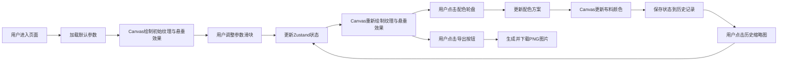

## 1. 产品概述

宋代彩帛行织物纹理生成与色彩搭配模拟Web应用，让用户以宋代杭州织锦坊染织匠人的身份，在虚拟店铺中选取不同材质的布料样本，通过调整经纬密度、捻度和浸染次数等参数，实时观察织物肌理变化和垂坠效果，并搭配出符合宋人审美的服饰配色方案。

- **核心价值**：通过沉浸式的交互体验，让用户直观了解宋代丝织工艺与配色美学，兼具教育性与趣味性
- **目标用户**：传统文化爱好者、服装设计从业者、学生群体

---

## 2. 核心功能

### 2.1 功能模块

1. **织物纹理生成模块**：根据经线密度、纬线捻度、浸染次数实时生成平纹、斜纹或缎纹纹理
2. **悬垂模拟模块**：根据悬垂系数计算布料在木案上的自然褶皱与光影变化
3. **配色轮盘模块**：120度扇形配色轮盘，支持选择最多3种颜色形成服饰配色方案
4. **历史记录模块**：记录最近8次调整状态，支持一键恢复
5. **导出模块**：将当前效果导出为512x512分辨率的PNG图片

### 2.2 页面详情

| 页面名称 | 模块名称 | 功能描述 |
|-----------|-------------|---------------------|
| 主页面 | 左侧画布区域 | 60%宽度，展示木案与织物纹理、悬垂效果的Canvas绘制 |
| 主页面 | 右侧控制面板 | 35%宽度，包含参数滑块、配色轮盘、历史记录、导出按钮 |
| 主页面 | 装饰框架 | 朱红木柱、黑漆牌匾、"彩帛行"楷体题字 |

---

## 3. 核心流程

### 3.1 主用户流程
用户进入页面 → 查看默认织物效果 → 拖动滑块调整经纬密度/捻度/浸染次数 → 实时观察纹理变化 → 点击配色轮盘选择颜色 → 观察布料颜色变化 → 点击历史记录缩略图恢复状态 → 点击导出按钮保存图片

### 3.2 流程图

---

## 4. 用户界面设计

### 4.1 设计风格

- **主色调**：
  - 背景：宣纸色 #f5f0e0
  - 木柱：朱红 #8b2500
  - 牌匾：黑漆 #1a1a1a，金色边框 #d4a017
  - 题字：金色 #e6c300
  - 木案：棕色 #c47e3a
  - 控制面板：米黄色 #e8dcc8，描边 #b8a070
  - 滑块：铜钉 #b87333，滑轨 #8b4513

- **字体**：
  - 牌匾：楷体
  - 控件标签：仿宋体
  - 正文：系统宋体

- **交互动效**：
  - 滑块拖动：金属光泽动画（radial-gradient高光从左上移至右下，0.3s）
  - 色块选中：膨胀10% + 轻微光晕
  - 所有过渡：framer-motion，duration 0.3s，ease easeInOut

### 4.2 页面设计概览

| 页面名称 | 模块名称 | UI元素 |
|-----------|-------------|-------------|
| 主页面 | 顶部牌匾 | 黑漆底 + 金色边框 + "彩帛行"楷体金字 |
| 主页面 | 两侧木柱 | 宽12px，朱红色，贯穿页面高度 |
| 主页面 | 左侧画布区 | 木案（径向渐变木纹） + 织物Canvas（带阴影rgba(0,0,0,0.2)） |
| 主页面 | 右侧控制面板 | 浅棕色描边 + 米黄背景 + 仿宋标签 + 铜钉滑块 + 配色轮盘 + 历史缩略图 |

### 4.3 响应式设计

- **宽屏（>1024px）**：左右布局，画布60%，控制面板35%
- **窄屏（768-1024px）**：上下布局，控制面板高度40%
- **触屏优化**：滑块增加触控区域，色块点击区域不小于48x48px

---
