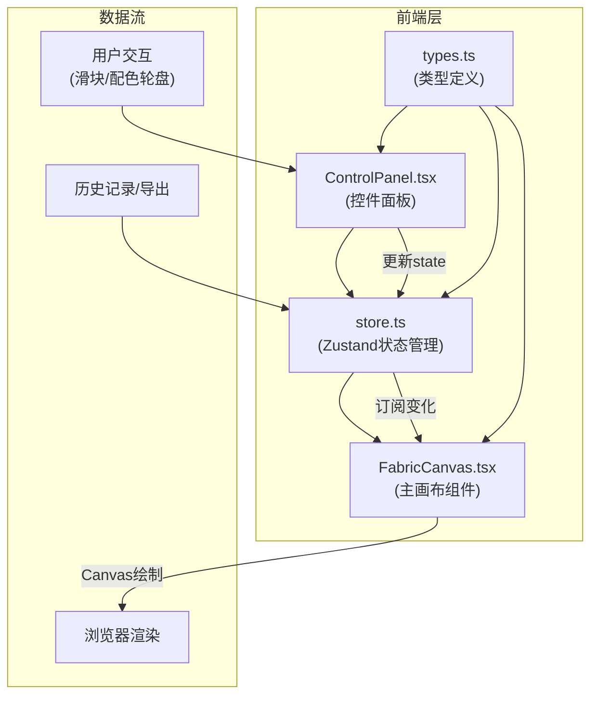

## 1. 架构设计



## 2. 技术描述

- **前端框架**：React 18 + TypeScript
- **构建工具**：Vite
- **状态管理**：Zustand
- **动画库**：framer-motion
- **配色方案**：nice-color-palettes
- **渲染技术**：Canvas 2D API（逐像素纹理绘制）

## 3. 文件结构与调用关系

```
src/
├── types.ts          # 类型定义（被所有文件引用）
├── store.ts          # Zustand状态管理（引用types，被ControlPanel/FabricCanvas引用）
├── FabricCanvas.tsx  # 主画布组件（引用types + store）
├── ControlPanel.tsx  # 控件面板组件（引用types + store）
└── App.tsx           # 根组件（组合FabricCanvas + ControlPanel）
```

### 数据流向
1. 用户在 `ControlPanel.tsx` 操作滑块或配色轮盘
2. 调用 `store.ts` 中的 action 更新状态
3. `FabricCanvas.tsx` 订阅 store 变化，触发重新绘制
4. Canvas API 逐像素生成纹理并计算悬垂效果

## 4. 核心数据模型

### 4.1 类型定义（types.ts）
```typescript
interface FabricParams {
  warpDensity: number;      // 经线密度 12-48根/寸
  weftTwist: number;        // 纬线捻度 200-600捻/米
  dyeCount: number;         // 浸染次数 1-5遍
  drapeCoefficient: number; // 悬垂系数 0.3-0.9
  colors: string[];         // 配色方案，最多3种
  textureType: 'plain' | 'twill' | 'satin'; // 纹理类型
}

interface HistoryItem {
  id: string;
  params: FabricParams;
  thumbnail: string; // base64缩略图
  timestamp: number;
}
```

### 4.2 Store状态（store.ts）
```typescript
interface StoreState {
  params: FabricParams;
  history: HistoryItem[];
  setWarpDensity: (v: number) => void;
  setWeftTwist: (v: number) => void;
  setDyeCount: (v: number) => void;
  setColors: (colors: string[]) => void;
  addToHistory: (item: HistoryItem) => void;
  restoreFromHistory: (id: string) => void;
}
```

## 5. 性能优化策略

1. **Canvas分层绘制**：将木案背景与织物纹理分离，参数变化时仅重绘织物层
2. **像素级缓存**：使用离屏Canvas缓存纹理图案，相似参数直接复用
3. **节流控制**：滑块拖动时使用requestAnimationFrame批量更新，确保FPS≥30
4. **贝塞尔曲线预计算**：悬垂褶皱的控制点计算结果缓存，避免重复计算
5. **绘制时长限制**：单次绘制≤50ms，超过时降低纹理采样精度

## 6. 响应式布局

- 使用CSS Media Queries实现宽屏/窄屏切换
- Canvas尺寸随容器动态调整，保持绘制比例
- 滑块和色块在触屏设备上自动增大触控区域

---
