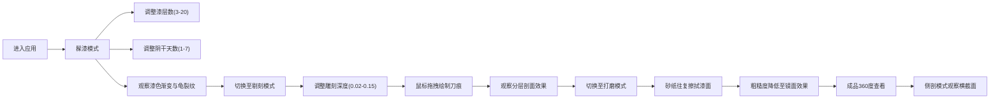

## 1. 产品概述

明代剔红漆器工艺数字化仿真平台，通过3D可视化技术模拟漆器制作从髹漆、雕刻到打磨抛光的全过程，解决传统工艺中漆层厚度、雕刻深度与刀法对最终效果难以预先评估的问题，面向工艺美术从业者、教育机构和文化爱好者。

## 2. 核心功能

### 2.1 功能模块

| 模块 | 核心功能 |
|------|----------|
| 3D作坊场景 | 明代漆器作坊剖面图，包含漆缸、操作台、木胎漆器、刷具 |
| 髹漆阶段 | 多层漆叠加、阴干时间控制、漆色渐变、龟裂纹理生成 |
| 雕刻阶段 | 鼠标拖拽雕刻、刀痕高光、分层剖面展示、云纹回纹效果 |
| 打磨阶段 | 虚拟砂纸打磨、粗糙度渐变、镜面反射、环境贴图倒影 |
| 成品展示 | 360度旋转查看、侧剖模式、漆层横截面展示 |
| 交互控制 | 参数滑块、模式切换、状态显示、响应式布局 |

### 2.2 页面详情

| 页面名称 | 模块名称 | 功能描述 |
|-----------|-------------|---------------------|
| 主页面 | 3D场景区域 | Three.js构建的作坊场景，漆器实时渲染，70%视高 |
| 主页面 | 控制面板区域 | 参数滑条、模式切换按钮、状态文本，30%视高 |

## 3. 核心流程

## 4. 用户界面设计

### 4.1 设计风格

- **主色调**：朱红#b22222、黑#1a1a1a、金#ffd700
- **配色方案**：明代宫廷风格，庄重典雅，朱红为主，黑金点缀
- **按钮风格**：金边圆角，悬停时金色微光扩散（box-shadow）
- **滑条样式**：轨道红黑渐变，滑块为金边圆珠
- **字体**：使用思源宋体彰显传统文化韵味，标题用艺术字体
- **布局风格**：上下两分，上主下次，木纹控制台底纹#8b5a2b
- **动效设计**：漆面高光随视角流淌，旋转阻尼惯性，按钮悬停微光

### 4.2 页面设计概述

| 页面名称 | 模块名称 | UI元素 |
|-----------|-------------|-------------|
| 主页面 | 3D场景区 | 青砖地面、漆缸、操作台、木胎漆器、刷具、砂纸、环境光、聚光灯 |
| 主页面 | 控制面板区 | 三个垂直排列滑条、模式切换按钮组、状态显示文本、侧剖按钮 |

### 4.3 响应式设计

- **桌面端**（≥768px）：上下两分布局，场景70%/控制台30%
- **移动端**（<768px）：控制台折叠为底部抽屉，场景占比提升至85%，抽屉可展开
- **触摸优化**：支持触摸拖拽雕刻、双指旋转查看

### 4.4 3D场景指南

- **环境氛围**：明代作坊室内，暖色偏暗光线，木质纹理，古雅氛围
- **光照设置**：主方向光模拟窗户外自然光，辅以环境光和聚光灯突出漆面光泽
- **相机设置**：透视相机，初始视角45度俯视，支持OrbitControls轨道控制
- **相机动效**：旋转阻尼惯性（enableDamping），阻尼系数0.05
- **构图元素**：漆缸居左，操作台居中，漆器为视觉焦点
- **材质特效**：漆层使用自定义ShaderMaterial，实现颜色渐变、龟裂纹理、高光流动
- **后处理**：Bloom效果增强金箔高光，SSAO增加场景深度感
- **性能指标**：面数≤5万，帧率≥60fps，纹理更新延迟≤100ms
