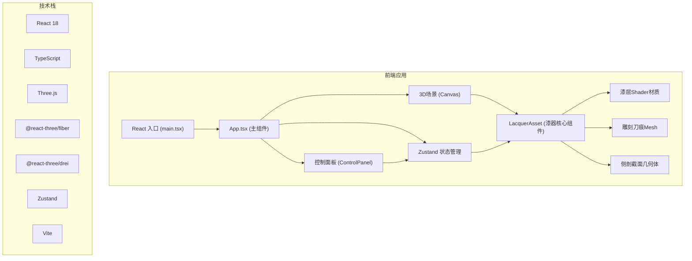

## 1. 架构设计



## 2. 技术描述

- **前端框架**：React 18 + TypeScript 5
- **3D引擎**：Three.js r160 + @react-three/fiber 8 + @react-three/drei 9
- **状态管理**：Zustand 4
- **构建工具**：Vite 5
- **样式方案**：CSS Modules + CSS Variables
- **无后端、无数据库**：纯前端应用，所有状态内存管理

## 3. 项目结构

```
auto19/
├── package.json
├── index.html
├── vite.config.js
├── tsconfig.json
└── src/
    ├── main.tsx          # React入口
    ├── App.tsx           # 主组件，布局+状态
    ├── LacquerAsset.tsx  # 3D漆器核心组件
    ├── ControlPanel.tsx  # 控制面板UI
    └── store.ts          # Zustand状态管理
```

## 4. 状态管理设计 (Zustand Store)

```typescript
type LacquerMode = 'painting' | 'carving' | 'polishing';

interface LacquerState {
  // 髹漆参数
  layerCount: number;      // 3-20层
  dryingDays: number;      // 1-7天
  // 雕刻参数
  carvingDepth: number;    // 0.02-0.15
  carvePaths: CarvePath[]; // 雕刻路径
  // 打磨参数
  roughness: number;       // 0.1-0.8
  polishCount: number;     // 打磨次数
  // 模式状态
  currentMode: LacquerMode;
  isSideCut: boolean;      // 侧剖模式
  // 动作
  setLayerCount: (n: number) => void;
  setDryingDays: (n: number) => void;
  setCarvingDepth: (n: number) => void;
  setCurrentMode: (mode: LacquerMode) => void;
  toggleSideCut: () => void;
  addCarvePath: (path: CarvePath) => void;
  incrementPolish: () => void;
  resetAll: () => void;
}

interface CarvePath {
  points: Vector3[];
  depth: number;
  timestamp: number;
}
```

## 5. 核心组件接口

### LacquerAsset Props
```typescript
interface LacquerAssetProps {
  layerCount: number;
  dryingDays: number;
  carvingDepth: number;
  carvePaths: CarvePath[];
  roughness: number;
  isSideCut: boolean;
  currentMode: LacquerMode;
  onCarve: (points: Vector3[]) => void;
  onPolish: () => void;
}
```

### ControlPanel Props
```typescript
interface ControlPanelProps {
  layerCount: number;
  dryingDays: number;
  carvingDepth: number;
  roughness: number;
  currentMode: LacquerMode;
  isSideCut: boolean;
  onLayerCountChange: (n: number) => void;
  onDryingDaysChange: (n: number) => void;
  onCarvingDepthChange: (n: number) => void;
  onModeChange: (mode: LacquerMode) => void;
  onSideCutToggle: () => void;
  onReset: () => void;
}
```

## 6. 漆层Shader实现

### 顶点着色器
- 传递UV坐标、法线、世界位置
- 计算视方向用于高光流动效果

### 片段着色器
- 漆色渐变：mix(#a52a2a, #4a0000, layerCount/20)
- 龟裂纹理：FBM噪声，密度由dryingDays控制
- 高光流动：视相关的各向异性高光
- 分层颜色：根据深度混合黄漆#8b8b00、黑漆#1a1a1a
- 粗糙度映射：roughness值控制镜面反射强度

## 7. 性能优化策略

1. **几何体复用**：漆器主体使用单个CylinderGeometry，通过Shader实现多层效果
2. **实例化渲染**：刀痕使用LineSegments合并绘制
3. **Shader Uniform更新**：仅在参数变化时更新uniform，避免每帧重建材质
4. **LOD控制**：远距离降低几何体细分
5. **面数控制**：整体场景≤5万面，漆器主体≤2万面
6. **纹理压缩**：环境贴图使用KTX2压缩格式

## 8. 关键交互实现

### 雕刻交互
1. 使用Raycaster拾取漆器表面点
2. 记录鼠标拖拽路径点序列
3. 路径点使用CatmullRomCurve3平滑
4. 沿路径生成TubeGeometry作为刀痕
5. 刀痕材质使用高光#ff6347描边

### 打磨交互
1. 鼠标移动时显示砂纸光标
2. 检测砂纸与漆面接触区域
3. 接触区域粗糙度降低（0.8→0.1）
4. 实时更新环境贴图反射强度

### 侧剖模式
1. 使用ClippingPlane剪切漆器
2. 生成截面几何体，展示N层漆
3. 每层使用不同色阶（红→黄→黑）
4. 左侧保留完整外观，右侧显示横截面
